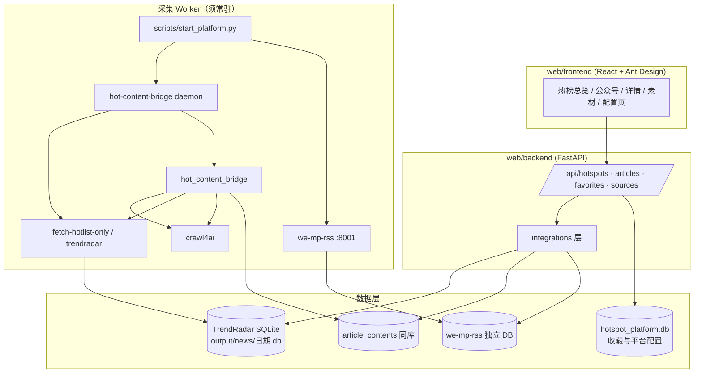

# 热点发现平台 - 产品需求文档 V9.3

| 文档版本 | 创建日期 | 创建者 | 备注 |
|---------|---------|-------|------|
| v6.1 | 2026-05-21 | AI助手 | 根据评审报告更新：补充热度算法、KPI、数据保留策略、异常流程 |
| v6.2 | 2026-05-21 | AI助手 | 更新素材中心为收藏库，添加图片和视频爬取存储方案 |
| v6.3 | 2026-05-22 | AI助手 | 第一阶段图片本地存储 + 视频只爬封面 |
| v7.0 | 2026-05-22 | AI助手 | 整合 we-mp-rss，新增微信公众号订阅功能 |
| v7.1 | 2026-05-22 | AI助手 | 完全整合微信公众号到统一架构，不再单独列出 |
| v7.2 | 2026-05-25 | AI助手 | 优化热榜正文对应机制、多平台热点处理方案、展示样式对比、增强筛选机制 |
| v7.3 | 2026-05-25 | AI助手 | **系统性整合 TrendRadar 核心功能**：关键词分组、AI智能筛选、热度算法、MCP工具、独立展示区、HTML报告增强等完整功能集成 |
| v8.0 | 2026-05-26 | AI智能体团队 | **多智能体协同优化 + UI/UX 设计系统**：邀请ai-integration-engineer、backend-architect、frontend-architect三大智能体进行专业优化，完善技术架构、AI功能、前后端设计，并集成 ui-ux-pro-max 专业设计系统 |
| v9.0 | 2026-05-26 | AI智能体团队 | **页面结构重构**：内容总览页重构为热榜总览页，微信公众号独立页面，新增关键词配置、AI分析、AI分析推送热榜信息、AI模型配置、推送渠道配置、调度配置页面 |
| v9.1 | 2026-05-26 | AI智能体团队 | **补充配置页面详细描述**：完善AI模型配置、推送渠道配置、调度配置、AI分析推送热榜信息等4个新增页面的功能描述、页面结构、API接口设计
| v9.2 | 2026-05-27 | AI智能体团队 | **实现现状校准**：新增第 0 章架构对照与差距说明；统一「热榜总览」术语；更新数据流与模块边界；修订实施路线图以匹配代码库实际状态 |
| v9.3 | 2026-05-27 | AI智能体团队 | **运行编排与实时采集**：§4.5 流水线守护进程、`start_platform` 一键启动；TrendRadar↔crawl4ai 同步机制；修订场景/流程/验收/路线图 |
| v9.4 | 2026-05-27 | AI智能体团队 | **项目环境与依赖规范**：§4.6 统一工具链、版本矩阵、Monorepo 依赖拓扑、安装/自检/反模式；修订 §10.0、§11.0、§24.8 与 §1.4 |
| v9.5 | 2026-05-28 | ui-ux-pro-max | **前端页面设计全面优化**：§6.12–§6.16 导航/令牌映射/交互/响应式规范；§7 各页 UI/UX 设计细则；去除 wireframe emoji，统一 Lucide 图标；落地 `design-system/pages/` 页面覆盖 |

> **文件名说明**：本文档文件名为 `热点发现平台 - 产品需求文档 V7.0.md`，正文版本以表头 **v9.5** 为准。

---

## 📋 目录
0. [实现现状与系统架构对照](#0-实现现状与系统架构对照)
1. [产品概述](#1-产品概述)
2. [目标用户](#2-目标用户)
3. [核心场景](#3-核心场景)
4. [技术设计](#4-技术设计)（含 [4.5 运行编排与实时采集](#45-运行编排与实时采集)、[4.6 项目环境与依赖规范](#46-项目环境与依赖规范)）
5. [功能范围](#5-功能范围)
6. [页面结构](#6-页面结构)
7. [关键流程](#7-关键流程)
8. [数据与状态](#8-数据与状态)
9. [非功能需求](#9-非功能需求)
10. [验收标准](#10-验收标准)
11. [数据保留策略](#11-数据保留策略)
12. [图片和视频爬取存储方案](#12-图片和视频爬取存储方案)
13. [RSS订阅与通知系统](#13-rss订阅与通知系统)
14. [热榜与正文统一机制](#14-热榜与正文统一机制)
15. [多平台热点处理方案](#15-多平台热点处理方案)
16. [展示样式对比分析](#16-展示样式对比分析)
17. [筛选机制增强](#17-筛选机制增强)
18. [TrendRadar 关键词分组与高级筛选](#18-trendradar-关键词分组与高级筛选)
19. [AI 智能筛选与自然语言兴趣描述](#19-ai-智能筛选与自然语言兴趣描述)
20. [热度算法设计（整合 TrendRadar）](#20-热度算法设计整合-trendradar)
21. [MCP 工具集成方案](#21-mcp-工具集成方案)
22. [独立展示区与 HTML 报告增强](#22-独立展示区与-html-报告增强)
23. [后端技术架构详细设计](#23-后端技术架构详细设计)
24. [前端技术架构详细设计](#24-前端技术架构详细设计)
25. [AI功能技术实现方案](#25-ai功能技术实现方案)
26. [实施路线图与优先级（历史章节）](#26-实施路线图与优先级)
27. [页面结构重构详细设计](#27-页面结构重构详细设计)
28. [实施路线图与优先级（当前）](#28-实施路线图与优先级)

---

## 0. 实现现状与系统架构对照

> 本章基于 **2026-05-27 代码库审查** 编写，用于校准 PRD 与真实实现之间的差距。后续开发应优先消除「集成断层」，再扩展 UI 与高级功能。

### 0.1 总体架构（目标 vs 现状）

**目标架构**（统一 Web 平台）：



**现状（v9.3）**：
- **运行层 ✅**：`hot-content-bridge daemon` + `scripts/start_platform.py` 可在启动后 **自动拉取当日热榜并触发正文爬取**；we-mp-rss 可由启动脚本带 `-job True` 拉起。
- **展示层 🟡**：`web/backend` / `web/frontend` 仍为脚手架，**尚未**稳定对接实时库；仅启动 Web 而不启动 daemon 时，仍会读到 **过期日库**。

### 0.2 核心模块说明

| 模块 | 路径 | 职责 | 对外接口 | 存储 |
|------|------|------|----------|------|
| **TrendRadar** | `trendRadar/` | 多平台热榜采集、关键词/AI 筛选、推送、RSS、HTML 报告、MCP | CLI：`trendradar`；MCP：`trendradar-mcp`；无内置 HTTP API | `output/news/{YYYY-MM-DD}.db`（`news_items`、`platforms`、`rank_history`、AI 表等） |
| **hot_content_bridge** | `hot_content_bridge/` | 热榜批次读取、正文爬取调度、**流水线守护进程**、平台规则 | CLI：`daemon`、`run-pipeline`、`fetch-hotlist-only`、`crawl-articles`、`serve-web`；编排：`scripts/start_platform.py` | 与 TrendRadar **同日库**；`article_contents` |
| **crawl4ai** | `crawl4ai/`（editable 依赖） | Playwright 爬虫、Markdown 提取、内容过滤 | 被 `article_crawler.py` 调用 | 无独立业务库 |
| **we-mp-rss** | `we-mp-rss/` | 公众号订阅、扫码授权、文章抓取、RSS、多渠道通知、级联节点 | 独立 FastAPI + `web_ui/` | 自有 SQLite（`feeds`、`articles` 等） |
| **web/backend** | `web/backend/` | 平台统一 API（目标） | 已实现：`/api/contents`、`/favorites`、`/sources`、`/settings`；**未实现**：`/api/hotspots`、集成层、任务队列 | `hotspot_platform.db` |
| **web/frontend** | `web/frontend/` | 产品 UI（目标 17 页） | 已路由 6 页（`/contents` 等），**均使用 Mock**；`api.js` 未被页面引用 | — |

### 0.3 关键数据流

**实时采集流水线（运行层，v9.3 已实现）**：

```
scripts/start_platform.py
    ├─ hot-content-bridge daemon（循环）
    │      ├─ fetch-hotlist-only → 当日 news_items（不受 TrendRadar schedule 跳过采集影响）
    │      └─ crawl-articles → crawl4ai → article_contents
    └─ we-mp-rss main.py -job True → 公众号定时采集
```

**平台展示层（待完善）**：

```
output/news/{今日}.db + we-mp-rss DB
    → web/backend integrations → REST API → web/frontend
用户收藏/配置 → hotspot_platform.db
```

调试预览（非产品前端）：`hot-content-bridge serve-web`（`:8765`）。

### 0.4 实现差距清单（PRD vs 代码库）

| 类别 | PRD 描述 | 当前状态 | 优先级 |
|------|----------|----------|--------|
| **运行编排** | 启动后自动热榜+正文+公众号采集 | ✅ `daemon` + `start_platform.py` | 保持 |
| 数据集成 | 统一 API 读取热榜与正文 | 🟡 `trendradar_reader` 已有，API 未挂路由 | **P0** |
| 页面路由 | 热榜总览 `/`、公众号 `/wechat` 等 17 页 | 仅 6 页，路径为 `/contents` 聚合 Mock | **P0** |
| API 契约 | `GET /api/hotspots` 分组结构 | 未实现；现有 `/api/contents` 为通用 CRUD | **P0** |
| 微信公众号 | 平台内 `/wechat` 页 | we-mp-rss 独立运行，无代理 API | **P0** |
| 正文重抓 | 详情页触发 bridge 爬取 | 仅 CLI `crawl-articles`，无 HTTP 触发 | **P0** |
| AI/MCP/关键词配置页 | 7 个配置与分析页 | TrendRadar 配置在 `trendRadar/config/`，平台 UI 未做 | P0–P1 |
| 任务队列/Redis | 第 23 章架构 | 未实现 | P1 |
| 图片视频资产 | 第 13 章 | bridge 以 Markdown 为主，无 `media_items` 表 | P1 |
| 设计系统 | Tailwind + Fira 字体（第 6 章） | 前端为 Ant Design，需明确「令牌映射到 Ant Design Token」 | P1 |

### 0.5 分阶段交付原则

1. **环境优先于运行**：新机器须先通过 **§4.6 环境自检**（`uv sync`、Playwright、锁文件一致），再执行 §4.5 采集流水线。
2. **运行优先于展示**：任何环境必须先启动 **采集流水线**（§4.5），再启动 Web；否则 UI/API 只能读到旧库。
3. **集成优先**：完成 `integrations/` + `GET /api/hotspots` 后，前端热榜/详情接真实数据，再扩展页面数量。
4. **复用不重写**：关键词、AI 筛选、推送、调度优先 **读写 TrendRadar / we-mp-rss 现有配置**，平台 UI 做薄封装。
5. **热榜采集路径**：平台默认 **`fetch-hotlist-only`**；完整 `python -m trendradar` 仅用于 AI/推送/报告，且受 `schedule` 时段限制。
6. **单进程编排**：开发期 `subprocess` + `daemon`；生产期可升级为任务队列，接口契约不变。
7. **锁文件入库**：`uv.lock`、`web/frontend/package-lock.json` 须提交版本库；禁止在无锁文件环境下用 `pip install` / `npm install` 裸装生产依赖。

### 0.6 前端实现说明（Ant Design 与 PRD 第 6 章）

- **组件库**：以 **Ant Design 5** 为实施基准（与 `web/frontend` 一致）。
- **设计令牌**：第 6 章颜色、字体、间距定义通过 **Ant Design `ConfigProvider` theme** 与 CSS 变量（`src/theme/tokens.js`、`src/index.css`）落地，不强制引入 Tailwind，避免双栈样式冲突。
- **图标**：使用 `lucide-react`，**禁止** emoji 作为功能图标（wireframe 与 UI 均使用图标名称标注，见 §6.12.3）。
- **设计系统文件**：全局规范见 `design-system/MASTER.md`；页面级覆盖见 `design-system/pages/*.md`（优先于 MASTER）。
- **已实现基线（v9.5）**：`AppShell` 全局布局、主题/宽屏偏好、`HotspotCard`/`TrendIndicator`/`HeatScoreBar` 等核心组件已在 `web/frontend` 落地，供后续页面复用。

---

## 1. 产品概述

### 1.1 产品定位
基于 **TrendRadar**（热榜采集）、**crawl4ai**（正文爬取）和 **we-mp-rss**（微信公众号采集）构建的综合内容发现平台，整合三大采集源（热榜、网站正文、微信公众号），提供统一的内容发现、素材获取和订阅管理工具，为内容创作者服务。

### 1.2 产品目标
| 目标 | 具体内容 |
|-----|---------|
| **实时采集** | 项目启动后自动拉取 **当日** 热榜并同步触发正文爬取；公众号采集进程独立常驻 |
| 整合现有功能 | TrendRadar + crawl4ai（经 bridge）+ we-mp-rss 统一编排，Web 平台只读展示与配置 |
| 完善 UI 体验 | 热榜总览/详情等核心页对接 **实时库**；支持多主题（13种） |
| 分阶段交付 | 运行层 → API 集成层 → 全页面；非核心页可暂用 Mock |
| 解决的问题 | 1. 热榜分散且数据陈旧<br>2. 正文与热榜脱节<br>3. 公众号难追踪<br>4. 缺少聚合展示<br>5. 通知渠道单一 |

### 1.3 成功指标（KPI）
| 指标类别 | 指标名称 | 定义 | 目标值 |
|---------|---------|------|--------|
| 用户行为 | 热点发现到正文阅读的平均时间 | 用户从打开平台到阅读正文的平均耗时 | < 30秒 |
| 系统性能 | 正文爬取成功率 | 成功爬取的正文数 / 尝试爬取的正文数 | > 85% |
| 系统性能 | 热榜数据新鲜度 | 热榜数据从采集到展示的时间差 | < 10分钟 |
| 用户体验 | 页面加载时间 | 热点总览页首屏加载时间 | < 2秒 |
| 用户体验 | API响应时间 | 后端API平均响应时间 | < 1秒 |

### 1.4 技术基础
- **核心依赖**：TrendRadar（热榜）、crawl4ai（正文引擎）、hot_content_bridge（流水线编排）、we-mp-rss（公众号）
- **环境与工具链**：**uv** 管理 Python 单体仓库；**Node 20 LTS + npm ci** 管理前端；Playwright Chromium 为正文爬取硬依赖（详见 **§4.6**）
- **运行入口**：`uv run python scripts/start_platform.py`（推荐）；或 `hot-content-bridge daemon` + 单独启动 we-mp-rss
- **技术栈**：FastAPI、React + Vite + Ant Design、SQLite（多库：TrendRadar 日库 / we-mp-rss / hotspot_platform）

---

## 2. 目标用户

### 2.1 第一阶段用户
| 用户类型 | 角色 | 使用场景 |
|---------|------|---------|
| 系统管理员 | 产品开发者 | 日常查看热点、测试平台功能、配置采集源 |

### 2.2 未来规划用户
| 用户类型 | 角色 | 使用场景 |
|---------|------|---------|
| 系统管理员 | IT/运维 | 系统配置、采集源管理、日志审计 |
| 栏目负责人 | 主编/制片人 | 团队管理、监测源配置、数据查看 |
| 记者/编辑 | 一线采编 | 热点浏览、素材获取、选题参考 |
| 浏览用户 | 实习生/外部合作 | 只读访问热点和素材 |

---

## 3. 核心场景

### 场景 1：浏览热榜与公众号内容
**角色**：系统管理员
**触发条件**：想查看热榜动态或微信公众号更新
**主要任务**：
1. 打开 **热榜总览页**（`/`）浏览分组热榜，或打开 **微信公众号页**（`/wechat`）浏览订阅文章
2. 使用平台、时间、关键词/AI 筛选
3. 点击条目查看详情（热榜可跳转正文详情）
4. 收藏有价值的内容

**完整流程**：
```
访问平台 → 热榜总览页 / 微信公众号页 → 筛选 → 浏览列表 → 详情 → 收藏（可选）
```

### 场景 2：收藏素材
**角色**：系统管理员
**触发条件**：看到有价值的内容（热榜、网站正文、公众号文章），想要收藏以便后续使用
**主要任务**：
1. 在内容流或详情页浏览
2. 点击"收藏"按钮
3. 可以添加标签或备注
4. 在素材中心查看已收藏内容

**完整流程**：
```
浏览内容 → 点击"收藏" → 添加标签备注（可选） → 内容进入素材中心
```

### 场景 3：查找素材
**角色**：系统管理员
**触发条件**：需要找某个主题的素材
**主要任务**：
1. 进入素材中心
2. 按来源、类型、时间、标签筛选
3. 查看素材详情
4. 可以取消收藏

**完整流程**：
```
访问平台 → 素材中心页 → 筛选条件 → 浏览素材列表 → 点击查看详情
```

### 场景 4：配置采集源
**角色**：系统管理员
**触发条件**：需要配置和管理各类采集源
**主要任务**：
1. 进入采集源配置页
2. 配置热榜源（开关、权重）
3. 配置网站源（URL 模板、CSS 选择器）
4. 配置微信公众号源（扫码授权、添加订阅、过滤规则）
5. 保存配置

### 场景 5：历史内容回顾
**角色**：系统管理员
**触发条件**：想查看过去的内容
**主要任务**：
1. 打开热榜总览页或微信公众号页
2. 选择时间范围（近7天、近30天、自定义）
3. 浏览历史热榜或历史文章
4. 点击查看详情

### 场景 6：内容通知配置
**角色**：系统管理员
**触发条件**：需要及时获取订阅内容更新
**主要任务**：
1. 进入通知配置页
2. 配置通知触发条件（新内容、关键词匹配）
3. 配置通知渠道（微信、钉钉、飞书、Bark、自定义 Webhook）
4. 查看通知历史

### 场景 7：RSS 订阅
**角色**：系统管理员
**触发条件**：想在外部 RSS 阅读器中订阅平台内容
**主要任务**：
1. 进入 RSS 订阅页
2. 选择要订阅的内容类型
3. 复制 RSS 链接
4. 在 RSS 阅读器中订阅

### 场景 8：级联节点管理（可选）
**角色**：系统管理员
**触发条件**：单节点采集能力不足，需要扩展
**主要任务**：
1. 配置父子节点
2. 设置任务分发策略
3. 监控各节点状态
4. 查看采集统计

### 场景 9：抓取失败处理
**角色**：系统管理员
**触发条件**：内容抓取失败，需要查看错误信息并重试
**主要任务**：
1. 在详情页看到抓取失败的提示
2. 查看错误信息
3. 点击"重新抓取"按钮
4. 等待抓取完成

### 场景 10：项目启动与后台实时采集
**角色**：系统管理员 / 运维
**触发条件**：开发或部署环境需要保证数据新鲜，而非只读历史 SQLite
**主要任务**：
1. 执行 §4.6 标准安装：`uv sync`、`playwright install chromium`、`verify_environment.py`
2. 运行 `uv run python scripts/start_platform.py`
3. 确认日志出现 `Hot list: OK` 与 `Article crawl: crawled=…`
4. 确认 `trendRadar/output/news/{今日}.db` 存在且 `last_crawl_time` 更新
5. （可选）再启动 `web/backend` 与 `web/frontend`

**完整流程**：
```
环境准备 → start_platform（daemon + we-mp-rss）→ 首轮热榜+正文 → 周期刷新 → 启动 Web 读库
```

**反模式（禁止）**：仅启动前端/后端、不启动 daemon → 只能看到旧日库或空库。

---

## 4. 技术设计

### 4.1 技术实现路径（v9.3）

```
阶段 A 运行编排（daemon + start_platform）  ← 必须先完成
        ↓
阶段 B Web 集成（integrations + REST API）
        ↓
阶段 C 前端对接真实数据 + 配置页薄封装
        ↓
阶段 D 增强（任务队列、监控、多主题全量）
```

### 4.2 核心依赖关系
| 模块 | 用途 | 复用方式 |
|------|------|---------|
| **TrendRadar** | 热榜数据采集、关键词分组 | 读取 SQLite 数据库、调用 `count_word_frequency()` |
| **hot_content_bridge** | 正文爬取 | 复用 `article_crawler.py`、调用 CLI 命令 |
| **crawl4ai** | 浏览器自动化爬虫 | 被 hot_content_bridge 调用 |
| **we-mp-rss** | 微信公众号订阅、RSS生成 | 复用完整模块，包括浏览器驱动、通知系统、级联功能 |

### 4.3 数据流转

**采集与存储（已实现）**：
```
TrendRadar 采集 → output/news/{date}.db (news_items)
       ↓
hot_content_bridge + crawl4ai → article_contents（同日库）
we-mp-rss 独立进程 → 自有 DB (feeds, articles)
```

**平台展示（目标，待集成）**：
```
上述 DB → web/backend integrations 层 → REST API → web/frontend
用户收藏/配置 → hotspot_platform.db（本平台库）
```

### 4.4 模块集成策略

| 能力 | 集成方式 | 说明 |
|------|----------|------|
| 热榜列表/分组 | 只读查询 TrendRadar 日库 + 调用 `count_word_frequency()` | 避免重复实现热度算法 |
| 正文详情 | 读 `article_contents`；缺失时 `subprocess` 调用 `hot-content-bridge crawl-articles --limit 1` | 异步任务 P1 化 |
| 公众号列表/文章 | HTTP 代理 we-mp-rss 现有 API，或只读其 DB | 不 fork 采集逻辑 |
| RSS/通知/调度 | 配置页写入 we-mp-rss / TrendRadar 配置文件或 API | 平台 UI 为配置壳 |
| MCP/智能助手 | 复用 `trendradar-mcp`；平台页仅嵌入连接说明或 iframe/WS 网关 | 不重复实现 MCP Server |

### 4.5 运行编排与实时采集

> **产品级要求**：平台视为「可运行系统」，而非「静态读库工具」。满足 KPI「热榜数据新鲜度 &lt; 10 分钟」的前提是 **daemon 常驻**。

#### 4.5.1 组件职责

| 组件 | 职责 |
|------|------|
| `pipeline_runner.run_pipeline_once` | 单轮：热榜 →（可选）正文爬取 |
| `PipelineDaemon` | 按间隔循环；启动时可 `run_on_startup` 立即执行一轮 |
| `hot-content-bridge daemon` | CLI 入口，读取 `hot_content_bridge/config.yaml` → `pipeline_daemon` |
| `scripts/start_platform.py` | 拉起 daemon 子进程 + we-mp-rss（`-job True`） |
| `fetch-hotlist-only` | 调用 TrendRadar `NewsAnalyzer._crawl_data()`，**始终写入当日库** |
| `crawl-articles` | 读最新热榜批次 → crawl4ai → `article_contents` |

#### 4.5.2 配置项（`hot_content_bridge/config.yaml` → `pipeline_daemon`）

| 键 | 默认值 | 说明 |
|----|--------|------|
| `enabled` | `true` | 是否启用守护进程 |
| `run_on_startup` | `true` | 启动后立即执行一轮采集 |
| `hotlist_interval_minutes` | `30` | 热榜刷新周期（分钟） |
| `initial_delay_seconds` | `5` | 首次执行前等待 |
| `full_trendradar_sync` | `false` | `false` 推荐；`true` 走完整 trendradar（受 schedule 限制可能不采集） |
| `crawl_after_hotlist` | `true` | 每轮热榜后自动正文爬取 |
| `crawl_limit_per_run` | `0` | 每轮正文上限，`0`=不限制 |

#### 4.5.3 TrendRadar 与 crawl4ai 同步机制

每一轮 daemon 周期严格顺序执行：

1. **热榜写入**：`fetch-hotlist-only` → `output/news/{YYYY-MM-DD}.db` 的 `news_items`、`crawl_records`
2. **批次识别**：`hotlist_reader.load_pending_from_latest_crawl()` 读取 **最新一批** `crawl_id`
3. **去重与过滤**：`filter_pending_for_crawl()` 跳过已成功 URL（除非 `recrawl_success: true`）
4. **正文爬取**：`article_crawler` + crawl4ai（Playwright）→ `article_contents` 同库关联 `news_item_id`
5. **失败重试**：详情页/API 可触发 `crawl-articles --limit 1` 或后续 `POST .../refetch`

**与 `python -m trendradar` 的区别**：

| 方式 | 采集热榜 | AI/推送/报告 | 适用 |
|------|----------|--------------|------|
| `fetch-hotlist-only` / daemon 默认 | 总是执行 | 不执行 | **平台实时数据** |
| `sync-hotlist` / `full_trendradar_sync: true` | 受 schedule 控制 | 执行 | 定时报告、通知场景 |

#### 4.5.4 we-mp-rss 运行要求

| 项 | 要求 |
|----|------|
| 启动命令 | `python main.py -job True`（由 `start_platform.py` 调用） |
| 配置 | `we-mp-rss/config.yaml` → `server.enable_job: true` |
| 端口 | 默认 `8001`（与 Web 后端 `8000` 分离） |
| 平台集成 | 阶段 B 通过 HTTP 代理或只读 DB 暴露 `/api/wechat/*` |

#### 4.5.5 标准启动命令

```bash
# 推荐：热榜守护进程 + 公众号任务
uv run python scripts/start_platform.py

# 仅采集流水线
uv run hot-content-bridge daemon

# 单轮测试
uv run hot-content-bridge daemon --once
uv run python scripts/start_platform.py --once

# 调试：bridge 内置浏览
uv run hot-content-bridge serve-web
```

详见 [`docs/DEPLOYMENT.md`](DEPLOYMENT.md)。

### 4.6 项目环境与依赖规范

> **目标**：统一开发/部署/CI 的工具链与版本，避免「本机能跑、他人/生产不能跑」的环境与依赖漂移。本章为 **P0 前置条件**，优先于 §4.5 运行编排验收。

#### 4.6.1 设计原则

| 原则 | 说明 |
|------|------|
| **单一 Python 工具链** | 仓库根目录 `uv` + 根 `pyproject.toml` + `uv.lock`；子包 `trendRadar/`、`crawl4ai/` 以 **editable** 方式挂载，禁止为 bridge 单独建 pip 虚拟环境 |
| **锁文件即真相** | 生产/CI/新同事克隆后只执行 `uv sync`、`npm ci`，不手改已解析版本 |
| **we-mp-rss 同解释器** | `scripts/start_platform.py` 使用根 venv 的 `sys.executable` 启动 `we-mp-rss/main.py`，避免双 Python 版本 |
| **浏览器依赖显式安装** | 正文爬取依赖 Playwright Chromium；安装步骤写入文档与自检脚本，不假设已全局安装 Chrome |
| **前端与 PRD 栈一致** | `web/frontend` 须对齐 §24/§25 声明的 React + Ant Design 等版本；以 `package-lock.json` 锁定 |

#### 4.6.2 运行时版本矩阵

| 组件 | 最低版本 | 推荐 | 版本来源 / 备注 |
|------|----------|------|-----------------|
| **Python** | 3.12 | 3.12.x 或 3.13.x | 根 `pyproject.toml` `requires-python = ">=3.12"`；`trendRadar` 同要求 |
| **uv** | 0.4.x | 最新稳定版 | [https://docs.astral.sh/uv/](https://docs.astral.sh/uv/) |
| **Node.js** | 20 LTS | 20.x | 仅 `web/frontend`；建议仓库根提供 `.nvmrc` 写 `20` |
| **npm** | 10+ | 随 Node 发行 | 使用 `npm ci`，不用 `npm install` 改锁文件 |
| **Playwright Chromium** | 与 lock 中 `playwright` 一致 | `uv run playwright install chromium` | 由 crawl4ai / we-mp-rss 间接依赖 |
| **Git** | 2.30+ | — | 用于克隆与子模块（若有） |

#### 4.6.3 Monorepo 依赖拓扑

```
仓库根 (hot-content-bridge)
├── pyproject.toml          # 元包：聚合 bridge + 声明 scripts
├── uv.lock                 # 全仓 Python 解析结果（须提交）
├── trendRadar/             # editable → trendradar
├── crawl4ai/               # editable → crawl4ai
├── hot_content_bridge/     # 流水线、daemon、CLI
├── app/                    # 平台 FastAPI（hotspot-api）
├── we-mp-rss/              # 独立 requirements.txt，运行时共用根 venv Python
└── web/frontend/           # 独立 Node 工程 + package-lock.json
```

**Python 包关系**（根 `pyproject.toml`）：

| 包名 | 路径 | 角色 |
|------|------|------|
| `hot-content-bridge` | 根 | CLI：`hot-content-bridge`；可选 `hotspot-api` → `app.main` |
| `trendradar` | `trendRadar/` | 热榜采集、MCP、AI 筛选 |
| `crawl4ai` | `crawl4ai/` | Playwright 爬虫引擎 |
| we-mp-rss | `we-mp-rss/` | **不**纳入根 `pyproject` 依赖列表；由启动脚本以子进程 + 同解释器运行 |

#### 4.6.4 标准安装流程（干净环境）

在**仓库根目录**执行（Windows / Linux / macOS 相同）：

```bash
# 1. Python 依赖（含 editable trendradar、crawl4ai）
uv sync --group dev

# 2. Playwright 浏览器（正文爬取必需，仅首次或升级 playwright 后）
uv run playwright install chromium

# 3. 环境自检（交付物，见开发任务 0.C.5）
uv run python scripts/verify_environment.py

# 4. 前端依赖（展示层开发时）
cd web/frontend && npm ci && cd ../..

# 5. 可选：we-mp-rss 独立调试前确认同 venv
uv run python -c "import fastapi, playwright; print('ok')"
```

**禁止做法**：

- 在 `web/backend` 单独 `python -m venv` + `pip install -r requirements.txt`（与 Monorepo 冲突，见旧版 §24.8 已废止）
- 仅 `pip install crawl4ai` 而不通过 `uv sync`（无法保证与 `trendradar` 同环境）
- 跳过 `playwright install chromium` 直接跑 `crawl-articles`
- CI 中使用 `npm install` 而非 `npm ci`

#### 4.6.5 Python 直接依赖（根仓声明）

根 `pyproject.toml` 当前直接依赖（子包传递依赖以 `uv.lock` 为准）：

| 依赖 | 用途 |
|------|------|
| `trendradar` (editable) | 热榜、存储、AI/MCP |
| `crawl4ai` (editable) | 正文爬取 |
| `PyYAML` | bridge / 平台配置 |
| `click` | CLI |
| `tenacity` | 重试 |
| `markdown` | 正文后处理 |
| `fastapi` / `uvicorn` | 平台 API、`serve-web` |

**开发依赖组** `dev`：`pytest`、`pytest-asyncio`（`uv sync --group dev`）。

**子包关键传递依赖**（排查冲突时参考）：

| 子包 |  notable 依赖 |
|------|----------------|
| trendRadar | `litellm`、`fastmcp`、`requests`、`PyYAML` |
| crawl4ai | `playwright`、`unclecode-litellm`、`aiohttp`、`pydantic` |

#### 4.6.6 前端依赖规范（`web/frontend`）

**当前实现**（`package.json`）已含：React 18.3、React Router 6.28、Axios 1.7、Vite 5.4。

**PRD 目标栈**（须在阶段〇-C / 阶段十六落地，并写入 `package.json` + 锁文件）：

| 包 | 目标版本 | 说明 |
|----|----------|------|
| `antd` | ^5.22.0 | 与 §0.6、§25 一致 |
| `dayjs` | ^1.11.13 | 时间展示 |
| `lucide-react` | ^0.4x | 图标，禁止 emoji 作功能图标 |
| `react-markdown` + `remark-gfm` | 最新兼容 18.x | 详情页 Markdown |

安装命令：`cd web/frontend && npm ci`（依赖变更后由维护者提交 `package-lock.json`）。

#### 4.6.7 服务端口与环境变量

| 服务 | 默认端口 | 启动方式 |
|------|----------|----------|
| 平台 FastAPI | `8000` | `uv run uvicorn app.main:app --reload`（阶段〇-B 后） |
| we-mp-rss | `8001` | `start_platform.py` 或 `we-mp-rss` 目录 `python main.py -job True` |
| bridge 调试 Web | `8765` | `uv run hot-content-bridge serve-web` |

| 变量 | 说明 | 默认 |
|------|------|------|
| `PYTHONUTF8` | Windows 下日志/路径 UTF-8 | `start_platform.py` 设为 `1` |
| `TRENDRADAR_DATA_DIR` | TrendRadar 日库目录（API reader） | `trendRadar/output/news` |
| `WEMP_RSS_BASE_URL` | we-mp-rss HTTP 代理基址 | `http://127.0.0.1:8001` |
| `HOTSPOT_PLATFORM_DB` | 收藏/平台配置库 | `data/hotspot_platform.db` |

路径类配置优先读 `hot_content_bridge/config.yaml` 与 `trendRadar/config/config.yaml`，环境变量用于部署覆盖。

#### 4.6.8 已知依赖冲突与规避

| 现象 | 原因 | 规避 |
|------|------|------|
| `import crawl4ai` 无 `AsyncWebCrawler` | 仓库根文件夹名与包名冲突 | 已通过 `hot_content_bridge/_crawl4ai_path.py` 修正；CLI/爬虫入口须先加载 shim |
| `litellm` 与 `unclecode-litellm` 共存 | trendRadar 与 crawl4ai 各依赖不同发行版 | bridge 默认仅用 crawl4ai 的 `AsyncWebCrawler` + Markdown，不启用 crawl4ai LLM 提取；见 `docs/DEPLOYMENT.md` |
| Playwright 浏览器未找到 | 未执行 `playwright install` | 安装 Chromium；自检脚本检测 |
| we-mp-rss 与 bridge Playwright 版本差 | 各自 requirements | 统一用根 `uv.lock` 解析版本；`start_platform` 勿混用系统 Python |
| 热榜库为空 / 过期 | 未启 daemon | 先 §4.5，再访问 Web |

#### 4.6.9 环境自检清单

交付 **`scripts/verify_environment.py`**（开发任务 0.C.5），至少检查：

| # | 检查项 | 通过标准 |
|---|--------|----------|
| 1 | Python 版本 | `>= 3.12` |
| 2 | `uv sync` 状态 | 可 import `hot_content_bridge`、`trendradar`、`crawl4ai` |
| 3 | crawl4ai shim | `AsyncWebCrawler` 可导入 |
| 4 | Playwright | `playwright install --dry-run` 或启动 Chromium 无报错 |
| 5 | 配置文件 | `hot_content_bridge/config.yaml`、`trendRadar/config/config.yaml` 存在 |
| 6 | TrendRadar 平台源 | 至少 1 个 `platforms.*.enabled: true` |
| 7 | 前端（可选） | `web/frontend/node_modules` 存在且 `npm run build` 可执行 |
| 8 | 锁文件 | 根目录存在 `uv.lock` |

自检失败时 **禁止** 进入 §11.0 运行验收；应先修复环境再启动 `start_platform`。

#### 4.6.10 配置与仓库交付物

| 文件 | 要求 |
|------|------|
| `uv.lock` | 提交；升级依赖后 `uv lock` + 回归 `verify_environment` |
| `web/frontend/package-lock.json` | 提交；前端依赖变更后更新 |
| `.python-version` | 建议写入 `3.12`（供 pyenv/uv 识别） |
| `.nvmrc` | 建议写入 `20` |
| `docs/DEPLOYMENT.md` | 与 §4.6 同步，作为运维手册 |
| `docs/DEVELOPMENT.md` | 开发调试说明，引用 §4.6 |

#### 4.6.11 CI / 干净环境复现（建议）

```yaml
# 伪代码：CI 最小步骤
- run: uv sync --frozen --group dev
- run: uv run playwright install chromium
- run: uv run python scripts/verify_environment.py
- run: uv run pytest hot_content_bridge/tests -q
- run: cd web/frontend && npm ci && npm run build
```

`--frozen` 要求 lock 与 pyproject 一致，防止 CI 静默升级依赖。

---

## 5. 功能范围

### 5.1 必做功能（第一阶段）

> **页面拆分说明（v9.0+）**：原「内容总览页」已拆分为 **热榜总览页**（`/`）与 **微信公众号页**（`/wechat`），不再使用单一时间线聚合首页。

| 功能 | 说明 | 数据源 |
|-----|------|-------|
| **运行编排（P0）** | `daemon` 周期热榜+正文；`start_platform` 一键启动；配置见 §4.5 | hot_content_bridge / we-mp-rss |
| 热榜总览页 | 关键词分组 Tab、平台/时间筛选、卡片/列表视图、热度与趋势 | TrendRadar SQLite（须 daemon 刷新） |
| 微信公众号页 | 公众号订阅列表、文章流、搜索、收藏 | we-mp-rss |
| 内容详情页 | Markdown 渲染内容，重新抓取按钮，收藏按钮 | 各数据源 |
| 素材中心页 | 收藏的内容列表、筛选、详情、取消收藏 | `favorites` 表 + 各数据源 |
| 采集源配置页 | 热榜源配置、网站源配置、微信公众号源配置、浏览器配置文件管理 | Mock 数据 + 各模块 |
| RSS 订阅页 | 为各类内容生成 RSS 链接 | we-mp-rss RSS 模块 |
| 通知配置页 | 配置通知触发条件和渠道（微信/钉钉/飞书/Bark/Webhook） | we-mp-rss 通知模块 |
| 系统设置页 | 系统配置、日志审计、主题切换 | Mock 数据 |

### 5.2 可选功能
| 功能 | 说明 |
|-----|------|
| 多主题切换 | 13种主题，亮色/暗色 |
| 搜索功能 | 全内容搜索 |
| 导出功能 | 导出内容列表或详情 |
| 级联节点管理 | 父子节点配置、任务分发 |

### 5.3 暂不做功能
| 功能 | 说明 | 原因 |
|-----|-----|-----|
| 用户登录与认证 | 账号密码、JWT | 第一阶段仅自己使用 |
| 权限控制 | 角色、权限矩阵 | 第一阶段仅自己使用 |
| 事件聚类算法 | 向量化 + DBSCAN | 算法复杂，需自研 |
<!-- | 多语言支持 | 简体/繁体/英文 | 第一阶段先做中文 | -->

---

## 6. 前端设计规范（基于 ui-ux-pro-max）

### 6.1 设计系统概述

#### 6.1.1 设计理念
本设计系统基于 **ui-ux-pro-max** 专业设计库，采用 **Data-Dense Dashboard（数据密集型仪表盘）** 风格。设计理念强调：
- **信息密度优先**：在有限屏幕空间内最大化数据展示效率
- **专业、简洁、高效**：减少视觉噪音，专注内容本身
- **数据驱动**：使用蓝色 + 琥珀色的专业配色方案，适合数据分析场景
- **高性能交互**：流畅的动画和响应式反馈

#### 6.1.2 设计模式
采用 **Minimal Single Column（极简单列）** 模式：
- 单一核心聚焦区，减少导航干扰
- 大量留白营造呼吸感
- 移动优先设计
- 清晰的视觉层次

### 6.2 设计令牌（Design Tokens）

#### 6.2.1 颜色系统

**主色调**
| 角色 | Hex | Tailwind Class | 用途 |
|------|-----|----------------|------|
| Primary | #1E40AF | bg-primary | 主要按钮、链接、强调 |
| Secondary | #3B82F6 | bg-secondary | 次要强调、辅助按钮 |
| CTA | #F59E0B | bg-cta | 行动号召、高亮显示 |
| Background | #F8FAFC | bg-background | 页面背景 |
| Text | #1E3A8A | text-primary | 正文文字 |

**功能色**
| 角色 | Hex | Tailwind Class | 用途 |
|------|-----|----------------|------|
| Success | #10B981 | bg-success | 成功状态、收藏、趋势上升 |
| Warning | #F59E0B | bg-warning | 警告状态、中热度 |
| Error | #EF4444 | bg-error | 错误状态、趋势下降、高热度 |

**平台专属色**
| 平台 | Hex | Tailwind Class | 用途 |
|------|-----|----------------|------|
| 微博 | #E6162D | bg-[#E6162D] | 微博标识 |
| 知乎 | #0084FF | bg-[#0084FF] | 知乎标识 |
| 今日头条 | #D2282A | bg-[#D2282A] | 今日头条标识 |
| 抖音 | #000000 | bg-[#000000] | 抖音标识 |
| B站 | #FB7299 | bg-[#FB7299] | B站标识 |

**暗色主题对应色**
| 角色 | Hex | 用途 |
|------|-----|------|
| Background (Dark) | #0F172A | 暗色背景 |
| Surface (Dark) | #1E293B | 暗色卡片背景 |
| Text (Dark) | #F8FAFC | 暗色文字 |
| Border (Dark) | #334155 | 暗色边框 |

#### 6.2.2 字体系统

**字体选择**
- **标题字体**：Fira Code（等宽字体，适合数据展示）
- **正文字体**：Fira Sans（无衬线字体，易读性强）

**字体引入**
```css
@import url('https://fonts.googleapis.com/css2?family=Fira+Code:wght@400;500;600;700&family=Fira+Sans:wght@300;400;500;600;700&display=swap');
```

**字体层级**
| Token | 值 | 用途 |
|-------|----|------|
| --font-family-heading | 'Fira Code', monospace | 标题、数字、代码 |
| --font-family-body | 'Fira Sans', sans-serif | 正文、说明文字 |
| --font-size-xs | 12px | 辅助文字、标签 |
| --font-size-sm | 14px | 次要文字 |
| --font-size-base | 16px | 正文 |
| --font-size-lg | 18px | 小标题 |
| --font-size-xl | 20px | 标题 |
| --font-size-2xl | 24px | 大标题 |
| --font-weight-light | 300 | 细体 |
| --font-weight-normal | 400 | 常规 |
| --font-weight-medium | 500 | 中等 |
| --font-weight-semibold | 600 | 半粗 |
| --font-weight-bold | 700 | 粗体 |

#### 6.2.3 间距系统（8px栅格）
| Token | 值 | Tailwind Class | 用途 |
|-------|----|----------------|------|
| --spacing-xs | 4px | space-x-1 | 紧凑间距 |
| --spacing-sm | 8px | space-x-2 | 小间距 |
| --spacing-md | 16px | space-x-4 | 标准间距 |
| --spacing-lg | 24px | space-x-6 | 大间距 |
| --spacing-xl | 32px | space-x-8 | 超大间距 |
| --spacing-2xl | 48px | space-x-12 | 区块间距 |

#### 6.2.4 阴影系统
| Token | 值 | Tailwind Class | 用途 |
|-------|----|----------------|------|
| --shadow-sm | 0 1px 2px rgba(0,0,0,0.05) | shadow-sm | 轻微阴影 |
| --shadow-base | 0 2px 8px rgba(0,0,0,0.08) | shadow | 卡片阴影 |
| --shadow-md | 0 4px 16px rgba(0,0,0,0.12) | shadow-md | 悬浮阴影 |
| --shadow-lg | 0 8px 24px rgba(0,0,0,0.16) | shadow-lg | 弹窗阴影 |

#### 6.2.5 圆角系统
| Token | 值 | Tailwind Class | 用途 |
|-------|----|----------------|------|
| --radius-sm | 4px | rounded-sm | 小圆角 |
| --radius-base | 8px | rounded | 标准圆角 |
| --radius-lg | 12px | rounded-lg | 大圆角 |
| --radius-full | 9999px | rounded-full | 圆角按钮 |

#### 6.2.6 动画系统
| Token | 值 | 用途 |
|-------|----|------|
| --duration-fast | 0.15s | 快速动画 |
| --duration-base | 0.2s | 标准动画 |
| --duration-slow | 0.3s | 慢速动画 |
| --ease-out | cubic-bezier(0.4, 0, 0.2, 1) | 减速曲线 |
| --ease-in-out | cubic-bezier(0.4, 0, 0.2, 1) | 平滑曲线 |

---

### 6.3 组件设计规范

#### 6.3.1 内容卡片组件（ContentCard）

**设计规范**
- 卡片尺寸：固定高度 180px（卡片模式），自适应高度（列表模式）
- 圆角：--radius-base (8px)
- 阴影：--shadow-base，hover 时 --shadow-md
- 内边距：--spacing-md (16px)
- 过渡动画：--duration-base, --ease-out
- **交互元素必须添加 cursor-pointer**

**卡片模式结构**
```
┌─────────────────────────────────────────────┐
│ [趋势图标]  热点标题（最多2行）       [序号] │ ← 顶部栏
│ 热度: [热力条]  AI匹配: [分数]              │ ← 元数据
│ 趋势: [状态]  发现: [时间]                  │
│ 平台: [标签组]  关键词: [标签组]            │ ← 底部操作区
│ [查看详情] [收藏] [复制]                    │
└─────────────────────────────────────────────┘
```

**视觉层次**
1. 标题：字体 --font-size-base，字重 --font-weight-semibold，优先级最高
2. 热度：使用渐变热力条，直观展示热度值
3. 平台标签：使用平台专属颜色，快速识别来源
4. 操作按钮：hover 时显示，减少视觉干扰

**交互状态**
| 状态 | 样式变化 |
|------|---------|
| Default | 背景 --color-bg-secondary，阴影 --shadow-base |
| Hover | 背景 --color-bg，阴影 --shadow-md，上移 2px |
| Active | 缩放 0.98 |
| Disabled | 透明度 0.5 |

**热力条设计**
- 宽度：100px
- 高度：8px
- 渐变方向：左到右
- 颜色过渡：
  - 0-50分：Success (#10B981) → Warning (#F59E0B)
  - 50-80分：Warning (#F59E0B) → Error (#EF4444)
  - 80-100分：Error (#EF4444) → 红色加深

#### 6.3.2 平台标签组件（PlatformTag）

**设计规范**
- 高度：24px
- 内边距：4px 10px
- 圆角：--radius-full
- 字体：--font-size-xs
- 字重：--font-weight-medium
- **使用 SVG 图标，不使用 emoji**

**平台颜色映射**
| 平台 | 背景色 | 文字色 |
|------|--------|--------|
| 微博 | rgba(230, 22, 45, 0.1) | #E6162D |
| 知乎 | rgba(0, 132, 255, 0.1) | #0084FF |
| 今日头条 | rgba(210, 40, 42, 0.1) | #D2282A |
| 抖音 | rgba(0, 0, 0, 0.05) | #000000 |
| B站 | rgba(251, 114, 153, 0.1) | #FB7299 |

#### 6.3.3 趋势指示器组件（TrendIndicator）

**图标规范（使用 Lucide/Heroicons SVG）**
| 状态 | 图标 | 颜色 | 动画 |
|------|------|------|------|
| 上升 | ChevronUp | Success (#10B981) | 轻微弹跳 |
| 下降 | ChevronDown | Error (#EF4444) | 轻微抖动 |
| 持平 | ChevronRight | Text Secondary (#64748B) | 无 |
| 新增 | Sparkles | Primary (#1E40AF) | 脉冲 |

#### 6.3.4 筛选面板组件（FilterPanel）

**设计规范**
- 宽度：300px（可展开）
- 可收起：收起时宽度 56px
- 背景：--color-bg-secondary
- 边框：右侧 1px --color-border

**筛选区块**
每个筛选区块包含：
- 标题：--font-size-sm，字重 --font-weight-semibold
- 间距：区块间距 --spacing-lg
- 复选框：自定义样式，选中时使用 --color-primary

#### 6.3.5 关键词编辑器组件（KeywordEditor）

**设计规范**
- 支持语法高亮
- 行号显示
- 实时语法验证
- 自动补全
- 错误提示（红色下划线 + tooltip）

**语法高亮颜色**
| 语法元素 | 颜色 |
|---------|------|
| 分组名 | Primary (#1E40AF) |
| 必须前缀（+） | Success (#10B981) |
| 排除前缀（-） | Error (#EF4444) |
| 正则表达式 | #A855F7 |
| 注释 | Text Secondary (#64748B) |

#### 6.3.6 AI 助手对话框组件（AIChat）

**设计规范**
- 消息气泡圆角：--radius-lg
- 用户消息：右对齐，背景 --color-primary，白色文字
- AI 消息：左对齐，背景 --color-bg-secondary
- 思考中状态：显示三个跳动的圆点动画
- 快捷指令按钮：横向排列，点击即发送

---

### 6.4 布局系统

#### 6.4.1 全局布局

**主布局结构**
```
┌─────────────────────────────────────────────┐
│ [Logo] [导航]       [搜索] [主题] [用户]   │ ← Header (64px)
├──────────┬──────────────────────────────────┤
│          │                                  │
│  侧边栏   │          主内容区                │
│ 筛选面板  │                                  │
│ (300px)  │                                  │
│          │                                  │
└──────────┴──────────────────────────────────┘
```

**Header 高度**：64px，固定顶部
**侧边栏宽度**：300px，可收起至 56px
**内容区域最大宽度**：1200px（宽屏模式）/ 600px（窄屏模式）
**Gutter（列间距）**：24px

**响应式间距**
- 使用 `px-4 md:px-6 lg:px-8` 模式
- 移动设备更小间距，大屏设备更大间距
- **移动优先**设计

#### 6.4.2 响应式布局断点

| 断点 | 屏幕宽度 | Tailwind Prefix | 布局变化 |
|------|---------|-----------------|---------|
| < 768px | 移动端 | sm: | 侧边栏隐藏（抽屉式），单列布局 |
| 768px - 1024px | 平板 | md: | 侧边栏可选，双列布局 |
| > 1024px | 桌面 | lg: / xl: | 完整布局，宽屏模式默认启用 |

---

### 6.5 可访问性（Accessibility）

#### 6.5.1 WCAG 2.1 AA 标准遵循

**对比度要求（严格执行）**
- ✅ 正文文字：4.5:1 对比度
- ✅ 大文字（≥18pt 或 ≥14pt 粗体）：3:1 对比度
- ✅ 装饰性文字：无要求
- ✅ **浅色模式玻璃效果不低于 80% 不透明度**

**键盘导航（必须实现）**
- ✅ 所有交互元素可通过 Tab 访问
- ✅ **焦点环清晰可见**：`focus:ring-2 focus:ring-blue-500`
- ✅ 逻辑 Tab 顺序（从左到右，从上到下）
- ✅ 支持 ESC 关闭弹窗，Enter 激活按钮
- ✅ 提供"跳转到主内容"链接（Skip Link）

**屏幕阅读器支持**
- ✅ 语义化 HTML（`<nav>`, `<main>`, `<article>`, `<aside>`）
- ✅ ARIA labels 和 roles
- ✅ 图片 alt 文字
- ✅ 表单 label 关联

**动画可访问性**
- ✅ 尊重 `prefers-reduced-motion` 设置
- ✅ 无限动画仅用于加载指示器
- ✅ 所有动画可通过系统设置禁用

---

### 6.6 主题系统

#### 6.6.1 亮色/暗色模式切换

**切换策略**
- 默认跟随系统设置
- 记住用户选择（localStorage）
- 平滑过渡动画（所有颜色属性）

**主题变量切换（Tailwind 配置）**
```javascript
// tailwind.config.js
module.exports = {
  darkMode: 'class', // or 'media'
  theme: {
    extend: {
      colors: {
        primary: '#1E40AF',
        secondary: '#3B82F6',
        cta: '#F59E0B',
        background: '#F8FAFC',
        success: '#10B981',
        warning: '#F59E0B',
        error: '#EF4444',
      },
      fontFamily: {
        heading: ['Fira Code', 'monospace'],
        body: ['Fira Sans', 'sans-serif'],
      },
    },
  },
}
```

#### 6.6.2 13种预设主题

参考 we-mp-rss 的主题系统，提供以下预设：
1. 简约蓝（默认）
2. 森林绿
3. 暖阳橙
4. 梦幻紫
5. 深海蓝
6. 墨黑
7. 樱花粉
8. 薄荷绿
9. 天空蓝
10. 沙漠黄
11. 暗夜紫
12. 海洋绿
13. 极光灰

---

### 6.7 微交互与动效

#### 6.7.1 入场动画

**列表项 Stagger Animation**
- 卡片依次入场
- 每个卡片延迟 50ms
- 动画：淡入 + 从下方滑入 16px
- 时长：0.3s
- **尊重 prefers-reduced-motion**

#### 6.7.2 交互反馈（关键效果）

**必备效果**：
- ✅ **Hover Tooltips**：悬停提示
- ✅ **Chart Zoom on Click**：图表点击缩放
- ✅ **Row Highlighting on Hover**：行悬停高亮
- ✅ **Smooth Filter Animations**：平滑筛选动画
- ✅ **Data Loading Spinners**：数据加载旋转器

**收藏按钮**
- 点击时缩放 0.9
- 收藏成功：显示心形填充动画
- 取消收藏：显示心形消散动画
- **无布局抖动的稳定 hover 效果**

**热力条**
- 加载时：从 0 增长到目标值
- 更新时：平滑过渡到新值

**趋势指示器**
- 上升图标：轻微弹跳动画
- 下降图标：轻微抖动动画
- 新增图标：脉冲呼吸效果

#### 6.7.3 页面过渡

使用 React Router 的页面过渡：
- 淡入淡出
- 滑动动画
- 保持状态

---

### 6.8 数据可视化规范

#### 6.8.1 图表库推荐
推荐使用以下图表库：
- **Chart.js**（简洁易用）
- **Recharts**（React 组件化）
- **ApexCharts**（功能强大）
- **Plotly**（复杂分析）

#### 6.8.2 趋势分析图表

**类型**：折线图（Line Chart）
**用途**：展示热度随时间变化趋势
**推荐库**：Recharts / Chart.js / ApexCharts
**交互**：悬停显示详情、支持缩放

**配色方案**
- 实际数据：实线 #1E40AF（Primary）
- 预测数据：虚线 #F59E0B（CTA）
- 置信区间：浅色填充

**无障碍支持**
- 为色盲用户提供图案叠加
- 清晰的图例
- 数据表格作为备用

#### 6.8.3 多变量对比图表

**类型**：雷达图（Radar Chart）或分组柱状图
**用途**：对比多维度数据
**推荐库**：Chart.js / Recharts
**注意**：限制 5-8 个轴，避免过于复杂

#### 6.8.4 实时数据展示

**类型**：流式面积图（Streaming Area Chart）
**用途**：展示实时数据更新
**注意**：提供暂停按钮，避免闪烁元素造成不适

#### 6.8.5 分类对比图表

**类型**：柱状图（Bar Chart，水平或垂直）
**用途**：对比各平台/分类数据
**交互**：悬停显示数值、支持点击排序
**推荐**：降序排列，数值标签直接显示在柱子上

#### 6.8.6 平台分布饼图

**图表类型**：环形图（Doughnut Chart）
**颜色**：各平台专属颜色
**悬停**：扇区放大 1.05 倍，显示占比

---

### 6.9 性能优化设计

#### 6.9.1 虚拟滚动

内容总览页使用虚拟滚动：
- 只渲染视口可见的卡片（约 10-15 个）
- 减少 DOM 节点数量
- 提升滚动流畅度

#### 6.9.2 图片优化

**响应式图片**
- 使用 `srcset` 和 `sizes`
- WebP 格式优先
- 占位图：低画质模糊图（LQIP）

**懒加载**
- Intersection Observer
- 视口外 200px 预加载

#### 6.9.3 代码分割

按路由代码分割：
- 首页（内容总览）预加载
- 其他页面按需加载
- 组件级懒加载

---

### 6.10 技术实现指导

#### 6.10.1 Tailwind CSS 使用指南

**最佳实践**
- ✅ 使用语义化类名：`bg-primary` 而非 `bg-blue-800`
- ✅ 移动优先：`text-sm md:text-base` 而非 `text-base max-md:text-sm`
- ✅ 响应式间距：`px-4 md:px-6 lg:px-8`
- ✅ 使用 `hidden md:block` 控制显示
- ❌ 不要直接使用十六进制颜色，使用主题 token

#### 6.10.2 React/Next.js 性能优化

参考 ui-ux-pro-max 的 React 性能建议：
- 使用 Suspense 和 lazy loading
- 避免不必要的 re-renders
- 使用 memo 和 useMemo
- 优化 bundle size

#### 6.10.3 Ant Design 定制（如果使用）

基于 Ant Design v5 CSS-in-JS 主题定制：
```javascript
const theme = {
  token: {
    colorPrimary: '#1E40AF',
    borderRadius: 8,
    fontFamily: 'Fira Sans, sans-serif',
  },
  components: {
    Button: {
      borderRadius: 8,
      controlHeight: 36,
    },
    Card: {
      borderRadiusLG: 8,
    },
  },
}
```

**二次封装原则**
- 业务组件命名：`HotListCard`, `FilterPanel`, `TrendChart`
- 统一 Props 接口
- 内置常用配置
- 保持 Ant Design 的可访问性

---

### 6.11 交付前检查清单

完成前端开发后，请逐项检查：

- [ ] **无 emoji 图标**：所有图标使用 SVG（Heroicons/Lucide）
- [ ] **cursor-pointer**：所有可点击/悬停元素有鼠标指针样式
- [ ] **Hover 反馈**：所有交互元素有清晰的 hover 视觉反馈
- [ ] **平滑过渡**：150-300ms 的平滑动画
- [ ] **焦点可见**：键盘导航的焦点状态清晰可见
- [ ] **尊重减少动画**：prefers-reduced-motion 被尊重
- [ ] **对比度达标**：浅色模式文字对比度 ≥4.5:1
- [ ] **玻璃效果可见**：浅色模式玻璃/透明元素不透明度 ≥80%
- [ ] **边框可见**：两种模式下边框都清晰可见
- [ ] **浮动元素有间距**：浮动导航栏有 4px 边距（top-4 left-4 right-4）
- [ ] **内容不被遮挡**：考虑固定头部高度，内容不被遮挡
- [ ] **一致的最大宽度**：容器使用相同的 max-w-6xl / max-w-7xl
- [ ] **响应式**：在 375px、768px、1024px、1440px 下测试
- [ ] **无横向滚动**：移动端无横向滚动条
- [ ] **图片有 alt**：所有图片有 alt 文字
- [ ] **表单有 label**：表单输入有关联 label
- [ ] **颜色不唯一**：颜色不是唯一的信息传达方式

---

### 6.12 全局导航与信息架构

#### 6.12.1 导航层级（三级）

| 层级 | 位置 | 内容 | 行为 |
|------|------|------|------|
| L1 全局 | 顶栏 `AppHeader` 64px | Logo、品牌名 | 点击回 `/` |
| L2 模块 | 左侧 `Sider` 260px（可折叠 56px） | 热榜、公众号、素材、配置等 | 高亮当前路由；禁用项 Tooltip 说明 |
| L3 页面 | 主内容区 `PageHeader` | 标题、描述、面包屑、操作按钮 | 面包屑可点击回溯 |

**移动端 (<768px)**：L2 收进 `Drawer`；顶栏左侧汉堡菜单触发；L3 操作按钮收进 `Dropdown`。

#### 6.12.2 路由与导航映射

| 导航标签 | 路径 | 优先级 | 图标 (Lucide) |
|---------|------|--------|---------------|
| 热榜总览 | `/` | P0 | `Flame` |
| 微信公众号 | `/wechat` | P0 | `MessageSquare` |
| 素材中心 | `/materials` | P0 | `Bookmark` |
| 采集源配置 | `/sources` | P0 | `Settings` |
| 关键词配置 | `/keywords` | P0 | `Tags` |
| AI 筛选 | `/ai-filter` | P0 | `Sparkles` |
| 智能助手 | `/assistant` | P0 | `Bot` |
| 系统设置 | `/settings` | P1 | `SlidersHorizontal` |

#### 6.12.3 图标规范（替代 emoji）

**所有 wireframe、UI 实现、文档示例均使用 Lucide 图标名，不使用 emoji。**

| 语义 | Lucide 图标 | 颜色 Token | aria-label |
|------|------------|------------|------------|
| 排名上升 | `ChevronUp` | success | 排名上升 |
| 排名下降 | `ChevronDown` | error | 排名下降 |
| 排名持平 | `ChevronRight` | textMuted | 排名持平 |
| 首次上榜 | `Sparkles` | primary | 首次上榜 |
| 文章 | `Newspaper` | primary | 文章 |
| 在线状态 | `Badge status="success"` | success | 在线 |
| 热点 | `Flame` | error/cta | 热点 |
| 成功状态 | `CheckCircle2` | success | 成功 |
| 复制 | `Copy` → `Check` | secondary | 已复制 |
| 收藏 | `Heart` (outline/fill) | error | 收藏/已收藏 |

---

### 6.13 Ant Design 主题令牌完整映射

设计令牌通过 `buildAntdTheme(isDark)` 注入 `ConfigProvider`，与 CSS 变量双轨一致：

| PRD Token | CSS 变量 | Ant Design Token | 值 (Light) |
|-----------|----------|------------------|------------|
| Primary | `--color-primary` | `colorPrimary` | `#1E40AF` |
| Secondary | — | `colorInfo` | `#3B82F6` |
| CTA | `--color-cta` | 自定义 Tag/Button | `#F59E0B` |
| Background | `--color-bg` | `colorBgLayout` | `#F8FAFC` |
| Surface | `--color-surface` | `colorBgContainer` | `#FFFFFF` |
| Text | `--color-text` | `colorText` | `#0F172A` |
| Text Secondary | `--color-text-secondary` | `colorTextSecondary` | `#475569` |
| Border | `--color-border` | `colorBorder` | `#E2E8F0` |
| Success | `--color-success` | `colorSuccess` | `#10B981` |
| Error | `--color-error` | `colorError` | `#EF4444` |
| Radius Base | — | `borderRadius` | `8` |
| Font Body | `--font-body` | `fontFamily` | Fira Sans |
| Font Heading | `--font-heading` | `fontFamilyCode` | Fira Code |

**暗色模式**：`algorithm: theme.darkAlgorithm`；Background `#0F172A`、Surface `#1E293B`、Text `#F8FAFC`。

---

### 6.14 页面布局模板

#### 模板 A：列表浏览页（热榜、素材、公众号文章）

```
PageHeader（标题 + 描述 + 状态 Tag）
Toolbar（sticky，筛选/搜索/视图切换/主题）
Tabs 或 FilterPanel（可选，分组/类型）
Content Grid | List（响应式网格 / 虚拟列表）
Empty | Skeleton（加载/空态）
```

#### 模板 B：详情阅读页（内容详情）

```
Breadcrumb + PageHeader（操作：原文/重抓/收藏）
Meta 条（平台 Tag、热度条、时间）
Prose 正文区 max-w-3xl
侧栏（≥1280px）：相关新闻 / TOC
```

#### 模板 C：配置表单页（采集源、AI 模型、调度）

```
PageHeader + 保存/重置 主操作
Tabs（多模块配置）
Form 分区块 Card + 字段级校验
底部 Sticky ActionBar（移动端）
```

#### 模板 D：对话分析页（智能助手）

```
双栏：快捷指令侧栏 + 对话主区
消息流 + 输入框固定底
结果区：图表/表格嵌入气泡下方
```

---

### 6.15 统一交互与反馈规范

| 交互类型 | 规范 | 时长 | 无障碍 |
|---------|------|------|--------|
| 按钮 hover | 背景/边框色变化，**禁止 scale 导致布局偏移** | 200ms | `focus-visible` 2px ring |
| 卡片 hover | `shadow-md` + 边框 primary/20 | 200ms | 整卡可键盘 Enter 激活 |
| 加载 | `Spin` 或 `Skeleton`；列表 `aria-busy="true"` | — | 播报加载状态 |
| 成功 | `message.success` 2s 自动消失 | — | `role="status"` |
| 错误 | `Alert` 可关闭 + 重试按钮 | — | `role="alert"` |
| 复制 | 图标 `Copy`→`Check` 1.5s | 200ms | `aria-live="polite"` |
| 收藏 | `Heart` fill 动画 | 200ms | `aria-pressed` |
| 页面切换 | 淡入 200ms（`prefers-reduced-motion` 时禁用） | 200ms | 焦点移至 `main` |
| 抽屉/弹窗 | ESC 关闭；焦点陷阱 | 300ms | `aria-modal="true"` |

**快捷键（全局）**：

| 按键 | 功能 |
|------|------|
| `/` | 聚焦搜索框 |
| `D` | 切换亮/暗主题 |
| `W` | 切换宽/窄阅读宽度 |
| `?` | 打开快捷键帮助 `Modal` |
| `Esc` | 关闭弹窗/抽屉 |

---

### 6.16 响应式适配矩阵

| 断点 | 宽度 | 布局 | 导航 | 内容区 | 卡片列数 |
|------|------|------|------|--------|---------|
| xs | <576px | 单列 | Drawer | padding 16px | 1 |
| sm | 576–767px | 单列 | Drawer | padding 16px | 1 |
| md | 768–1023px | 可选侧栏 | 可折叠 Sider | padding 20px | 2 |
| lg | 1024–1279px | 侧栏+主区 | 固定 Sider | max-w-7xl | 2–3 |
| xl | ≥1280px | 侧栏+主区+可选右栏 | 固定 Sider | max-w-7xl 或 720px | 3–4 |

**验收分辨率**：375px、768px、1024px、1440px 无横向滚动；触控目标最小 44×44px。

**页面级覆盖索引**：

| 页面 | 覆盖文件 |
|------|---------|
| 热榜总览 | `design-system/pages/hotspots.md` |
| 内容详情 | `design-system/pages/content-detail.md` |
| 微信公众号 | `design-system/pages/wechat.md` |

---

## 7. 页面结构

### 7.1 页面清单
| 页面 | 路径 | 优先级 | 数据来源 |
|-----|------|-------|---------|
| **热榜总览页** | `/` | P0 | 真实数据（热榜） |
| 内容详情页 | `/content/:type/:id` | P0 | 真实数据 |
| **微信公众号页** | `/wechat` | P0 | 真实数据（公众号文章） |
| 素材中心页 | `/materials` | P0 | 真实数据 |
| 采集源配置页 | `/sources` | P0 | 真实数据 |
| RSS 订阅页 | `/rss` | P1 | 真实数据 |
| 通知配置页 | `/notifications` | P1 | 真实数据 |
| 系统设置页 | `/settings` | P1 | Mock 数据 |
| **关键词配置页** | `/keywords` | P0 | 真实数据 |
| **AI分析页面** | `/ai-analysis` | P0 | 真实数据 |
| **AI分析推送热榜信息页面** | `/ai-push` | P0 | 真实数据 |
| **AI模型配置页面** | `/ai-model-config` | P0 | 真实数据 |
| **推送渠道配置页面** | `/channel-config` | P0 | 真实数据 |
| **调度配置页面** | `/schedule-config` | P0 | 真实数据 |
| **AI筛选配置页** | `/ai-filter` | P0 | 真实数据 |
| **智能助手页** | `/assistant` | P0 | 真实数据 |
| **独立展示区** | `/independent` | P1 | 真实数据 |
| **热点趋势分析页** | `/trends` | P1 | 真实数据 |

---

### 7.2 热榜总览页（`/`）

#### 7.2.1 页面功能
| 功能 | 输入 | 输出 | 边界条件 |
|-----|------|------|---------|
| **关键词分组 Tab** | 点击分组 Tab | 切换显示对应分组内容 | 默认显示全部分组 |
| **筛选模式切换** | 点击"关键词" / "AI筛选" | 切换筛选模式 | 关键词模式默认 |
| **展示模式切换** | 点击卡片/列表图标 | 切换展示样式 | 卡片模式默认 |
| **排序方式切换** | 选择"热度优先" / "配置顺序" | 重排内容 | 热度优先默认 |
| **平台筛选** | 勾选平台复选框 | 只显示选中平台 | 全选默认选中 |
| **时间筛选** | 选择时间范围（今天/近3天/近7天/近30天） | 只显示该时间范围 | 默认近7天 |
| **热榜流展示** | - | 按分组展示热榜卡片，带趋势箭头和AI分数 | 最多 100 条 |
| **实时搜索** | 按 `/` 键或点击搜索图标 | 搜索框弹出，输入即时过滤 | 高亮匹配关键词 |
| **一键复制** | 鼠标悬停新闻序号 | 显示复制按钮，点击复制标题+链接 | - |
| **暗色模式** | 点击月亮图标或按 `D` | 切换深色/浅色主题 | 记住用户偏好 |
| **宽屏模式** | 按 `W` 键 | 切换 600px/1200px 布局 | 桌面端自动宽屏 |
| **快捷键帮助** | 按 `?` 键 | 显示快捷键面板 | - |
| **热榜卡片点击** | 点击卡片 | 跳转到热榜详情页 | - |
| **收藏按钮** | 点击收藏 | 收藏该热榜 | - |
| **定时采集状态** | - | 显示最后采集时间和下次采集时间 | - |

#### 7.2.2 热榜卡片结构

**热榜卡片（卡片视图）：**
```
┌─────────────────────────────────────────┐
│ [↑] 热点标题                      [#1] │ ← 序号 hover 显示 Copy 按钮
│ 热度：[=======---] 89   AI：9           │ ← HeatScoreBar + 分数 Tag
│ 趋势：首次上榜  首次发现：2小时前         │
│ 平台：[微博] [知乎] [今日头条]            │ ← PlatformTag
│ 关键词：AI  大模型                       │
│ [详情] [收藏 Heart] [复制 Copy]          │
└─────────────────────────────────────────┘
```

**热榜卡片（列表视图）：**
```
┌─────────────────────────────────────────────────────────┐
│ #1  [↑]  热点标题              [====] 89  AI:9  [详情][♥] │
│         平台:微博/知乎  发现:2小时前  关键词:AI/大模型    │
└─────────────────────────────────────────────────────────┘
```
（注：`[↑]` 等为 Lucide 图标占位，见 §6.12.3，**禁止**在实现中使用 emoji。）

**趋势指示说明：**
| 图标 (Lucide) | 状态 | 颜色 | 动画 |
|--------------|------|------|------|
| `ChevronUp` | 上升 — 排名提升 | Success | 轻微弹跳 |
| `ChevronDown` | 下降 — 排名下降 | Error | 无 |
| `ChevronRight` | 持平 — 排名不变 | textMuted | 无 |
| `Sparkles` | 新增 — 首次出现 | Primary | 脉冲（可减动效） |

#### 7.2.4 UI/UX 设计规范

| 维度 | 规范 |
|------|------|
| **布局** | 模板 A；Toolbar sticky `top: header+16px`；卡片网格 `minmax(300px,1fr)` |
| **组件** | `HotspotCard`、`HotspotToolbar`、`TrendIndicator`、`HeatScoreBar`、`PlatformTag` |
| **信息层级** | 标题 semibold 15px > 热度条 > 平台 Tag > 操作按钮 text |
| **响应式** | `<768px` 单列 + Drawer 筛选；工具栏横向 wrap |
| **交互** | 卡片整卡可点；`/` 聚焦搜索；序号 hover 复制；收藏 `aria-pressed` |
| **空态** | `Empty` + 引导运行 `start_platform.py` |
| **无障碍** | 列表 `role="feed"`；趋势 `aria-label`；对比度 ≥4.5:1 |

> 页面覆盖详情：`design-system/pages/hotspots.md`

#### 7.2.3 API 接口
```
GET /api/hotspots
参数：
  - sources: 来源 ID 列表（可选）
  - time_range: "today" | "3d" | "7d" | "30d"（默认 7d）
  - limit: 数量限制（默认 100）

返回：
{
  "groups": [
    {
      "name": "组名",
      "hotspots": [
        {
          "id": 1,
          "title": "热点标题",
          "score": 89,
          "platforms": ["weibo", "zhihu"],
          "first_seen": "2026-05-20T10:00:00",
          "related_news": [
            { "title": "相关新闻1", "platform": "微博", "url": "..." },
            { "title": "相关新闻2", "platform": "知乎", "url": "..." }
          ]
        }
      ]
    }
  ],
  "last_fetch_time": "2026-05-26T14:30:00",
  "next_fetch_time": "2026-05-26T15:00:00"
}
```

---

### 7.3 微信公众号页（`/wechat`）

#### 7.3.1 页面功能
| 功能 | 输入 | 输出 | 边界条件 |
|-----|------|------|---------|
| **公众号列表** | - | 显示已订阅的公众号列表 | - |
| **公众号筛选** | 按名称搜索或按分组筛选 | 筛选后的公众号列表 | - |
| **文章列表** | 点击公众号或查看全部 | 显示该公众号的文章列表 | - |
| **文章筛选** | 按时间、阅读量、点赞量筛选 | 筛选后的文章列表 | - |
| **文章详情** | 点击文章卡片 | 查看文章完整内容 | - |
| **文章搜索** | 输入关键词 | 搜索匹配的文章 | - |
| **文章收藏** | 点击收藏按钮 | 收藏该文章 | - |
| **手动抓取** | 点击抓取按钮 | 触发公众号文章抓取 | - |
| **导出文章** | 选择导出格式 | 导出文章为 md/docx/pdf/json | - |

#### 7.3.2 页面结构

**公众号列表视图：**
```
┌─────────────────────────────────────────┐
│ [分组 Tabs] [全部] [科技] [财经] [生活]  │
├─────────────────────────────────────────┤
│ [Search 搜索公众号...]                  │
├─────────────────────────────────────────┤
│ ┌───────────────────────────────────┐ │
│ │ (Badge在线) Avatar  公众号A         │ │
│ │ 微信号：xxx  文章数：128            │ │
│ │ 最后更新：2小时前                   │ │
│ │ [查看文章] [RefreshCw 抓取]         │ │
│ └───────────────────────────────────┘ │
│ [Plus 添加公众号]                       │
└─────────────────────────────────────────┘
```

**文章列表视图：**
```
┌─────────────────────────────────────────┐
│ [← 返回]  公众号A                       │
├─────────────────────────────────────────┤
│ Segmented：[全部] [近7天] [阅读量排序]   │
├─────────────────────────────────────────┤
│ ┌───────────────────────────────────┐ │
│ │ Newspaper  文章标题                 │ │
│ │ 发布：2小时前  阅读：1.2万  赞：128  │ │
│ │ [详情] [Heart 收藏] [导出]          │ │
│ └───────────────────────────────────┘ │
└─────────────────────────────────────────┘
```

#### 7.3.4 UI/UX 设计规范

| 维度 | 规范 |
|------|------|
| **布局** | 桌面：左 8 栏公众号列表 + 右 16 栏文章；移动：栈式导航 |
| **组件** | `Card`+`Avatar`+`Badge`；文章 `Newspaper` 图标 |
| **状态** | 在线 `Badge status="success"`，离线 `default` |
| **交互** | 抓取按钮 loading + `notification`；导出 `Dropdown` |
| **响应式** | `<992px` 上下堆叠；卡片 full-width |
| **无障碍** | 头像 `alt={公众号名}`；列表项键盘可达 |

> 页面覆盖详情：`design-system/pages/wechat.md`

#### 7.3.3 API 接口
```
GET /api/wechat/accounts
返回公众号列表

GET /api/wechat/articles
参数：
  - account_id: 公众号ID（可选）
  - time_range: "today" | "3d" | "7d" | "30d"（默认 7d）
  - limit: 数量限制（默认 100）

返回文章列表

GET /api/wechat/articles/:id
返回文章详情

POST /api/wechat/accounts/:id/fetch
手动触发抓取
```

---

### 7.4 内容详情页（`/content/:type/:id`）

#### 7.4.1 页面功能
| 功能 | 输入 | 输出 | 边界条件 |
|-----|------|------|---------|
| 内容展示 | - | Markdown 渲染的内容（支持热榜详情、网站正文、公众号文章） | - |
| 内容信息 | - | 显示来源、发布时间、状态 | - |
| 重新抓取 | 点击"重新抓取"按钮 | 触发抓取任务，显示加载状态 | 抓取失败显示错误信息 |
| 原始链接 | 点击"查看原文" | 在新窗口打开原文链接 | - |
| 收藏按钮 | 点击"收藏" | 收藏该内容 | - |

#### 7.4.2 页面结构

**热榜详情：**
```
┌─────────────────────────────────────────┐
│ Flame 热点标题                           │
│ 热度：[HeatScoreBar]  首次发现：2小时前   │
│ PlatformTag × N                          │
│ [ExternalLink 原文] [RefreshCw 重抓] [Heart 收藏] │
├─────────────────────────────────────────┤
│ 相关新闻列表（Table / List）              │
└─────────────────────────────────────────┘
```

**网站正文/公众号文章详情：**
```
┌─────────────────────────────────────────┐
│ 标题（h1）                               │
│ 来源 Tag  发布时间  CheckCircle2 状态    │
│ [原文] [重抓] [收藏]                     │
├─────────────────────────────────────────┤
│ markdown-body 正文区 max-w-3xl           │
│ Image preview 组                         │
└─────────────────────────────────────────┘
```

#### 7.4.4 UI/UX 设计规范

| 维度 | 规范 |
|------|------|
| **布局** | 模板 B；正文 `max-w-3xl`；≥1280px 可选右侧相关新闻 |
| **排版** | `markdown-body`：行高 1.75；代码 Fira Code |
| **交互** | 重抓 loading + 轮询；图片 `Image.PreviewGroup` |
| **降级** | 无正文时 `Alert` 引导重抓；媒体失败显示原链接 |
| **无障碍** | 唯一 `h1`；外链 `rel="noopener noreferrer"` |

> 页面覆盖详情：`design-system/pages/content-detail.md`

#### 7.4.3 API 接口
```
GET /api/contents/:type/:id
参数：
  - type: "hotspot" | "article" | "wechat"
  - id: 内容 ID

返回（根据类型不同）：
{
  "id": 1,
  "type": "hotspot",
  "title": "热点标题",
  // 热榜特有字段
  "score": 89,
  "platforms": ["weibo", "zhihu"],
  // 或正文/公众号特有字段
  "content": "Markdown 内容...",
  "author": "作者",
  "read_count": 12000,
  "like_count": 128
}

POST /api/contents/:type/:id/refetch
返回：
{
  "success": true,
  "message": "重新抓取任务已提交"
}
```

---

### 7.5 素材中心页（`/materials`）

#### 7.5.1 页面功能
| 功能 | 输入 | 输出 | 边界条件 |
|-----|------|------|---------|
| 素材列表 | - | 收藏的热榜、网站正文、公众号文章列表（支持切换视图：列表/卡片） | - |
| 类型筛选 | 选择类型（全部/热榜/网站/公众号） | 只显示该类型素材 | - |
| 来源筛选 | 选择来源平台/公众号 | 只显示该来源素材 | - |
| 时间筛选 | 选择时间范围 | 只显示该时间范围内素材 | - |
| 标签筛选 | 选择标签 | 只显示带该标签的素材 | - |
| 查看详情 | 点击素材 | 跳转内容详情页 | - |
| 取消收藏 | 点击"取消收藏"按钮 | 从素材列表中移除 | - |
| 添加标签 | 编辑标签 | 给素材添加标签 | - |
| 添加备注 | 编辑备注 | 给素材添加备注 | - |

#### 7.5.2 数据结构
素材 = 收藏的热榜 + 收藏的网站正文 + 收藏的公众号文章，通过 `favorites` 表关联

```javascript
// 素材列表数据
[
  {
    id: 1,
    type: "hotspot", // "hotspot" | "article" | "wechat"
    target_id: 123, // 关联的目标 ID
    title: "标题",
    source: "来源",
    tags: ["重要", "待阅读"],
    note: "备注",
    favorite_time: "2026-05-20T10:00:00",
    // 各类型特有字段
    score: 89, // 热榜特有
    author: "作者", // 正文/公众号特有
    read_count: 12000 // 公众号特有
  }
]
```

#### 7.5.3 UI/UX 设计规范

| 维度 | 规范 |
|------|------|
| **布局** | 模板 A；左侧筛选面板（类型/来源/时间/标签）+ 主列表 |
| **视图** | 卡片/列表 Segmented 切换；与热榜页组件复用 |
| **交互** | 取消收藏二次确认 `Popconfirm`；标签编辑 `Modal` |
| **空态** | 引导至热榜页收藏内容 |
| **响应式** | 筛选面板 `<768px` 为 Drawer |

---

## 页面 UI/UX 设计总则（§7 其余页面）

以下页面均遵循 **§6.12–§6.16** 与对应布局模板，实施时复用 `AppShell`、`PageHeader` 与 Ant Design 主题令牌：

| 页面 | 模板 | 关键 UI 要点 |
|------|------|-------------|
| 采集源 `/sources` | C | 四 Tab；表单分 Card；危险操作 `Popconfirm` |
| RSS `/rss` | A 简化 | 链接列表 + `Copy` 一键复制 + 成功 Toast |
| 通知 `/notifications` | C | 渠道图标用 Lucide；Webhook 代码块 monospace |
| 设置 `/settings` | C | 主题 Segmented 13 预设；日志 Table 虚拟滚动 |
| 关键词 `/keywords` | C + 双栏 | 左分组 Menu + 右 Monaco/ACE 编辑器 |
| AI 筛选 `/ai-filter` | C + 双栏 | Slider 分数阈值；Tag 可编辑；时段 Timeline |
| 智能助手 `/assistant` | D | 聊天气泡；快捷指令 Chip；结果 Chart 嵌入 |
| 独立展示 `/independent` | A | 平台 Tabs；Table 高密度；行 hover 高亮 |
| 趋势分析 `/trends` | A + 图表 | Recharts 折线/饼图；色盲友好 pattern |
| AI 模型/推送/调度/AI推送 | C | 统一配置页 ActionBar；测试连接 inline 反馈 |

**所有配置页共同规范**：保存前 dirty 提示；测试按钮独立 loading；敏感字段 `Input.Password`；字段级 `Form.Item` `help` 文案。

---

### 7.6 采集源配置页（`/sources`）

#### 7.6.1 页面功能
采集源分为三类：热榜源、网站源、微信公众号源

| 功能 | 输入 | 输出 | 边界条件 |
|-----|------|------|---------|
| 热榜源配置 | 开关勾选、权重调整 | 保存热榜源配置 | - |
| 网站源配置 | 添加/编辑/删除网站、URL模板、CSS选择器 | 保存网站源配置 | - |
| 微信公众号源配置 | 扫码授权、添加/编辑/删除公众号、配置抓取间隔/过滤规则 | 保存公众号源配置 | - |
| 浏览器配置文件管理 | 创建、查看、删除配置文件 | 配置文件列表 | - |
| 来源与配置文件关联 | 为每个来源选择使用的配置文件 | 保存关联关系 | 默认使用全局兜底配置 |

#### 7.6.2 热榜源配置（Tab 1）
| 功能 | 说明 |
|-----|------|
| 热榜源列表 | 显示所有支持的热榜平台：微博、知乎、今日头条等 |
| 开关控制 | 启用/禁用各热榜源 |
| 权重调整 | 设置各平台在热度计算中的权重 |

#### 7.6.3 网站源配置（Tab 2）
| 功能 | 说明 |
|-----|------|
| 网站列表 | 显示已配置的网站源 |
| 添加网站 | 填写网站名称、URL模板、CSS选择器 |
| 编辑网站 | 修改现有网站的配置 |
| 删除网站 | 删除不再需要的网站源 |

#### 7.6.4 微信公众号源配置（Tab 3）
| 功能 | 说明 |
|-----|------|
| 微信扫码授权 | 启动浏览器，用户扫码登录微信公众平台/订阅号助手 |
| 公众号列表 | 显示已订阅的公众号：名称、微信号、状态、最后抓取时间 |
| 添加公众号 | 通过搜索、微信号或文章链接添加公众号 |
| 编辑公众号 | 修改抓取间隔、内容过滤规则等 |
| 删除公众号 | 取消订阅公众号 |
| 手动抓取 | 立即触发某公众号的文章抓取 |
| 导出文章 | 支持导出公众号文章为 md/docx/pdf/json 格式 |

#### 7.6.5 浏览器配置文件管理（Tab 4）
| 功能 | 说明 |
|-----|------|
| 创建配置文件 | 输入名称，启动浏览器，用户手动登录平台后保存 |
| 配置文件列表 | 显示所有配置文件：名称、创建时间、关联来源、大小 |
| 删除配置文件 | 删除不再需要的配置文件 |
| 设置全局兜底 | 选择一个配置文件作为全局默认配置 |

#### 7.6.6 创建配置文件流程
```
用户点击"创建配置文件"
    ↓
输入配置文件名称（如"我的知乎登录"）
    ↓
点击"启动浏览器"
    ↓
后端启动浏览器窗口（非headless模式）
    ↓
用户在浏览器中手动登录目标平台
    ↓
用户点击"保存配置文件"
    ↓
后端保存浏览器配置文件（cookies、localStorage等）
    ↓
配置文件出现在列表中
```

#### 7.6.7 数据结构
```javascript
{
  hotlist_sources: [
    { 
      id: "weibo", 
      name: "微博", 
      enabled: true, 
      weight: 10,
      browser_profile_id: null
    }
  ],
  website_sources: [
    {
      id: "site_1",
      name: "XXX网站",
      url_template: "https://...",
      css_selector: "...",
      enabled: true,
      browser_profile_id: null
    }
  ],
  wechat_sources: [
    {
      id: "wechat_1",
      name: "公众号名称",
      account_id: "微信号",
      avatar_url: "头像URL",
      enabled: true,
      crawl_interval: 3600, // 抓取间隔（秒）
      filter_rules: [], // 内容过滤规则
      browser_profile_id: null
    }
  ],
  browser_profiles: [
    {
      id: "profile_123",
      name: "我的登录配置",
      created_at: "2026-05-20T10:00:00",
      associated_sources: ["weibo", "wechat_1"],
      size: "15MB",
      is_global_default: false
    }
  ]
}
```

#### 7.6.8 API 接口
```
# 浏览器配置文件相关
GET /api/browser-profiles
返回所有配置文件列表

POST /api/browser-profiles
创建新配置文件
{ "name": "配置文件名称" }

POST /api/browser-profiles/:id/start-browser
启动浏览器

POST /api/browser-profiles/:id/save
保存配置文件

DELETE /api/browser-profiles/:id
删除配置文件

# 微信公众号相关
POST /api/wechat/auth
启动扫码授权流程

GET /api/wechat/sources
获取公众号列表

POST /api/wechat/sources
添加公众号
{ "name": "...", "account_id": "..." }

POST /api/wechat/sources/:id/crawl
手动触发抓取
```

---

### 7.6 RSS 订阅页（`/rss`）

#### 7.6.1 页面功能
| 功能 | 输入 | 输出 | 边界条件 |
|-----|------|------|---------|
| RSS 源列表 | - | 显示所有可用的 RSS 源：全量内容、按类型、按来源 | - |
| 复制链接 | 点击复制按钮 | 复制 RSS 链接到剪贴板 | - |

#### 7.6.2 RSS 源类型
```
1. 全量内容 RSS：https://.../rss/all
2. 热榜 RSS：https://.../rss/hotspots
3. 网站正文 RSS：https://.../rss/articles
4. 公众号文章 RSS：https://.../rss/wechat
5. 按来源 RSS：https://.../rss/source/:source_id
```

---

### 7.7 通知配置页（`/notifications`）

#### 7.7.1 页面功能
| 功能 | 输入 | 输出 | 边界条件 |
|-----|------|------|---------|
| 通知渠道配置 | 配置微信/钉钉/飞书/Bark/自定义 Webhook | 保存通知渠道配置 | - |
| 通知规则配置 | 设置触发条件（新内容/关键词匹配）、通知内容模板 | 保存通知规则 | - |
| 通知历史 | - | 查看历史通知记录 | - |

#### 7.7.2 通知渠道
| 渠道 | 配置参数 |
|-----|----------|
| 微信 | Server 酱 key 或企业微信 Webhook |
| 钉钉 | 钉钉 Webhook URL + 加签密钥（可选） |
| 飞书 | 飞书 Webhook URL |
| Bark | Bark 设备 key |
| 自定义 Webhook | Webhook URL + 请求头/请求体模板 |

---

### 7.8 系统设置页（`/settings`）

#### 7.8.1 页面功能
| 功能 | 输入 | 输出 | 边界条件 |
|-----|------|------|---------|
| 系统配置 | 修改配置项 | 保存配置 | - |
| 日志审计 | 查看日志 | 展示日志列表 | - |
| 数据清理 | 选择清理范围 | 执行清理 | - |
| 用户管理 | 添加/编辑/删除用户 | 更新用户列表 | - |
| 角色管理 | 编辑角色权限 | 保存角色配置 | - |
| 主题切换 | 选择主题 | 应用主题 | - |

#### 7.8.2 Mock 数据结构
```javascript
// 用户数据
[
  {
    id: 1,
    username: "admin",
    role: "admin",
    email: "admin@example.com",
    created_at: "2026-05-01T00:00:00"
  }
]
```

---

### 7.9 关键词配置页（`/keywords`）

#### 7.9.1 页面功能
| 功能 | 输入 | 输出 | 边界条件 |
|-----|------|------|---------|
| **关键词分组管理** | 添加/删除/重命名分组 | 更新分组列表 | - |
| **关键词编辑** | 直接编辑关键词文本 | 实时预览语法高亮 | 支持高级语法 |
| **拖拽排序** | 拖拽关键词调整顺序 | 更新配置顺序 | - |
| **语法提示** | 输入关键词时 | 显示语法提示和验证 | - |
| **配置导入/导出** | 导入/导出 JSON/YAML | 保存/加载配置 | - |
| **实时预览** | 编辑配置时 | 右侧显示匹配的示例内容 | - |

#### 7.9.2 页面结构
```
┌─────────────────────────────────────────────────────────┐
│ [关键词配置]  [AI筛选配置]  ← 顶部Tab切换                  │
├──────────┬───────────────────────────────────────────────┤
│          │ 分组: [科技新闻] [+添加分组] [导出][导入]      │
│ 分组列表 │ ┌───────────────────────────────────────────┐ │
│ • 科技新 │ │ 关键词编辑器（带语法高亮）                  │ │
│ • 财经投 │ │                                         │ │
│ • 全球热 │ │ [科技新闻]                              │ │
│ • 独立展 │ │ AI                                      │ │
│ • GLOBAL │ │ +ChatGPT  // 必须同时包含                 │ │
│ • ...    │ │ -广告     // 排除包含广告的               │ │
│          │ │ /大模型/  // 正则表达式                   │ │
│          │ │ /deepseek/i => DeepSeek  // 自定义名称    │ │
│          │ │ AI@5      // 最多显示5条                 │ │
│          │ │                                         │ │
│          │ │ [GLOBAL_FILTER]                          │ │
│          │ │ -广告                                    │ │
│          │ │ -推广                                    │ │
│          │ │                                         │ │
│          │ │ [保存配置] [重置]                        │ │
│          │ └───────────────────────────────────────────┘ │
│          │                                               │
│          │ ┌───────────────────────────────────────────┐ │
│          │ │ 实时预览：匹配的内容（5条）                │ │
│          │ │ 1. 🔺 AI大模型最新进展...                 │ │
│          │ │ 2. ➖ DeepSeek发布新功能...               │ │
│          │ └───────────────────────────────────────────┘ │
└──────────┴───────────────────────────────────────────────┘
```

#### 7.9.3 关键词语法说明卡片
```
┌─────────────────────────────────┐
│ 📖 语法说明（点击展开）          │
├─────────────────────────────────┤
│ • 基础关键词：直接写关键词       │
│ • + 前缀：必须同时包含           │
│ • - 或 ! 前缀：排除包含的        │
│ • /pattern/：正则表达式         │
│ • // 后缀：注释                  │
│ • => 名称：自定义显示名称        │
│ • @数字：该关键词最多显示条数   │
│ • [分组名]：分组标记             │
└─────────────────────────────────┘
```

---

### 7.10 AI筛选配置页（`/ai-filter`）

#### 7.10.1 页面功能
| 功能 | 输入 | 输出 | 边界条件 |
|-----|------|------|---------|
| **兴趣描述编辑** | 输入自然语言描述 | AI实时提取标签 | - |
| **筛选模式切换** | 关键词/AI筛选切换 | 更新筛选策略 | 关键词模式默认 |
| **分数阈值调整** | 滑块或输入 1-10 | 设置最低匹配分数 | 默认 6 分 |
| **分时段配置** | 配置不同时段策略 | 更新时间表 | - |
| **预设模板选择** | 选择内置模板 | 快速应用配置 | - |
| **自动回退开关** | 开启/关闭自动回退 | 故障时切换关键词模式 | 默认开启 |
| **标签预览** | AI提取的标签 | 显示标签列表，可手动编辑 | - |

#### 7.10.2 页面结构
```
┌─────────────────────────────────────────────────────────┐
│ [关键词配置]  [AI筛选配置]  ← 顶部Tab（当前激活）         │
├──────────┬───────────────────────────────────────────────┤
│          │ AI筛选设置                                    │
│ 预设模板 │ ┌───────────────────────────────────────────┐ │
│ • 全天   │ │ 兴趣描述（自然语言）                       │ │
│ • 早晚   │ │ ┌───────────────────────────────────────┐ │ │
│ • 办公   │ │ │ 我想看人工智能和新能源汽车相关新闻，    │ │ │
│ • 夜猫   │ │ │ 关注科技创业公司的融资动态...         │ │ │
│ • 自定义 │ │ └───────────────────────────────────────┘ │ │
│          │ │ [AI辅助生成] [示例模板]                  │ │
│          │ │                                         │ │
│          │ │ 最低匹配分数: [6/10] ────●────────     │ │
│          │ │  (推荐: 6-7分 = 中度相关)                 │ │
│          │ │                                         │ │
│          │ │ AI提取的标签（可编辑）:                  │ │
│          │ │ [AI] [大模型] [新能源汽车] [融资] [创业]  │ │
│          │ │ [+添加标签]                               │ │
│          │ │                                         │ │
│          │ │ 自动回退: ✅ 开启 （AI失败时切换关键词）  │ │
│          │ │                                         │ │
│          │ │ [保存配置]                                │ │
│          │ └───────────────────────────────────────────┘ │
│          │                                               │
│          │ 分时段策略配置                                │
│          │ ┌───────────────────────────────────────────┐ │
│          │ │ 时段: [周一至周五 09:00-18:00]           │ │
│          │ │ 策略: 关键词筛选（科技+财经）            │ │
│          │ │                                         │ │
│          │ │ 时段: [周一至周五 18:00-22:00]           │ │
│          │ │ 策略: AI筛选（兴趣描述）                 │ │
│          │ │                                         │ │
│          │ │ [+添加时段规则]                           │ │
│          │ └───────────────────────────────────────────┘ │
└──────────┴───────────────────────────────────────────────┘
```

---

### 7.11 智能助手页（`/assistant`）

#### 7.11.1 页面功能
| 功能 | 输入 | 输出 | 边界条件 |
|-----|------|------|---------|
| **自然语言对话** | 输入问题 | AI分析并调用MCP工具 | - |
| **快捷指令按钮** | 点击快捷按钮 | 快速执行常用查询 | - |
| **对话历史** | - | 显示历史对话记录 | - |
| **结果展示** | - | 展示图表、词云、列表等 | - |
| **一键推送** | 点击推送按钮 | 推送到配置的通知渠道 | - |

#### 7.11.2 页面结构
```
┌─────────────────────────────────────────────────────────┐
│ 智能助手                                                │
├──────────┬───────────────────────────────────────────────┤
│ 快捷查询 │ ┌───────────────────────────────────────────┐ │
│ • 今天热 │ │ 对话历史（滚动）                           │ │
│ • 找AI新 │ │ [AI] 你好！我可以帮你分析热点、查找新闻、│ │
│ • 比较本 │ │      对比趋势...                          │ │
│ • 查看趋 │ │                                         │ │
│ • 导出数 │ │ [用户] 今天有什么热点？                    │ │
│ • ...    │ │                                         │ │
│          │ │ [AI] 今天的热门话题：                     │ │
│          │ │ 1. AI大模型（5个平台上榜）               │ │
│          │ │ 2. 新能源汽车（3个平台上榜）             │ │
│          │ │    [查看详情] [推送]                     │ │
│          │ │                                         │ │
│          │ └───────────────────────────────────────────┘ │
│          │                                               │
│          │ ┌───────────────────────────────────────────┐ │
│          │ │ 输入框: 输入你的问题...              [发送] │ │
│          │ └───────────────────────────────────────────┘ │
│          │                                               │
│          │ 分析结果展示区                                │
│          │ ┌───────────────────────────────────────────┐ │
│          │ │ 📊 热点趋势图表（近7天）                   │ │
│          │ │ [图表占位]                               │ │
│          │ │                                         │ │
│          │ │ ☁️ 热门关键词词云                          │ │
│          │ │ [词云占位]                               │ │
│          │ └───────────────────────────────────────────┘ │
└──────────┴───────────────────────────────────────────────┘
```

#### 7.11.3 快捷指令示例
| 指令 | 功能 |
|-----|------|
| "今天有什么热点？" | 获取今日热门话题 |
| "帮我找 AI 相关新闻" | 搜索关键词相关内容 |
| "对比本周和上周热点" | 周期对比分析 |
| "查看趋势图" | 显示趋势图表 |
| "导出本周数据" | 导出数据文件 |

---

### 7.12 独立展示区页（`/independent`）

#### 7.12.1 页面功能
| 功能 | 输入 | 输出 | 边界条件 |
|-----|------|------|---------|
| **平台切换** | 选择平台 | 显示该平台完整热榜 | - |
| **展示条数调整** | 输入/选择条数 | 更新显示条数 | 默认 50 条 |
| **AI分析开关** | 开启/关闭 | 显示/隐藏AI深度分析 | - |
| **Tab切换** | 点击不同平台Tab | 切换显示对应平台 | - |
| **一键复制榜单** | 点击复制按钮 | 复制完整榜单文本 | - |

#### 7.12.2 页面结构
```
┌─────────────────────────────────────────────────────────┐
│ 独立展示区 - 完整热榜                                    │
├─────────────────────────────────────────────────────────┤
│ [微博] [知乎] [今日头条] [抖音] [B站] [百度热搜] [RSS]  │
├─────────────────────────────────────────────────────────┤
│ 显示: Top 50  [调整条数]  AI深度分析: ✅ 开启             │
├─────────────────────────────────────────────────────────┤
│ ┌───────────────────────────────────────────────────┐ │
│ │ 📊 微博热搜 - 2026-05-25 14:30                    │ │
│ ├───────────────────────────────────────────────────┤ │
│ │ 1. 🔺 AI大模型最新进展 🔥 89分  [详情] [复制]    │ │
│ │ 2. ➖ 新能源汽车销量创新高 🔥 87分  [详情] [复制]│ │
│ │ 3. 🔻 股市波动分析 🔥 85分  [详情] [复制]        │ │
│ │ 4. 🆕 科技创业公司融资 🔥 83分  [详情] [复制]    │ │
│ │ ...                                               │ │
│ │ 50. ➖ 其他热点 🔥 50分  [详情] [复制]           │ │
│ └───────────────────────────────────────────────────┘ │
│                                                           │
│ AI深度分析（可选）                                       │
│ ┌───────────────────────────────────────────────────┐ │
│ │ 🤖 AI分析摘要：                                   │ │
│ │ 今日热点主要集中在AI和新能源领域...               │ │
│ │ [推送分析结果]                                    │ │
│ └───────────────────────────────────────────────────┘ │
└─────────────────────────────────────────────────────────┘
```

---

### 7.13 热点趋势分析页（`/trends`）

#### 7.13.1 页面功能
| 功能 | 输入 | 输出 | 边界条件 |
|-----|------|------|---------|
| **时间范围选择** | 选择 7天/30天/90天 | 更新趋势图表 | - |
| **趋势图表** | - | 热度变化折线图 | - |
| **平台对比** | 选择平台 | 对比各平台热点分布 | - |
| **关键词热度** | 输入关键词 | 显示该关键词热度趋势 | - |
| **数据导出** | 选择格式 | 导出 JSON/CSV/Markdown | - |

#### 7.13.2 页面结构
```
┌─────────────────────────────────────────────────────────┐
│ 热点趋势分析                                            │
├─────────────────────────────────────────────────────────┤
│ 时间范围: [近7天▼] [近30天] [近90天]  [导出数据]        │
├──────────┬───────────────────────────────────────────────┤
│          │ 📈 整体热度趋势                                │
│ 平台选择 │ ┌───────────────────────────────────────────┐ │
│ ✅ 微博  │ │ [图表: 近7天热度趋势]                     │ │
│ ✅ 知乎  │ │                                         │ │
│ ✅ 今日  │ │ 关键词热度查询: [AI大模型] [查询]         │ │
│ ✅ 抖音  │ │                                         │ │
│ ✅ B站   │ │ 📊 关键词"AI大模型"热度趋势               │ │
│ ✅ 百度  │ │ [图表: AI大模型近7天热度]                 │ │
│          │ └───────────────────────────────────────────┘ │
│          │                                               │
│          │ 📊 平台对比分布                               │
│          │ ┌───────────────────────────────────────────┐ │
│          │ │ [饼图: 各平台热点占比]                    │ │
│          │ └───────────────────────────────────────────┘ │
└──────────┴───────────────────────────────────────────────┘
```

---

## 8. 关键流程

### 8.1 浏览热榜总览（Web）
```
1. 后台 daemon 已刷新当日 trendRadar/output/news/{date}.db
2. 用户访问热榜总览页 /
3. 前端调用 GET /api/hotspots（目标契约，§7.2.3）
4. 后端 integrations/trendradar_reader 读当日库（无则回退最新库并告警）
5. 返回分组热榜 + last_fetch_time / next_fetch_time
6. 前端渲染卡片/列表；点击进入详情
```

### 8.2 内容详情查看流程
```
1. 用户在内容总览页点击某个内容卡片
2. 根据类型跳转到内容详情页
3. 前端调用 GET /api/contents/:type/:id
4. 后端返回对应内容
   - 热榜：显示相关新闻列表
   - 网站正文/公众号文章：渲染 Markdown 内容
5. 前端展示内容
6. 用户可点击"收藏"按钮收藏内容
7. 用户可点击"查看原文"跳转到原链接
8. 用户可点击"重新抓取"触发抓取
```

### 8.3 热榜与正文同步流程（后台，自动）

**触发**：`start_platform.py` 启动 `hot-content-bridge daemon`，或手动 `run-pipeline --quick-hotlist`。

```
1. PipelineDaemon 定时器触发（或 run_on_startup 立即触发）
2. fetch-hotlist-only
   → NewsNow/API → news_items（当日库）
3. load_pending_from_latest_crawl（最新 crawl 批次）
4. filter_pending_for_crawl（跳过已成功 URL）
5. crawl_pending_batch → crawl4ai → article_contents
6. 日志记录 crawled / skipped；Web/API 读库展示
```

**手动单轮**：`uv run hot-content-bridge run-pipeline --quick-hotlist [--limit N]`

**完整 TrendRadar**（含 AI/推送，非默认）：`sync-hotlist` 或 `full_trendradar_sync: true`

### 8.4 公众号文章抓取流程
```
1. 定时任务触发或用户手动点击"抓取"
2. 使用关联的浏览器配置文件（如已授权）
3. Playwright 驱动浏览器访问微信公众号平台
4. 获取最新文章列表
5. 爬取文章详情，转换为 Markdown
6. 保存到 wechat_articles 表
7. 处理图片/视频封面（本地存储）
```

### 8.5 浏览器配置文件创建流程
```
1. 用户在采集源配置页点击"创建配置文件"
2. 输入配置文件名称
3. 点击"启动浏览器"
4. 后端启动 Playwright 浏览器（非 headless 模式）
5. 用户在浏览器中手动登录目标平台
6. 用户点击"保存配置文件"
7. 后端保存浏览器配置文件（cookies、localStorage等）
8. 配置文件出现在列表中
```

### 8.6 异常流程：抓取失败重试
```
1. 用户在内容详情页看到抓取失败的提示
2. 查看错误信息（如：网络超时、页面结构变化）
3. 点击"重新抓取"按钮
4. 前端调用 POST /api/contents/:type/:id/refetch
5. 后端重新调用 crawler 进行抓取
6. 如果成功：更新内容状态为 success，刷新显示
7. 如果再次失败：显示错误信息，允许再次重试
```

### 8.7 收藏素材流程
```
1. 用户在内容总览页或内容详情页点击"收藏"按钮
2. 弹出收藏对话框，可选择添加标签和备注
3. 点击确认收藏
4. 后端保存到 favorites 表
5. 前端显示"收藏成功"提示
6. 素材中心显示该内容
```

### 8.8 取消收藏流程
```
1. 用户在素材中心或详情页点击"取消收藏"
2. 确认对话框提示
3. 后端删除 favorites 表中的记录
4. 前端从素材列表中移除
```

### 8.9 异常流程：数据源不可用时的降级
```
1. 后端调用 TrendRadar 获取热榜数据
2. 如果 TrendRadar 数据库不可用或无数据
3. 前端显示友好提示："暂无热点数据，请稍后再试"
4. 提供刷新按钮，允许用户手动刷新
```

### 8.10 AI筛选配置流程
```
1. 用户访问 AI筛选配置页
2. 输入自然语言兴趣描述（如：我想看AI和新能源相关新闻）
3. 点击"AI辅助生成"
4. 后端调用AI提取标签
5. 显示AI提取的标签：[AI] [大模型] [新能源汽车] [融资] [创业]
6. 用户可手动编辑标签
7. 调整分数阈值（默认6分）
8. 配置分时段策略（可选）
9. 点击"保存配置"
10. 保存到 ai_interests.txt 和 timeline.yaml
```

### 8.11 关键词筛选配置流程
```
1. 用户访问关键词配置页
2. 在编辑器中输入关键词配置
3. 使用语法：+ 前缀（必须）、- 前缀（排除）、/pattern/（正则）
4. 使用分组语法：[分组名]
5. 右侧实时预览匹配的内容
6. 拖拽调整分组和关键词顺序
7. 点击"保存配置"
8. 保存到 frequency_words.txt
```

### 8.12 智能助手对话流程
```
1. 用户访问智能助手页
2. 输入自然语言问题（如：今天有什么热点？）
3. 前端发送请求到后端
4. 后端通过MCP调用 TrendRadar 工具
5. MCP工具分析并返回结果
6. 前端展示结果（列表、图表等）
7. 用户可点击"推送"推送到通知渠道
```

### 8.13 快捷键操作流程
```
1. 用户在内容总览页
2. 按下 / 键 → 搜索框聚焦，输入即时过滤
3. 按下 W 键 → 切换宽屏/窄屏模式
4. 按下 D 键 → 切换暗色/亮色主题
5. 按下 ? 键 → 显示快捷键帮助面板
6. 悬停新闻序号 → 显示复制按钮，点击复制
```

---

## 9. 数据与状态

### 9.1 核心数据对象

#### 9.1.1 热点（Hotspot）
| 字段 | 类型 | 说明 |
|-----|------|-----|
| id | int | 热点 ID |
| title | string | 热点标题 |
| score | float | 热度分数 |
| platforms | string[] | 涉及平台列表 |
| first_seen | datetime | 首次发现时间 |
| related_news | News[] | 相关新闻列表 |

##### 9.1.1.1 热度分数计算逻辑
热度分数用于对热点进行排序，分数越高表示热点越热门。

**计算公式**：
```
热度分数 = max(平台权重 × (1 / 排名) × 100)

其中：
- 平台权重：可在配置中设置（默认：微博=1.2，知乎=1.1，其他=1.0）
- 排名：该热点在各平台的热榜排名（1-50）
- max()：如果一个热点在多个平台出现，取分数最高的那个
```

**示例**：
- 微博排名第1：1.2 × (1/1) × 100 = 120分
- 知乎排名第3：1.1 × (1/3) × 100 ≈ 37分
- 如果一个热点同时在微博排第1和知乎排第3，则取最高分120分

**说明**：
- 第一阶段使用此简单算法，后续可根据用户反馈升级到更复杂的算法（加入时间衰减因子）
- 平台权重可在采集源配置页进行调整

#### 9.1.2 新闻（News）
| 字段 | 类型 | 说明 |
|-----|------|-----|
| id | int | 新闻 ID |
| title | string | 标题 |
| platform | string | 平台 ID |
| url | string | 原始 URL |
| rank | int | 排名 |
| heat | int | 热度值 |
| crawl_time | datetime | 抓取时间 |

#### 9.1.3 文章（Article）
| 字段 | 类型 | 说明 |
|-----|------|-----|
| id | int | 文章 ID |
| url | string | 原始 URL |
| url_norm | string | 标准化 URL（去重） |
| platform_id | string | 平台 ID |
| status | string | 状态：pending/success/failed |
| markdown | string | 正文 Markdown |
| extracted_title | string | 提取的标题 |
| content_sha256 | string | 内容哈希 |
| crawl_time | datetime | 抓取时间 |
| error_msg | string | 错误信息 |

#### 9.1.4 浏览器配置文件（BrowserProfile）
| 字段 | 类型 | 说明 |
|-----|------|-----|
| id | string | 配置文件 ID |
| name | string | 配置文件名称 |
| profile_path | string | 配置文件存储路径 |
| is_global_default | bool | 是否为全局兜底配置 |
| created_at | datetime | 创建时间 |
| size | int | 配置文件大小（字节） |

#### 9.1.5 平台配置（PlatformConfig）
| 字段 | 类型 | 说明 |
|-----|------|-----|
| platform_id | string | 平台 ID |
| browser_profile_id | string | 关联的配置文件 ID（null 表示使用全局兜底） |

#### 9.1.6 收藏（Favorite）
| 字段 | 类型 | 说明 |
|-----|------|-----|
| id | int | 收藏 ID |
| type | string | 类型："hotspot"（热点）或 "article"（正文） |
| target_id | int | 关联的目标 ID（news_items.id 或 article_contents.id） |
| tags | string[] | 标签列表 |
| note | string | 备注 |
| created_at | datetime | 收藏时间 |

#### 9.1.7 媒体文件（MediaItem）
| 字段 | 类型 | 说明 |
|-----|------|-----|
| id | int | 媒体文件 ID |
| article_id | int | 关联的文章 ID |
| original_url | string | 原始 URL |
| stored_url | string | 存储后的本地路径（图片/视频封面） |
| media_type | string | 类型："image"（图片）或 "video"（视频） |
| is_video_cover | boolean | 是否为视频封面 |
| file_size | int | 文件大小（字节） |
| width | int | 图片宽度 |
| height | int | 图片高度 |
| format | string | 文件格式 |
| status | string | 状态："pending"（待处理）、"success"（成功）、"failed"（失败） |
| error_msg | string | 错误信息（如果失败） |
| created_at | datetime | 创建时间 |

#### 9.1.8 公众号订阅（WeChatFeed）
| 字段 | 类型 | 说明 |
|-----|------|-----|
| id | int | 订阅 ID |
| name | string | 公众号名称 |
| account_id | string | 微信号 |
| avatar_url | string | 头像 URL |
| feed_url | string | RSS 链接 |
| status | string | 状态："active"/"inactive" |
| crawl_interval | int | 抓取间隔（秒） |
| last_fetch_time | datetime | 最后抓取时间 |
| browser_profile_id | string | 关联的浏览器配置文件 ID |
| created_at | datetime | 创建时间 |

#### 9.1.9 公众号文章（WeChatArticle）
| 字段 | 类型 | 说明 |
|-----|------|-----|
| id | int | 文章 ID |
| feed_id | int | 所属订阅 ID |
| title | string | 标题 |
| url | string | 文章链接 |
| author | string | 作者 |
| digest | string | 摘要 |
| cover | string | 封面图 |
| content | string | 文章内容（Markdown） |
| content_html | string | HTML 原文 |
| publish_time | datetime | 发布时间 |
| read_count | int | 阅读数 |
| like_count | int | 点赞数 |
| status | string | 状态："pending"/"success"/"failed" |
| error_msg | string | 错误信息 |
| created_at | datetime | 创建时间 |

### 9.2 状态流转

#### 9.2.1 文章抓取状态
```
pending → success
   ↓
  failed
```

| 状态 | 触发条件 | 说明 |
|-----|---------|-----|
| pending | 创建待抓取任务 | 等待抓取 |
| success | 抓取成功 | 正文已保存 |
| failed | 抓取失败 | 记录错误信息 |

---

## 10. 非功能需求

### 10.0 运行与可用性（v9.4）

| 项 | 要求 |
|----|------|
| 环境规范 | 新环境须通过 §4.6.9 自检；`uv.lock` / `package-lock.json` 与仓库一致 |
| 启动编排 | 提供 `scripts/start_platform.py`；文档说明 **先环境 → 再采集 → 再 Web** |
| 热榜新鲜度 | daemon 默认 30 分钟刷新；`run_on_startup` 保证启动后 5 分钟内首轮入库 |
| 进程存活 | daemon 异常退出应可观测（日志 ERROR）；生产建议进程管理（systemd/Task Scheduler） |
| 依赖 | Playwright Chromium 已安装；TrendRadar 平台源在 config 中 `enabled: true` |
| we-mp-rss | `enable_job: true` 且以 `-job True` 启动时，定时采集任务运行 |
| 工具链 | 禁止生产使用未锁定的 `pip install` / `npm install` 安装直接依赖 |

### 10.1 性能
| 指标 | 要求 |
|-----|------|
| 页面加载时间 | 首屏加载 < 2s |
| API 响应时间 | < 1s |
| 并发支持 | 暂不限制，后续根据需求扩展 |

### 10.2 正文渲染降级策略
当 crawl4ai 提取的 Markdown 内容质量不佳或为空时，采用以下降级策略：

| 情况 | 降级方案 |
|-----|---------|
| Markdown 为空或解析失败 | 显示提示："正文提取失败，点击查看原文"，并提供"查看原文"按钮 |
| Markdown 内容过于简短（< 50字） | 显示原文链接作为 fallback |
| Markdown 包含无效格式 | 尝试使用纯文本渲染，保持可读性 |

### 10.3 权限
- 第一阶段无权限控制，所有功能开放
- 后续版本接入登录和权限

### 10.4 安全
- 不对外暴露数据库
- API 后续增加认证机制
- 不记录敏感信息

### 10.5 响应式
- 第一阶段暂不需要响应式
- 只适配桌面端

### 10.6 可维护性
- 代码按模块分离
- API 有自动文档（FastAPI）
- 保留 hot_content_bridge CLI 工具

---

## 11. 验收标准

### 11.0 环境与运行编排（P0，先于页面验收）

#### 11.0.1 环境与依赖（§4.6）

| 验收项 | 验收标准 |
|-------|---------|
| 工具链 | `uv --version` 可用；Python ≥ 3.12 |
| 依赖锁定 | `uv sync --frozen` 成功（或开发环境 `uv sync` 与已提交 `uv.lock` 一致） |
| Playwright | `uv run playwright install chromium` 已执行；自检脚本 Playwright 项通过 |
| 环境自检 | `uv run python scripts/verify_environment.py` 退出码 0 |
| 前端锁文件 | `cd web/frontend && npm ci` 无报错（展示层开发验收） |
| 反例 | 未执行 `uv sync` 直接 `python main.py` 启动 we-mp-rss → **不通过** |

#### 11.0.2 运行编排与实时采集（§4.5）

| 验收项 | 验收标准 |
|-------|---------|
| 一键启动 | `uv run python scripts/start_platform.py` 无报错退出（Ctrl+C 前持续运行） |
| 首轮热榜 | 启动后 10 分钟内生成/更新 `trendRadar/output/news/{今日}.db` |
| 热榜内容 | `news_items` 表有当日各启用平台数据；`last_crawl_time` 为近期时间 |
| 正文同步 | 同库 `article_contents` 存在与热榜 URL 对应的记录（允许部分失败，成功率目标 §1.3） |
| 周期刷新 | 修改 `hotlist_interval_minutes` 后，间隔内日志出现新一轮 `Pipeline cycle` |
| 公众号 | we-mp-rss 进程运行且日志显示定时任务已开启（`enable_job`） |
| 反例 | 仅启动 Web、不启动 daemon 时，文档明确标注为 **不支持的生产用法** |

### 11.1 热点总览页
| 验收项 | 验收标准 |
|-------|---------|
| 热点展示 | 能够正确从 TrendRadar 读取并展示热点 |
| 分组功能 | 按关键词/平台分组正确显示 |
| 筛选功能 | 平台筛选、时间筛选正确生效 |
| 悬浮窗 | 鼠标悬停显示前 3 条相关新闻 |
| 跳转 | 点击热点跳转到事件详情页（Mock） |
| **收藏功能** | 点击收藏按钮可以收藏热点，显示收藏状态 |

### 11.2 内容详情页
| 验收项 | 验收标准 |
|-------|---------|
| 热榜详情展示 | 热点详情、相关新闻正确显示 |
| 正文展示 | 网站正文、公众号文章 Markdown 正确渲染 |
| **图片展示** | 正文内图片使用本地路径正确显示，支持点击放大 |
| **视频展示** | 正文内视频显示封面图 + 播放按钮，点击跳转到原链接播放 |
| 信息显示 | 来源、发布时间、状态正确显示 |
| 重新抓取 | 点击按钮触发抓取，结果正确更新 |
| 原始链接 | 点击在新窗口打开原文 |
| **收藏功能** | 点击收藏按钮可以收藏内容，显示收藏状态 |

### 11.3 素材中心页
| 验收项 | 验收标准 |
|-------|---------|
| **素材列表** | 显示已收藏的热榜、网站正文、公众号文章 |
| **筛选功能** | 按类型（热榜/网站/公众号）、来源、时间、标签筛选正常 |
| **取消收藏** | 可以取消收藏，素材从列表中移除 |
| **标签备注** | 可以添加标签和备注 |
| **跳转详情** | 点击素材可以跳转到对应详情页 |

### 11.4 采集源配置页
| 验收项 | 验收标准 |
|-------|---------|
| **热榜源配置** | 可以启用/禁用热榜源、调整权重 |
| **网站源配置** | 可以添加、编辑、删除网站源 |
| **公众号源配置** | 可以扫码授权、添加、编辑、删除公众号、手动抓取 |
| **浏览器配置文件管理** | 可以创建、查看、删除配置文件 |
| **关联配置** | 可以为各源关联配置文件，设置全局兜底 |

### 11.5 RSS订阅页
| 验收项 | 验收标准 |
|-------|---------|
| RSS源列表 | 显示所有可用的RSS源 |
| 复制链接 | 点击复制按钮可以复制RSS链接 |

### 11.6 通知配置页
| 验收项 | 验收标准 |
|-------|---------|
| 通知渠道配置 | 可以配置微信/钉钉/飞书/Bark/Webhook |
| 通知规则配置 | 可以设置触发条件和内容模板 |
| 通知历史 | 可以查看历史通知记录 |

### 11.7 系统设置页
| 验收项 | 验收标准 |
|-------|---------|
| 系统配置 | 可以修改系统配置项 |
| 日志审计 | 可以查看系统日志 |
| 数据清理 | 可以选择清理范围并执行 |
| 主题切换 | 可以切换主题 |

### 11.8 整体验收
| 验收项 | 验收标准 |
|-------|---------|
| 技术栈 | 后端 FastAPI，前端 React + Ant Design |
| 数据 | 热榜总览、详情、采集源配置对接真实数据；**后台 daemon 已运行** |
| UI | 界面符合 Ant Design 设计规范，信息密度适中，不出现 Lorem Ipsum 等占位符 |
| 稳定性 | 页面无报错，功能正常 |

### 11.9 边界条件验收
| 验收项 | 验收标准 |
|-------|---------|
| 热点数据为空 | 显示"暂无热点数据，请稍后再试"提示 |
| 正文 Markdown 为空 | 显示"正文提取失败，点击查看原文"提示 |
| 抓取失败 | 显示错误信息，允许重新抓取 |

---

## 12. 数据保留策略
根据评审报告建议，对不同类型的数据采用不同的保留期限：

| 数据类型 | 保留期限 | 说明 |
|---------|---------|------|
| 热榜数据（news_items） | 1个月 | 热点时效性短，1个月后价值较低 |
| 正文数据（article_contents） | 1个月 | 与热榜数据保持一致 |
| 用户行为数据 | 6个月 | 用于分析用户习惯，优化产品 |
| 系统日志 | 3个月 | 用于排查问题，无需保留太久 |
| 浏览器配置文件 | 永久（除非用户手动删除） | 用户登录凭证，需长期保存 |

**清理方式**：
- 第一阶段暂不做自动清理
- 后续版本可通过 CLI 命令或前端按钮手动清理
- 可考虑添加定期清理任务（优先级低）

---

## 13. 图片和视频爬取存储方案

### 13.1 方案概述
第一阶段**图片本地存储 + 视频只爬封面**，方案如下：
- **存储方式**：本地文件系统存储（简化实现，降低成本）
- **处理策略**：自动压缩图片，视频只爬封面不下载
- **目标**：确保正文内容完整性，避免视频爬取的性能问题

### 13.2 第一阶段方案

#### 13.2.1 存储方案
**本地文件系统存储**
- 图片路径：`/storage/images/{year}/{month}/{day}/{hash}.{ext}`
- 视频封面路径：`/storage/videos/{year}/{month}/{day}/{hash}_cover.{ext}`
- 文件命名：使用 SHA256 哈希值避免文件名冲突
- 优点：实现简单、成本低、无需第三方服务
- 后续可平滑迁移到对象存储

#### 13.2.2 处理策略

**图片处理**
- 支持格式：jpg、png、gif、webp
- 自动压缩：将大图片压缩到合理尺寸（最大宽度 1920px）
- 尺寸限制：单张图片最大 10MB
- 智能过滤：跳过广告图片、图标等非正文图片

**视频处理**
- 不下载视频文件（避免大文件下载的性能和成本问题）
- 只下载视频第一帧作为封面图（如果可以获取）
- 保存视频原始链接
- 用户点击视频时跳转到原链接播放

**抓取流程**
1. 爬取正文时，从 Markdown 中提取所有图片和视频 URL
2. 异步下载图片文件（避免阻塞正文抓取）
3. 对于视频，尝试下载第一帧作为封面图
4. 保存图片和封面到本地文件系统
5. 更新 Markdown 中的图片链接为本地路径，视频链接保持原始链接
6. 记录到 media_items 表

#### 13.2.3 数据结构
```javascript
// 新增 media_items 表
{
  id: 1,
  article_id: 123, // 关联的文章 ID
  original_url: "https://example.com/image.jpg", // 原始 URL
  stored_url: "/storage/images/2024/05/21/abc123.jpg", // 存储后的本地路径（图片/视频封面）
  media_type: "image", // "image"（图片）或 "video"（视频）
  is_video_cover: false, // 是否为视频封面
  file_size: 102400, // 文件大小（字节）
  width: 1920, // 图片宽度
  height: 1080, // 图片高度
  format: "jpg", // 文件格式
  status: "success", // "pending"（待处理）、"success"（成功）、"failed"（失败）
  error_msg: "", // 错误信息（如果失败）
  created_at: "2024-05-21T10:00:00"
}
```

### 13.3 前端展示策略
- 图片：使用本地路径展示，支持点击放大
- 视频：显示封面图 + 播放按钮，点击跳转到原链接播放
- 加载失败：降级显示原始链接
- 响应式：适配不同屏幕尺寸

### 13.4 数据保留策略
- 图片/视频封面数据保留期限：与正文数据一致（1个月）
- 已收藏的正文，其图片/封面可延长保留期限
- 存储空间监控：定期清理过期文件，监控磁盘使用

### 13.5 后续优化方向（可选）
- 迁移到对象存储（OSS/COS）
- 图片 CDN 加速
- 视频支持可选下载（用户主动触发）
- 视频转文字（Whisper模型，只对收藏文章）
- 图片人脸识别和智能裁剪

---

---

## 14. RSS订阅与通知系统

### 14.1 RSS订阅功能

**功能描述**：
- 为每个订阅源（热榜、网站、公众号）自动生成 RSS feed
- 支持自定义 RSS 标题、描述、封面
- 提供 RSS 订阅链接，支持在 RSS 阅读器中订阅

**RSS 源类型**：
1. 平台热榜 RSS
2. 网站正文 RSS
3. 微信公众号 RSS
4. 自定义标签 RSS（收藏的内容）

### 14.2 多渠道通知系统

**支持的通知渠道**：

| 渠道 | 说明 | 优先级 |
|-----|------|--------|
| 微信通知 | 通过 Server 酱或企业微信 | P0 |
| 钉钉通知 | 钉钉 Webhook | P0 |
| 飞书通知 | 飞书 Webhook | P0 |
| Bark通知 | iOS 设备推送通知 | P1 |
| 自定义 Webhook | 用户自定义 HTTP 回调 | P1 |

**通知触发条件**：
- 新热点出现（符合热度阈值）
- 新文章采集完成
- 收藏的公众号有新文章
- 采集失败告警

**通知模板配置**：
- 支持自定义通知内容模板
- 支持变量替换（如标题、链接、时间）
- 支持条件筛选通知

### 14.3 主题与 UI 特性

**主题切换**：
- 13种主题支持（参考 we-mp-rss）
- 亮色/暗色模式
- 响应式布局，支持移动端

**多语言**：
- 中文简体（zh-Hans）
- 中文繁体（zh-Hant）
- 英文（en）
- 意大利语（it）

---

## 15. 热榜与正文统一机制

### 15.1 设计理念
**问题分析**：原来的文档中，"热榜"和"正文"是两个分离的概念，用户点击热榜条目后需要找到对应的正文内容，体验不连贯。

**统一机制**：
- 热榜条目是发现热点的入口，正文内容是热点的详细信息
- 每个热榜条目自动关联对应的新闻正文
- 从热榜点击后，直接查看该热点在各平台的相关新闻详情

### 15.2 数据关联逻辑

#### 15.2.1 热点与新闻的关系
```
一个热点 → 多个平台的新闻条目
              ↓
         每个新闻 → 可选的正文内容
```

#### 15.2.2 关联方式
1. **URL关联**：新闻条目有原始 URL，通过 URL 爬取正文
2. **标题相似性**：通过标题相似度匹配正文内容
3. **时间戳匹配**：同一时间范围内的内容可关联

#### 15.2.3 交互流程
```
1. 用户在内容总览页看到热榜条目
2. 点击热榜条目 → 打开详情页
3. 详情页展示：
   - 热点标题、热度分数
   - 相关新闻列表（按平台分组）
   - 每条新闻的正文预览
   - 点击新闻 → 查看完整正文
4. 可直接收藏该热点或具体新闻
```

### 15.3 内容详情页结构
```
┌───────────────────────────────────────┐
│ 🔥 热点标题                         │
│ 热度：89分 | 平台：微博、知乎 | 时间   │
├───────────────────────────────────────┤
│ [收藏此热点] [刷新热点]             │
├───────────────────────────────────────┤
│ 📋 相关新闻列表                    │
│ ┌───────────────────────────────────┐ │
│ │ 📰 微博新闻标题  [已获取正文]  │ │
│ │ 摘要：...                         │ │
│ │ [查看完整正文] [收藏]            │ │
│ └───────────────────────────────────┘ │
│ ┌───────────────────────────────────┐ │
│ │ 📰 知乎新闻标题  [待抓取]     │ │
│ │ 摘要：...                         │ │
│ │ [点击抓取正文] [收藏]            │ │
│ └───────────────────────────────────┘ │
└───────────────────────────────────────┘
```

---

<!-- ## 15. 多平台热点处理方案

### 15.1 现状分析
**TrendRadar 当前行为**：
- 从多个平台抓取热榜
- 各平台的热榜独立存储
- 未对跨平台的同一热点进行专门处理

**问题**：
- 同一热点可能在多个平台出现
- 用户看到重复内容
- 难以判断热点的真实热度

---

### 15.2 方案对比

#### 方案 1：关键词分组聚合（推荐）
**核心思路**：通过关键词相似性将多个平台的相关热榜条目聚合为一个"热点事件"

**实现逻辑**：
1. 从各平台热榜标题提取关键词
2. 计算标题相似度（如：编辑距离、余弦相似度）
3. 将相似度超过阈值的条目归为同一热点
4. 计算聚合后的热度分数

**优点**：
- ✅ 直观，用户容易理解
- ✅ 减少重复内容
- ✅ 可以展示热点在多平台的传播情况
- ✅ 实现难度适中

**缺点**：
- ❌ 关键词提取可能不准确
- ❌ 相似度阈值需要调优
- ❌ 可能出现错误聚合

**适用场景**：
- 一般用户浏览热点
- 需要了解热点在多平台的传播情况
- 快速发现热点

---

#### 方案 2：平台独立展示 + 关联提示
**核心思路**：各平台热榜独立展示，但在条目中提示"该热点在X平台也上榜"

**实现逻辑**：
1. 各平台热榜按原始方式展示
2. 后台计算相似热点
3. 在条目中显示关联提示
4. 用户可点击查看其他平台的相关热点

**优点**：
- ✅ 保留各平台的独立性
- ✅ 用户可以关注特定平台的热榜
- ✅ 实现简单，改动小
- ✅ 不会丢失原始排名信息

**缺点**：
- ❌ 用户仍会看到重复内容
- ❌ 关联提示可能不够明显
- ❌ 需要额外的空间显示提示

**适用场景**：
- 用户需要关注特定平台
- 各平台热榜差异较大
- 不想对原始数据做太多处理

---

#### 方案 3：智能去重 + 主平台标识
**核心思路**：自动去重，选择一个"主平台"代表该热点，其他平台作为补充

**实现逻辑**：
1. 检测重复热点
2. 根据规则选择主平台（如：权重最高、排名最靠前）
3. 主平台条目正常展示
4. 其他平台在"相关平台"中列出
5. 点击可查看该平台的原始条目

**优点**：
- ✅ 最大限度减少重复
- ✅ 界面简洁
- ✅ 保留了完整的平台信息
- ✅ 用户可自主选择查看哪个平台

**缺点**：
- ❌ 主平台选择规则需要设计
- ❌ 可能丢失某些平台的重要信息
- ❌ 实现相对复杂

**适用场景**：
- 追求界面简洁
- 热点在多平台高度重复
- 用户主要关注热点本身而非特定平台

---

### 15.3 请您确认选择方案
请从以上三个方案中选择一个：
1. **方案 1：关键词分组聚合**（推荐，适合一般用户）
2. **方案 2：平台独立展示 + 关联提示**（保留各平台特性）
3. **方案 3：智能去重 + 主平台标识**（界面简洁）

或提出您的想法，我们可以进一步调整方案。 -->

---

## 16. 展示样式对比分析

<!-- ### 16.1 内容卡片式

**设计特点**：
- 每个内容项是一个独立的卡片
- 卡片包含：标题、摘要、来源、时间、操作按钮
- 通常采用网格布局或瀑布流

**优点**：
✅ **信息密度适中**：一个屏幕可以展示 6-12 个卡片，既不会太多也不会太少
✅ **视觉层次清晰**：卡片之间有明显的分隔，易于区分
✅ **交互友好**：每个卡片有独立的操作按钮（收藏、分享等）
✅ **支持富媒体**：可以在卡片中展示缩略图、图标等
✅ **适应性强**：支持多种内容类型（热榜、文章、公众号），样式可区分
✅ **移动端友好**：卡片布局天然适配移动端

**缺点**：
❌ **占用空间较大**：相比列表式，相同信息需要更多屏幕空间
❌ **信息分散**：对比多个内容项时，不如列表式直观
❌ **快速浏览效率低**：不适合快速扫描大量内容

**适用场景**：
- 内容类型多样（热榜、文章、公众号）
- 需要展示丰富信息
- 用户需要对单个内容进行操作

**设计建议**：
- 卡片高度保持一致或采用瀑布流
- 重要信息（标题、热度）突出显示
- 次要信息（摘要）适当收起或限制行数
- 操作按钮放在卡片底部或悬浮显示

---

### 16.2 直接榜单式

**设计特点**：
- 类似传统热榜的列表形式
- 每行一个条目，包含：排名、标题、热度、平台
- 紧凑排列，信息密度高

**优点**：
✅ **信息密度高**：一个屏幕可以展示 20-30 个条目
✅ **快速浏览**：用户可以快速扫描大量内容
✅ **排名直观**：清晰显示排名顺序
✅ **对比方便**：横向对比多个内容项更直观
✅ **节省空间**：相同信息占用更少屏幕空间
✅ **符合用户习惯**：类似传统门户网站的热榜

**缺点**：
❌ **视觉单调**：列表形式容易显得枯燥
❌ **交互相对弱**：操作按钮不如卡片式显眼
❌ **富媒体支持弱**：不适合展示缩略图等富媒体
❌ **内容类型区分困难**：多种内容类型在列表中不易区分

**适用场景**：
- 单一内容类型（纯热榜）
- 需要快速浏览大量内容
- 排名信息很重要

**设计建议**：
- 使用斑马线（交替背景色）提高可读性
- 重要信息（排名、热度）使用高亮颜色
- 鼠标悬停时显示更多操作按钮
- 考虑添加"展开详情"的交互 -->

---

### 16.3 混合方案（推荐）

**设计思路**：
- 默认使用卡片式展示
- 提供"视图切换"按钮，可切换到列表式
- 用户可以根据场景选择合适的视图

**优点**：
- 兼顾两种样式的优点
- 满足不同用户的偏好
- 灵活适应不同场景

**实现建议**：
- 在页面顶部添加视图切换按钮（卡片/列表）
- 记住用户的选择，下次打开时保持
- 两种视图共享相同的数据源
- 筛选、排序等功能在两种视图下都可用

---

## 17. 筛选机制增强

### 17.1 现有筛选（基础）
| 筛选类型 | 说明 | 实现方式 |
|---------|------|---------|
| 内容类型 | 热榜/文章/公众号 | 复选框 |
| 时间范围 | 今天/近3天/近7天/近30天 | 下拉选择 |

---

### 17.2 新增筛选（增强）

#### 17.2.1 平台筛选
**功能描述**：
- 支持按热榜平台筛选（平台筛选后只会出现该平台的热榜信息）
- 支持按网站来源筛选
- 支持按公众号筛选
- 支持多选和全选

**UI设计**：
```
┌───────────────────────────────────────┐
│ 🏷️ 平台筛选                         │
│ ┌───────────────────────────────────┐ │
│ │ ☑ 微博  ☑ 知乎  ☑ 今日头条     │ │
│ │ ☑ 抖音  ☑ B站   ☑ 小红书       │ │
│ │ [全选] [反选] [清除]            │ │
│ └───────────────────────────────────┘ │
└───────────────────────────────────────┘
```

**实现方式**：
- 后端：从配置中读取平台列表
- 前端：动态生成复选框
- API：支持传入 platform_ids 参数

---

#### 17.2.2 关键词筛选（重点）
**功能描述**：
- 支持按关键词筛选内容
- 支持多个关键词（AND/OR 逻辑）
- 支持排除关键词
- 调用 TrendRadar 的筛选功能

**UI设计**：
```
┌───────────────────────────────────────┐
│ 🔍 关键词筛选                        │
│ ┌───────────────────────────────────┐ │
│ │ 包含关键词：[AI, 科技]          │ │
│ │ 排除关键词：[广告, 推广]        │ │
│ │ 匹配逻辑：[同时包含 ▼]          │ │
│ │ [应用筛选] [保存为预设]         │ │
│ └───────────────────────────────────┘ │
└───────────────────────────────────────┘
```

**匹配逻辑**：
- **同时包含**（AND）：内容必须包含所有关键词
- **包含任一**（OR）：内容包含任一关键词即可
- **精确匹配**：完整匹配短语

**TrendRadar 集成**：
- TrendRadar 已有多种热榜筛选方式
- 复用其关键词提取和匹配逻辑
- 支持模糊匹配和同义词扩展

**高级功能**（后续版本）：
- 保存常用关键词组合为预设
- 支持正则表达式
- 关键词高亮显示
- 关键词统计和趋势分析

---

#### 17.2.3 热度筛选
**功能描述**：
- 按热度分数范围筛选
- 支持预设范围（如：> 80分、> 60分）
- 支持自定义范围

**UI设计**：
```
┌───────────────────────────────────────┐
│ 🔥 热度筛选                         │
│ ┌───────────────────────────────────┐ │
│ │ 热度范围：[60] - [100]         │ │
│ │ 或选择预设：                      │ │
│ │ ○ 全部  ○ 热门(>80)  ● 较热(>60)│ │
│ └───────────────────────────────────┘ │
└───────────────────────────────────────┘
```

---

#### 17.2.4 平台数量筛选
**功能描述**：
- 筛选在多个平台上榜的热点
- 如：只看在 3 个及以上平台出现的热点

**UI设计**：
```
┌───────────────────────────────────────┐
│ 🌐 平台数量筛选                     │
│ ┌───────────────────────────────────┐ │
│ │ 至少在 [2] 个平台上榜          │ │
│ │ 或选择预设：                      │ │
│ │ ○ 全部  ○ 多平台(≥2)  ● 热门(≥3)│ │
│ └───────────────────────────────────┘ │
└───────────────────────────────────────┘
```

---

### 17.3 筛选面板设计

#### 17.3.1 侧边栏式（推荐）
**布局**：
- 筛选面板在页面左侧
- 内容列表在右侧
- 可收起/展开筛选面板

**优点**：
- 筛选条件始终可见
- 用户可以快速调整
- 不占用内容区域空间

---

<!-- #### 17.3.2 顶部悬浮式
**布局**：
- 筛选栏在页面顶部
- 点击展开筛选面板
- 收起时只显示已选中的筛选条件

**优点**：
- 节省屏幕空间
- 适合移动端 -->

---

### 17.4 筛选交互优化

#### 17.4.1 筛选
- 选择筛选条件后，需要点击"应用"按钮
- 提供"重置"按钮快速清除所有筛选

#### 17.4.2 筛选历史
- 记录最近使用的筛选组合
- 支持一键恢复之前的筛选

#### 17.4.3 筛选结果统计
- 显示符合条件的内容数量
- 如："共找到 42 条内容"

---

### 17.5 API设计

```
GET /api/contents
参数：
  - types: 内容类型列表（hotspot/article/wechat）
  - platforms: 平台 ID 列表
  - keywords: 关键词列表
  - exclude_keywords: 排除关键词列表
  - keyword_logic: "and"/"or"（关键词匹配逻辑）
  - min_score: 最小热度分数
  - min_platforms: 最少平台数量
  - time_range: "today"/"3d"/"7d"/"30d"
  - limit: 数量限制
  - offset: 偏移量（分页）

返回：
{
  "total": 42,
  "items": [...],
  "applied_filters": {
    "types": ["hotspot"],
    "platforms": ["weibo", "zhihu"],
    "keywords": ["AI"],
    ...
  }
}
```

---

## 附录

### A. 数据库表结构
#### TrendRadar
- `news_items`：热榜新闻
- `platforms`：平台信息
- `rank_history`：排名历史
- `crawl_records`：抓取记录
- `rss_items`：RSS 文章
- `ai_filter_results`：AI 筛选结果

#### hot_content_bridge
- `article_contents`：文章正文

#### we-mp-rss（整合复用）
- `feeds`：公众号订阅
- `articles`：公众号文章
- `filter_rules`：内容过滤规则
- `message_tasks`：通知任务
- `message_task_logs`：通知任务日志
- `cascade_nodes`：级联节点
- `cascade_task_allocations`：级联任务分配
- `access_keys`：API 访问密钥
- `users`：用户
- `tags`：标签
- `config_management`：配置管理

#### 本平台新增
- `favorites`：收藏的热点和正文
- `browser_profiles`：浏览器配置文件
- `platform_configs`：平台配置
- `media_items`：媒体文件（图片和视频）

### B. 复用的现有功能
1. TrendRadar 的 `count_word_frequency()` 函数
2. hot_content_bridge 的 `article_crawler.py` 模块
3. crawl4ai 的智能内容提取能力
4. we-mp-rss 的完整模块：
   - Playwright 浏览器驱动
   - 微信公众号采集
   - RSS 生成
   - 通知系统（微信/钉钉/飞书/Bark/Webhook）
   - 级联节点系统
   - 多主题 UI 组件库
   - 内容过滤规则引擎

---

## 18. TrendRadar 关键词分组与高级筛选

### 18.1 关键词分组功能

#### 18.1.1 分组语法
支持 `[组别名]` 语法，将相关关键词组织成逻辑分组：

```
[科技新闻]
AI
人工智能
大语言模型
GPT
DeepSeek

[财经投资]
股票
基金
比特币
央行
汇率
```

每组关键词在内容总览页中独立显示，用户可以按分组快速查看相关内容。

#### 18.1.2 分组显示策略
- **按分组展示**：内容总览页中，每个关键词分组作为独立的卡片/列表
- **分组内排序**：同一分组内按热度或时间排序
- **分组数量限制**：可配置每个分组最多显示的内容条数（避免单个热门话题占满页面）

### 18.2 高级关键词语法

#### 18.2.1 基础关键词
```
AI              # 匹配包含 "AI" 的标题
人工智能        # 匹配包含 "人工智能" 的标题
```

#### 18.2.2 必须词（+ 号前缀）
标题必须同时包含所有标记为必须词的关键词才会被收录：

```
+AI
+ChatGPT
```
表示标题必须同时包含 "AI" 和 "ChatGPT" 才会显示。

#### 18.2.3 排除词（! 号前缀）
标题包含排除词的内容将被过滤掉：

```
AI
!广告
!推广
```
表示包含 "AI" 但不包含 "广告" 或 "推广" 的内容才会显示。

#### 18.2.4 正则表达式（/pattern/ 语法）
支持正则表达式进行更灵活的匹配：

```
/AI|人工智能/       # 匹配 "AI" 或 "人工智能"
/\d{4}年/         # 匹配类似 "2025年" 的年份
```

#### 18.2.5 显示名称（=> 注释语法）
为复杂的正则表达式或关键词添加友好的显示名称：

```
/\bai\b/ => AI相关           # 匹配独立的 "AI" 单词，显示为 "AI相关"
/\d{4}年/ => 年份新闻        # 匹配年份，显示为 "年份新闻"
```

#### 18.2.6 显示数量限制（@ 数字后缀）
为特定关键词设置单独的显示数量限制：

```
AI@5              # AI相关最多显示5条
人工智能@10       # 人工智能最多显示10条
```

### 18.3 全局过滤关键词

在 `[GLOBAL_FILTER]` 分组中定义的关键词将应用于所有内容过滤：

```
[GLOBAL_FILTER]
!广告
!推广
!营销
!促销
```

这些过滤词优先于其他关键词，任何包含这些词的内容都会被过滤。

### 18.4 关键词筛选 UI 设计

#### 18.4.1 筛选面板
- **关键词分组选择器**：复选框形式，显示所有定义的关键词分组
- **自定义关键词输入**：允许用户临时添加筛选关键词
- **排除词输入**：允许用户临时添加排除词
- **正则表达式编辑器**：高级用户可以直接编辑正则表达式
- **预设保存/加载**：保存常用的筛选组合为预设

#### 18.4.2 可视化配置编辑器
提供 Web 图形化配置界面：
- 关键词分组管理（添加、删除、重命名分组）
- 关键词拖拽排序
- 语法提示和验证
- 实时预览筛选效果
- 一键导出/导入配置

### 18.5 关键词匹配逻辑

| 匹配模式 | 说明 | 示例 |
|---------|------|------|
| **精确匹配** | 关键词完全出现在标题中 | "AI" → "AI技术发展" |
| **模糊匹配** | 关键词的变体也能匹配 | "人工智能" → "人工智技术" |
| **正则匹配** | 使用正则表达式匹配 | `/\d+亿/` → "100亿营收" |
| **分组AND** | 必须同时包含分组内所有必须词 | +AI +ChatGPT |
| **分组OR** | 包含分组内任意关键词即可 | AI 人工智能 |

---

## 19. AI 智能筛选与自然语言兴趣描述

### 19.1 AI 智能筛选功能

#### 19.1.1 功能概述
不再需要手动配置复杂的关键词，用户可以用自然语言描述自己的兴趣，AI 自动理解并筛选内容：

```
我想看 AI 和新能源相关的新闻
我对财经政策和股市动态感兴趣
关注科技领域的创业公司和融资新闻
```

#### 19.1.2 两阶段智能处理
1. **标签提取阶段**：AI 从用户的自然语言描述中提取结构化标签
2. **内容分类阶段**：AI 对每条新闻按标签批量分类打分

#### 19.1.3 分数阈值控制
通过 `min_score` 参数精确控制推送质量（1-10分）：
- 8-10分：高度相关
- 6-7分：中度相关
- 4-5分：轻度相关
- <4分：不相关

### 19.2 灵活切换机制

#### 19.2.1 双筛选模式
支持两种筛选方式自由切换：
- **关键词模式（keyword）**：传统的关键词匹配，精确可控
- **AI模式（ai）**：自然语言描述，智能灵活

#### 19.2.2 自动回退保障
当 AI 筛选失败时（API错误、模型不可用等），系统自动回退到关键词匹配模式，确保筛选功能不中断。

<!-- ### 19.3 分时段个性化筛选

#### 19.3.1 时间表配置
支持按周一到周日逐日编排筛选策略：

```
周一到周五 9:00-18:00：用科技关键词快速筛选
周一到周五 18:00-22:00：用AI筛选财经和生活新闻
周末：用AI筛选兴趣相关的深度内容
```

#### 19.3.2 内置预设模板
- **always_on**：全天候监控
- **morning_evening**：早晚汇总
- **office_hours**：办公时间
- **night_owl**：夜猫子
- **custom**：完全自定义 -->

### 19.4 AI 兴趣描述文件

#### 19.4.1 文件格式
```
我关注以下领域的新闻：
1. 人工智能和大语言模型的最新进展
2. 新能源汽车和电池技术
3. 宏观经济政策和股市动态
4. 科技创新和创业融资
```

#### 19.4.2 智能标签更新
当用户修改兴趣描述时：
- AI 自动评估变化幅度
- 小变化：增量更新标签，只重新分类受影响的新闻
- 大变化：全量重新分类

### 19.5 AI 筛选 UI 设计

#### 19.5.1 兴趣描述编辑器
- **纯文本输入**：支持多行文本输入
- **示例模板**：提供常用的兴趣描述模板
- **AI 辅助生成**：输入几个关键词，AI 自动生成完整的兴趣描述
- **实时预览**：显示 AI 提取的标签列表

#### 19.5.2 筛选效果反馈
- **相关性分数显示**：每条内容显示 AI 给出的相关性分数
- **标签高亮**：显示内容匹配的标签
- **调整建议**：AI 根据筛选结果建议如何优化兴趣描述

---

## 20. 热度算法设计（整合 TrendRadar）

### 20.1 核心热度计算公式

整合 TrendRadar 的热度算法，综合考虑平台权重和排名：

```
热度分数 = max(平台权重 × (1 / 排名) × 100)
```

### 20.2 平台权重配置

#### 20.2.1 默认权重值
| 平台 | 默认权重 | 说明 |
|------|---------|------|
| 微博 | 1.2 | 时效性强，传播快 |
| 知乎 | 1.1 | 深度讨论，质量高 |
| 今日头条 | 1.0 | 覆盖面广 |
| 抖音 | 1.0 | 短视频热点 |
| B站 | 1.0 | 年轻人社区 |
| 百度热搜 | 1.0 | 大众关注度 |
| 其他平台 | 1.0 | 基础权重 |

#### 20.2.2 权重可配置
用户可以在采集源配置页调整各平台的权重，以符合个人偏好。

### 20.3 排名计算逻辑

#### 20.3.1 单平台排名
对于在单个平台上榜的内容：
```
热度分数 = 平台权重 × (1 / 排名) × 100
```

示例：
- 微博排名第1：1.2 × (1/1) × 100 = 120分
- 知乎排名第3：1.1 × (1/3) × 100 ≈ 37分

#### 20.3.2 多平台聚合
对于在多个平台同时上榜的内容：
```
热度分数 = max(各平台热度分数)
```

取所有平台中最高的热度分数作为最终分数（方案确认：独立展示，不聚合）。

### 20.4 热度趋势追踪

#### 20.4.1 时间轴记录
记录每条内容的完整历史轨迹：
- 首次出现时间
- 每次排名变化
- 持续在榜时长
- 出现频次统计

#### 20.4.2 趋势箭头标识
在内容列表中显示热度变化趋势：
- 🔺 上升：排名相比上次提升
- 🔻 下降：排名相比上次下降
- ➖ 持平：排名无变化
- 🆕 新增：首次出现的内容

### 20.5 排序策略配置

#### 20.5.1 两种排序方式
| 排序策略 | 说明 | 适用场景 |
|---------|------|---------|
| **热度优先** | 按计算出的热度分数排序 | 快速发现最热门内容 |
| **配置顺序优先** | 按关键词配置顺序分组，组内按热度 | 按自己关注的领域浏览 |

#### 20.5.2 个性化排序
用户可以自定义：
- 热度分数的权重比例
- 时间衰减因子（越新的内容权重越高）
- 平台偏好系数

---

## 21. MCP 工具集成方案

### 21.1 MCP (Model Context Protocol) 概述

TrendRadar 提供完整的 MCP 服务，支持用自然语言与新闻数据交互。本平台将深度集成这些工具。

### 21.2 核心 MCP 工具列表

#### 21.2.1 基础查询工具
| 工具名 | 功能说明 |
|-------|---------|
| `get_trending_topics` | 获取热门话题，支持 auto_extract 自动提取 |
| `get_news_by_platform` | 按平台获取新闻 |
| `get_available_dates` | 列出可用的数据日期 |
| `list_platforms` | 列出所有支持的平台 |

#### 21.2.2 智能搜索工具
| 工具名 | 功能说明 |
|-------|---------|
| `search_news` | 搜索新闻，支持关键词和时间范围，可包含 RSS |
| `find_related_news` | 查找相关新闻（合并了 find_similar 和 search_history） |
| `search_rss` | 搜索 RSS 订阅内容 |
| `get_rss_feeds_status` | 获取 RSS 源状态 |

#### 21.2.3 高级分析工具
| 工具名 | 功能说明 |
|-------|---------|
| `aggregate_news` | 跨平台新闻去重聚合 |
| `compare_periods` | 时期对比分析（周环比/月环比） |
| `resolve_date_range` | 自然语言日期解析（如"最近7天"） |

#### 21.2.4 内容阅读工具
| 工具名 | 功能说明 |
|-------|---------|
| `read_article` | 读取单篇文章正文（Markdown格式） |
| `read_articles_batch` | 批量读取多篇文章（最多5篇，自动限速） |

#### 21.2.5 系统管理工具
| 工具名 | 功能说明 |
|-------|---------|
| `check_version` | 检查 TrendRadar 和 MCP 版本更新 |
| `sync_from_remote` | 从远程存储同步数据 |
| `get_storage_status` | 获取存储状态 |
| `get_channel_format_guide` | 获取各通知渠道格式指南 |

### 21.3 AI 消息直推功能

#### 21.3.1 多渠道推送
让 AI 写好的内容一键推送到所有配置的渠道：
- 飞书
- 钉钉
- Telegram
- 邮件
- 企业微信
- Bark
- ntfy
- Slack
- 通用 Webhook

#### 21.3.2 智能分批发送
超长消息自动按各渠道字节限制拆分：
- 飞书：30KB
- 钉钉：20KB
- 其他渠道按各自限制

### 21.4 MCP 集成 UI 设计

#### 21.4.1 智能助手面板
- **自然语言输入框**：用户用自然语言提问
- **对话历史**：显示历史对话记录
- **快捷指令**：常用查询的快捷按钮
  - "今天有什么热点？"
  - "帮我找 AI 相关新闻"
  - "对比本周和上周热点"

#### 21.4.2 分析结果展示
- **趋势图表**：热度变化趋势图
- **关键词云**：热门关键词词云
- **平台对比**：各平台热点分布
- **情感分析**：热点情感倾向（正面/负面/中性/争议）

### 21.5 推荐工作流

#### 21.5.1 热点发现 → 详情阅读
```
1. search_news(query="AI", include_url=True)
   → 获取相关新闻列表
2. 用户选择感兴趣的新闻
3. read_article(url=...)
   → 读取完整正文
```

#### 21.5.2 趋势分析
```
1. get_trending_topics(auto_extract=True)
   → 自动提取热门话题
2. compare_periods(period1="本周", period2="上周")
   → 对比两周热点变化
3. aggregate_news()
   → 跨平台去重聚合
```

---

## 22. 独立展示区与 HTML 报告增强

### 22.1 独立展示区功能

#### 22.1.1 功能概述
为指定平台提供完整热榜展示，**完全不受关键词过滤影响**。

#### 22.1.2 适用场景
- 想看某个平台的完整排名
- 监控特定平台的所有热点
- RSS 源内容完整展示

#### 22.1.3 配置项
- 展示平台列表
- RSS 源列表
- 最大展示条数
- 是否启用 AI 深度分析

### 22.2 HTML 报告浏览器增强

#### 22.2.1 宽屏模式
- 桌面端自动切换 1200px 宽屏布局
- 充分利用屏幕空间
- 邮件客户端仍显示原始 600px 布局（零回归）

#### 22.2.2 Tab 快速切换
- 关键词分组支持 Tab 导航
- 独立展示区支持 Tab 切换
- 告别长页面翻滚

#### 22.2.3 暗色模式
- 一键切换深色主题
- 自动记住用户偏好
- 适合夜间阅读

#### 22.2.4 实时搜索
- 按 `/` 键唤起搜索框
- 即时过滤新闻标题
- 高亮匹配关键词

#### 22.2.5 一键复制
- 鼠标悬停新闻序号
- 自动复制标题和链接
- 方便快速分享

#### 22.2.6 快捷键系统
| 快捷键 | 功能 |
|-------|------|
| `W` | 切换宽屏模式 |
| `D` | 切换暗色模式 |
| `/` | 聚焦搜索框 |
| `?` | 查看快捷键帮助 |

#### 22.2.7 阅读进度条
- 页面顶部实时显示阅读进度
- 长文章快速定位

### 22.3 导出功能

#### 22.3.1 截图导出
- 整页截图
- 分段截图
- 下拉式导出按钮
- 截图时自动还原干净布局

#### 22.3.2 数据导出
- 导出为 JSON
- 导出为 CSV
- 导出为 Markdown

### 22.4 页面结构设计

#### 22.4.1 内容区域布局
```
┌─────────────────────────────────────────┐
│  [导航栏]  Logo  搜索  设置             │
├─────────────────────────────────────────┤
│  [侧边栏]  筛选条件  关键词分组         │
├──────────────┬──────────────────────────┤
│              │  [Tab切换]  热榜 | 正文 │
│  筛选面板    │  ┌────────────────────┐  │
│              │  │  内容卡片/列表      │  │
│  • 平台      │  └────────────────────┘  │
│  • 时间      │  ┌────────────────────┐  │
│  • 关键词    │  │  内容卡片/列表      │  │
│  • AI筛选    │  └────────────────────┘  │
│              │  [分页]  1 2 3 ...     │
└──────────────┴──────────────────────────┘
```

#### 22.4.2 独立展示区布局
```
┌─────────────────────────────────────────┐
│  📊 独立展示区 - 微博热搜 Top50         │
├─────────────────────────────────────────┤
│  1. 热点标题一  🔥 热度值  ↑ 🔺       │
│  2. 热点标题二  🔥 热度值  → ➖       │
│  3. 热点标题三  🔥 热度值  ↓ 🔻       │
│  ...                                    │
│  50. 热点标题五十                        │
└─────────────────────────────────────────┘
```

---

### 7.14 AI模型配置页面（`/ai-model-config`）

#### 7.14.1 页面功能
| 功能 | 输入 | 输出 | 边界条件 |
|-----|------|------|---------|
| **模型选择** | 选择模型提供商和模型名称 | 更新模型配置 | 支持100+ AI提供商 |
| **API密钥配置** | 输入API密钥 | 保存密钥信息 | 密钥加密存储 |
| **API端点配置** | 输入自定义API端点 | 更新端点配置 | 可选配置 |
| **模型参数调整** | 调整温度、最大Token数等 | 更新模型参数 | 参数在合理范围内 |
| **备用模型配置** | 添加多个备用模型 | 保存备用模型列表 | 可选配置 |
| **连接测试** | 点击测试按钮 | 显示连接状态和测试结果 | 测试请求超时控制 |

#### 7.14.2 页面结构
```
┌─────────────────────────────────────────────────────────┐
│ [AI模型配置]                                              │
├─────────────────────────────────────────────────────────┤
│  模型基础设置                                             │
│  ┌─────────────────────────────────────────────────────┐ │
│  │ 模型提供商：[下拉选择] DeepSeek/OpenAI/Gemini/...     │ │
│  │ 模型名称：   [输入框] deepseek/deepseek-chat         │ │
│  │ API密钥：    [密码输入] ****************             │ │
│  │ API端点：   [输入框] https://api.example.com/v1      │ │
│  └─────────────────────────────────────────────────────┘ │
│                                                           │
│  模型参数调整                                             │
│  ┌─────────────────────────────────────────────────────┐ │
│  │ 请求超时：   [数字输入] 120 秒                        │ │
│  │ 采样温度：   [滑块] 1.0 (0.0-2.0)                    │ │
│  │ 最大Token： [数字输入] 5000                          │ │
│  │ 失败重试：   [数字输入] 1                            │ │
│  └─────────────────────────────────────────────────────┘ │
│                                                           │
│  备用模型配置                                             │
│  ┌─────────────────────────────────────────────────────┐ │
│  │ [添加备用模型]                                       │ │
│  │ ┌─────────────────────────────────────────────────┐  │ │
│  │ │ 1. openai/gpt-4o-mini [删除] [上移] [下移]      │  │ │
│  │ └─────────────────────────────────────────────────┘  │ │
│  └─────────────────────────────────────────────────────┘ │
│                                                           │
│  [连接测试] [保存配置] [重置默认]                         │
└─────────────────────────────────────────────────────────┘
```

#### 7.14.3 API接口
```
GET /api/config/ai-model
返回当前AI模型配置

POST /api/config/ai-model
{
  "model": "deepseek/deepseek-chat",
  "api_key": "sk-...",
  "api_base": "https://api.example.com/v1",
  "timeout": 120,
  "temperature": 1.0,
  "max_tokens": 5000,
  "num_retries": 1,
  "fallback_models": ["openai/gpt-4o-mini"]
}
保存AI模型配置

POST /api/config/ai-model/test
测试AI模型连接，返回连接状态
```

---

### 7.15 推送渠道配置页面（`/channel-config`）

#### 7.15.1 页面功能
| 功能 | 输入 | 输出 | 边界条件 |
|-----|------|------|---------|
| **飞书配置** | 输入Webhook URL | 保存飞书配置 | URL格式验证 |
| **钉钉配置** | 输入Webhook URL | 保存钉钉配置 | URL格式验证 |
| **企业微信配置** | 输入Webhook URL和消息类型 | 保存企业微信配置 | URL格式验证 |
| **Telegram配置** | 输入Bot Token和Chat ID | 保存Telegram配置 | Token格式验证 |
| **邮件配置** | 输入发件人、收件人、SMTP信息 | 保存邮件配置 | 邮箱格式验证 |
| **ntfy配置** | 输入服务器地址、主题、令牌 | 保存ntfy配置 | URL格式验证 |
| **Bark配置** | 输入推送URL | 保存Bark配置 | URL格式验证 |
| **Slack配置** | 输入Webhook URL | 保存Slack配置 | URL格式验证 |
| **通用Webhook配置** | 输入Webhook URL和负载模板 | 保存通用Webhook配置 | JSON格式验证 |
| **渠道测试** | 点击测试按钮 | 发送测试消息到对应渠道 | 测试消息长度限制 |
| **渠道开关** | 开关各推送渠道 | 更新渠道启用状态 | 至少一个渠道启用 |

#### 7.15.2 页面结构
```
┌─────────────────────────────────────────────────────────┐
│ [推送渠道配置]                                            │
├─────────────────────────────────────────────────────────┤
│  [飞书] [钉钉] [企业微信] [Telegram] [邮件] [更多▼]     │
├─────────────────────────────────────────────────────────┤
│  当前Tab：飞书                                             │
│  ┌─────────────────────────────────────────────────────┐ │
│  │ 启用： [✓] 开关                                       │ │
│  │ Webhook URL： [输入框]                                │ │
│  │ [发送测试消息] [保存]                                 │ │
│  └─────────────────────────────────────────────────────┘ │
│                                                           │
│  渠道状态汇总                                             │
│  ┌─────────────────────────────────────────────────────┐ │
│  │ 渠道      │ 状态  │ 最后测试时间        │           │ │
│  ├───────────┼───────┼─────────────────────┤           │ │
│  │ 飞书      │ ✓ 启用 │ 2026-05-26 14:30   │           │ │
│  │ 钉钉      │ ✗ 禁用 │ -                  │           │ │
│  │ 企业微信  │ ✗ 禁用 │ -                  │           │ │
│  │ ...       │ ...   │ ...                │           │ │
│  └─────────────────────────────────────────────────────┘ │
│                                                           │
│  [全部保存] [重置默认]                                     │
└─────────────────────────────────────────────────────────┘
```

#### 7.15.3 API接口
```
GET /api/config/channels
返回所有推送渠道配置

POST /api/config/channels
{
  "feishu": { "enabled": true, "webhook_url": "..." },
  "dingtalk": { "enabled": false, "webhook_url": "" },
  "wework": { "enabled": false, "webhook_url": "", "msg_type": "markdown" },
  "telegram": { "enabled": false, "bot_token": "", "chat_id": "" },
  "email": { "enabled": false, "from": "", "password": "", "to": "", "smtp_server": "", "smtp_port": "" },
  "ntfy": { "enabled": false, "server_url": "https://ntfy.sh", "topic": "", "token": "" },
  "bark": { "enabled": false, "url": "" },
  "slack": { "enabled": false, "webhook_url": "" },
  "generic_webhook": { "enabled": false, "webhook_url": "", "payload_template": "" }
}
保存推送渠道配置

POST /api/config/channels/{channel}/test
测试指定推送渠道，发送测试消息
```

---

### 7.16 调度配置页面（`/schedule-config`）

#### 7.16.1 页面功能
| 功能 | 输入 | 输出 | 边界条件 |
|-----|------|------|---------|
| **预设模板选择** | 选择预设模板 | 应用模板配置 | 包含5种预设模板 |
| **时区设置** | 选择时区 | 更新时区配置 | 支持全球时区 |
| **时间段配置** | 添加/编辑/删除时间段 | 更新调度时间线 | 时间段不重叠验证 |
| **采集开关** | 开关数据采集 | 更新采集配置 | 默认开启 |
| **AI分析开关** | 开关AI分析 | 更新AI分析配置 | 默认关闭 |
| **推送开关** | 开关推送通知 | 更新推送配置 | 默认关闭 |
| **报告模式选择** | 选择报告模式 | 更新报告模式 | daily/current/incremental |
| **日计划配置** | 配置工作日和周末的时间段组合 | 更新日计划 | 支持7天分别配置 |
| **配置预览** | 可视化展示一周的调度安排 | 显示时间线图 | 预览当前配置 |

#### 7.16.2 页面结构
```
┌─────────────────────────────────────────────────────────┐
│ [调度配置]                                                │
├─────────────────────────────────────────────────────────┤
│  基础设置                                                 │
│  ┌─────────────────────────────────────────────────────┐ │
│  │ 启用调度： [✓] 开关                                  │ │
│  │ 时区：     [下拉] Asia/Shanghai                      │ │
│  │ 预设模板： [下拉] 早晚汇总 [应用模板]                 │ │
│  └─────────────────────────────────────────────────────┘ │
│                                                           │
│  预设模板说明                                             │
│  ┌─────────────────────────────────────────────────────┐ │
│  │ [✓] 全天监控    全天候采集+推送，有新增即推        │ │
│  │ [✓] 早晚汇总    全天推送+晚间当日汇总 (推荐)       │ │
│  │ [ ] 办公时间    工作日三段式推送，周末增量自由推    │ │
│  │ [ ] 夜猫子模式  午后速览+深夜全天汇总               │ │
│  │ [ ] 自定义      完全自定义时间段                   │ │
│  └─────────────────────────────────────────────────────┘ │
│                                                           │
│  时间段配置（当选择自定义时显示）                           │
│  ┌─────────────────────────────────────────────────────┐ │
│  │ [添加时间段]                                       │ │
│  │ ┌─────────────────────────────────────────────────┐  │ │
│  │ │ 名称：[早间速览] 时间：[08:00]-[10:00]          │  │ │
│  │ │ 采集：[✓] AI分析：[✗] 推送：[✓]                │  │ │
│  │ │ 报告模式：[current] [删除] [编辑]              │  │ │
│  │ └─────────────────────────────────────────────────┘  │ │
│  └─────────────────────────────────────────────────────┘ │
│                                                           │
│  周计划预览                                               │
│  ┌─────────────────────────────────────────────────────┐ │
│  │ 周一周二周三周四周五周六周日                          │ │
│  │ ██████░██████░██████░██████░██████░██████░██████ │ │
│  │ [图例] █=采集 ░=分析 ▓=推送                          │ │
│  └─────────────────────────────────────────────────────┘ │
│                                                           │
│  [保存配置] [重置默认]                                     │
└─────────────────────────────────────────────────────────┘
```

#### 7.16.3 API接口
```
GET /api/config/schedule
返回当前调度配置

POST /api/config/schedule
{
  "enabled": true,
  "timezone": "Asia/Shanghai",
  "preset": "morning_evening",
  "custom": {
    "default": {
      "collect": true,
      "analyze": true,
      "ai_mode": "current",
      "push": true,
      "report_mode": "current",
      "once": { "analyze": false, "push": false }
    },
    "periods": {},
    "day_plans": {},
    "week_map": {}
  }
}
保存调度配置

GET /api/config/schedule/presets
返回所有可用的预设模板列表

POST /api/config/schedule/presets/{preset_name}
应用指定的预设模板
```

---

### 7.17 AI分析推送热榜信息页面（`/ai-push`）

#### 7.17.1 页面功能
| 功能 | 输入 | 输出 | 边界条件 |
|-----|------|------|---------|
| **AI分析开关** | 开关AI分析功能 | 更新分析配置 | 总开关控制 |
| **分析语言选择** | 选择输出语言 | 更新语言配置 | 支持多语言 |
| **分析模式选择** | 选择分析模式 | 更新分析模式 | follow_report/daily/current/incremental |
| **最大新闻数设置** | 调整参与分析的新闻数量 | 更新数量配置 | 1-500条 |
| **RSS内容开关** | 开关是否包含RSS内容 | 更新RSS配置 | 可选配置 |
| **独立展示区开关** | 开关是否包含独立展示区数据 | 更新独立展示区配置 | 可选配置 |
| **排名时间线开关** | 开关是否传递完整排名时间线 | 更新时间线配置 | 可选配置 |
| **提示词编辑** | 编辑AI分析提示词 | 保存自定义提示词 | 支持Markdown格式 |
| **手动触发分析** | 点击分析按钮 | 立即执行AI分析 | 生成分析报告 |
| **历史报告查看** | 查看历史分析报告 | 显示历史报告列表 | 按时间倒序 |

#### 7.17.2 页面结构
```
┌─────────────────────────────────────────────────────────┐
│ [AI分析推送]                                              │
├─────────────────────────────────────────────────────────┤
│  基础配置                                                 │
│  ┌─────────────────────────────────────────────────────┐ │
│  │ 启用AI分析： [✓] 开关                               │ │
│  │ 分析语言：   [下拉] 中文                             │ │
│  │ 分析模式：   [下拉] 跟随报告模式                     │ │
│  │ 最大新闻数： [数字输入] 150                         │ │
│  └─────────────────────────────────────────────────────┘ │
│                                                           │
│  内容选择                                                 │
│  ┌─────────────────────────────────────────────────────┐ │
│  │ 包含RSS内容：        [✗] 开关                        │ │
│  │ 包含独立展示区数据：  [✓] 开关                        │ │
│  │ 传递完整排名时间线：  [✓] 开关                        │ │
│  └─────────────────────────────────────────────────────┘ │
│                                                           │
│  提示词配置                                               │
│  ┌─────────────────────────────────────────────────────┐ │
│  │ [编辑提示词] [重置默认]                              │ │
│  │ ┌─────────────────────────────────────────────────┐  │ │
│  │ │ 请对以下热点新闻进行分析，总结趋势和关键点...     │  │ │
│  │ └─────────────────────────────────────────────────┘  │ │
│  └─────────────────────────────────────────────────────┘ │
│                                                           │
│  操作区                                                   │
│  ┌─────────────────────────────────────────────────────┐ │
│  │ [立即分析] [预览报告]                                │ │
│  └─────────────────────────────────────────────────────┘ │
│                                                           │
│  历史报告                                                 │
│  ┌─────────────────────────────────────────────────────┐ │
│  │ 时间                │ 新闻数 │ 状态   │ [查看]        │ │
│  ├─────────────────────┼─────────┼─────────┤             │ │
│  │ 2026-05-26 14:30   │ 120     ✓ 成功  │ [查看]        │ │
│  │ 2026-05-26 08:00   │ 115     ✓ 成功  │ [查看]        │ │
│  │ ...                 │ ...     ...    │ ...           │ │
│  └─────────────────────────────────────────────────────┘ │
│                                                           │
│  [保存配置] [重置默认]                                     │
└─────────────────────────────────────────────────────────┘
```

#### 7.17.3 API接口
```
GET /api/config/ai-push
返回当前AI分析推送配置

POST /api/config/ai-push
{
  "enabled": true,
  "language": "中文",
  "prompt_file": "ai_analysis_prompt.txt",
  "mode": "follow_report",
  "max_news_for_analysis": 150,
  "include_rss": false,
  "include_standalone": true,
  "include_rank_timeline": true
}
保存AI分析推送配置

POST /api/ai-analysis/trigger
立即触发AI分析任务，返回任务ID

GET /api/ai-analysis/tasks
返回AI分析任务历史列表

GET /api/ai-analysis/tasks/{task_id}
返回指定任务的分析报告详情

GET /api/config/ai-push/prompt
获取当前提示词内容

POST /api/config/ai-push/prompt
{
  "prompt": "自定义提示词内容"
}
保存自定义提示词
```

---

### C. TrendRadar 完整功能清单
1. **全网热点聚合**：知乎、抖音、B站、华尔街见闻、贴吧、百度热搜、财联社、澎湃、凤凰网、今日头条、微博等11+平台
2. **RSS 订阅源支持**：统一格式、简单配置、合并推送、新鲜度过滤
3. **可视化配置编辑器**：Web图形化配置界面
4. **三种推送模式**：当日汇总(daily)、当前榜单(current)、增量监控(incremental)
5. **调度系统**：timeline.yaml分时段配置、5种预设模板
6. **精准内容筛选**：关键词分组、必须词、排除词、正则表达式、显示名称
7. **AI 智能筛选**：自然语言兴趣描述、两阶段处理、分数阈值、自动回退
8. **热点趋势分析**：时间轴追踪、热度变化、新增检测、持续性分析、跨平台对比
9. **个性化热点算法**：平台权重、排名计算、趋势箭头
10. **多渠道多账号推送**：企业微信、飞书、钉钉、Telegram、邮件、ntfy、Bark、Slack、Webhook
11. **AI 多语言翻译**：一键翻译、多语言支持、智能批量、自定义风格
12. **HTML 报告增强**：宽屏模式、Tab切换、暗色模式、实时搜索、一键复制、快捷键
13. **灵活存储架构**：本地SQLite、远程云存储(S3/R2/OSS/COS)
14. **多端部署**：GitHub Actions、Docker、本地运行
15. **AI 分析推送**：智能分析、多提供商、灵活推送、自定义提示词
16. **独立展示区**：完整热榜、RSS独立展示、AI深度分析
17. **MCP AI 智能分析**：17+分析工具、自然语言交互、多客户端支持

---

## 23. 前端交互设计详解

### 23.1 导航栏与侧边栏

#### 23.1.1 导航栏组件
```jsx
<Header>
  <Logo>热点发现平台</Logo>
  <SearchBar 
    placeholder="按 / 键搜索..." 
    shortcut="/" 
  />
  <ThemeToggle shortcut="D" />
  <ExportButton />
</Header>
```

#### 23.1.2 侧边栏导航
```jsx
<Sidebar>
  <NavItem icon="📊" path="/" label="内容总览" active />
  <NavItem icon="📁" path="/materials" label="素材中心" />
  <NavItem icon="⚙️" path="/sources" label="采集源配置" />
  <NavItem icon="🔑" path="/keywords" label="关键词配置" />
  <NavItem icon="🤖" path="/ai-filter" label="AI筛选配置" />
  <NavItem icon="💬" path="/assistant" label="智能助手" />
  <NavItem icon="📋" path="/independent" label="独立展示区" />
  <NavItem icon="📈" path="/trends" label="热点趋势分析" />
  <NavItem icon="📡" path="/rss" label="RSS订阅" />
  <NavItem icon="🔔" path="/notifications" label="通知配置" />
  <NavItem icon="🛠️" path="/settings" label="系统设置" />
</Sidebar>
```

### 23.2 内容总览页交互

#### 23.2.1 关键词分组Tab切换
```jsx
<GroupTabs>
  <Tab label="全部" active />
  <Tab label="科技新闻" />
  <Tab label="财经投资" />
  <Tab label="全球热点" />
</GroupTabs>
```
**交互细节**：
- 点击Tab切换显示对应分组内容
- 支持横向滚动（Tab过多时）
- 记住用户上次查看的分组

#### 23.2.2 展示模式切换
```jsx
<ViewToggle>
  <Button icon="🗂️" active>卡片视图</Button>
  <Button icon="📋">列表视图</Button>
</ViewToggle>
```
**交互细节**：
- 点击切换视图模式
- 记住用户偏好（localStorage）

#### 23.2.3 筛选面板
```jsx
<FilterPanel>
  <Section title="筛选模式">
    <RadioGroup value="keyword">
      <Radio value="keyword">关键词筛选</Radio>
      <Radio value="ai">AI筛选</Radio>
    </RadioGroup>
  </Section>
  
  <Section title="平台">
    <CheckboxGroup>
      <Checkbox value="weibo" checked>微博</Checkbox>
      <Checkbox value="zhihu" checked>知乎</Checkbox>
      <Checkbox value="toutiao" checked>今日头条</Checkbox>
      <Checkbox value="douyin" checked>抖音</Checkbox>
      <Checkbox value="bilibili" checked>B站</Checkbox>
      <Checkbox value="baidu" checked>百度热搜</Checkbox>
    </CheckboxGroup>
  </Section>
  
  <Section title="时间范围">
    <Select defaultValue="7d">
      <Option value="today">今天</Option>
      <Option value="3d">近3天</Option>
      <Option value="7d">近7天</Option>
      <Option value="30d">近30天</Option>
    </Select>
  </Section>
  
  <Section title="排序">
    <RadioGroup value="score">
      <Radio value="score">热度优先</Radio>
      <Radio value="config">配置顺序</Radio>
    </RadioGroup>
  </Section>
</FilterPanel>
```

#### 23.2.4 内容卡片（卡片视图）
```jsx
<ContentCard>
  <CardHeader>
    <TrendArrow trend="up">🔺</TrendArrow>
    <Title>AI大模型最新进展</Title>
    <CopyButton text="AI大模型最新进展" />
  </CardHeader>
  <CardMeta>
    <Score>🔥 89分</Score>
    <AIScore>🤖 9分</Score>
    <FirstSeen>首次发现: 2小时前</FirstSeen>
  </CardMeta>
  <Platforms>
    <PlatformTag>微博</PlatformTag>
    <PlatformTag>知乎</PlatformTag>
    <PlatformTag>今日头条</PlatformTag>
  </Platforms>
  <Keywords>
    <KeywordTag>AI</KeywordTag>
    <KeywordTag>大模型</KeywordTag>
  </Keywords>
  <CardActions>
    <Button onClick="viewDetail">查看详情</Button>
    <Button onClick="toggleFavorite">收藏</Button>
  </CardActions>
</ContentCard>
```

#### 23.2.5 内容卡片（列表视图）
```jsx
<ContentListItem>
  <Rank>1</Rank>
  <TrendArrow trend="up">🔺</TrendArrow>
  <Title>AI大模型最新进展</Title>
  <Score>89分</Score>
  <AIScore>9分</AIScore>
  <Platforms>微博/知乎/今日头条</Platforms>
  <FirstSeen>2小时前</FirstSeen>
  <Actions>
    <Button onClick="viewDetail">详情</Button>
    <Button onClick="toggleFavorite">收藏</Button>
  </Actions>
</ContentListItem>
```

#### 23.2.6 快捷键帮助面板
```jsx
<KeyboardShortcuts>
  <Modal visible={showHelp} onClose="hideHelp">
    <Title>快捷键</Title>
    <ShortcutList>
      <Item key="/" description="搜索">
        <Key>/</Key>
      </Item>
      <Item key="W" description="宽屏模式">
        <Key>W</Key>
      </Item>
      <Item key="D" description="暗色主题">
        <Key>D</Key>
      </Item>
      <Item key="?" description="帮助">
        <Key>?</Key>
      </Item>
    </ShortcutList>
  </Modal>
</KeyboardShortcuts>
```

#### 23.2.7 阅读进度条
```jsx
<ReadingProgress style={{ width: `${progress}%` }} />
```

### 23.3 关键词配置页交互

#### 23.3.1 关键词编辑器组件
```jsx
<KeywordEditor>
  <Toolbar>
    <GroupSelector>
      <Button>科技新闻</Button>
      <Button>财经投资</Button>
      <Button>+ 添加分组</Button>
    </GroupSelector>
    <ImportButton />
    <ExportButton />
  </Toolbar>
  <EditorContent>
    <CodeEditor 
      language="text" 
      value={configText}
      onChange={handleEdit}
      syntaxHighlight={customHighlight}
    />
  </Toolbar>
  <Preview>
    <Title>实时预览</Title>
    <ContentList items={matchedContents} />
  </Preview>
  <Actions>
    <SaveButton onClick={handleSave} />
    <ResetButton onClick={handleReset} />
  </Actions>
</KeywordEditor>
```

#### 23.3.2 语法说明卡片
```jsx
<SyntaxHelp>
  <Expandable title="📖 语法说明">
    <HelpItem>
      <Code>关键词</Code>
      <Desc>基础关键词匹配</Desc>
    </HelpItem>
    <HelpItem>
      <Code>+关键词</Code>
      <Desc>必须同时包含</Desc>
    </HelpItem>
    <HelpItem>
      <Code>-关键词</Code>
      <Desc>排除包含的</Desc>
    </HelpItem>
    <HelpItem>
      <Code>/pattern/</Code>
      <Desc>正则表达式</Desc>
    </HelpItem>
    <HelpItem>
      <Code>/pattern/ => 名称</Code>
      <Desc>自定义显示名称</Desc>
    </HelpItem>
    <HelpItem>
      <Code>关键词@5</Code>
      <Desc>最多显示5条</Desc>
    </HelpItem>
    <HelpItem>
      <Code>[分组名]</Code>
      <Desc>分组标记</Desc>
    </HelpItem>
  </Expandable>
</SyntaxHelp>
```

### 23.4 AI筛选配置页交互

#### 23.4.1 兴趣描述编辑器
```jsx
<InterestEditor>
  <Label>兴趣描述（自然语言）</Label>
  <Textarea 
    placeholder="我想看人工智能和新能源汽车相关新闻..."
    value={interestText}
    onChange={handleInterestChange}
    rows={6}
  />
  <Actions>
    <Button onClick={handleAIGenerate}>AI辅助生成</Button>
    <Button onClick={handleLoadTemplate}>示例模板</Button>
  </Actions>
</InterestEditor>
```

#### 23.4.2 分数阈值滑块
```jsx
<ScoreSlider>
  <Label>最低匹配分数: {score}/10</Label>
  <Slider 
    min={1} 
    max={10} 
    value={score} 
    onChange={handleScoreChange}
    marks={{
      4: '轻度',
      6: '中度',
      8: '高度',
      10: '精确'
    }}
  />
  <Hint>推荐: 6-7分 = 中度相关</Hint>
</ScoreSlider>
```

#### 23.4.3 标签预览
```jsx
<TagPreview>
  <Label>AI提取的标签（可编辑）</Label>
  <TagList>
    {tags.map(tag => (
      <Tag 
        key={tag.id}
        value={tag.value}
        editable
        onDelete={handleDeleteTag}
        onEdit={handleEditTag}
      />
    ))}
    <AddTagButton onClick={handleAddTag}>+ 添加标签</AddTagButton>
  </TagList>
</TagPreview>
```

#### 23.4.4 分时段策略配置
```jsx
<TimelineConfig>
  <Title>分时段策略配置</Title>
  <TimelineList>
    {timelines.map(item => (
      <TimelineItem key={item.id}>
        <TimeInput value={item.time} />
        <StrategySelect value={item.strategy} />
        <DeleteButton onClick={() => handleDeleteTimeline(item.id)} />
      </TimelineItem>
    ))}
  </TimelineList>
  <AddTimelineButton onClick={handleAddTimeline}>
    + 添加时段规则
  </AddTimelineButton>
</TimelineConfig>
```

### 23.5 智能助手页交互

#### 23.5.1 对话界面
```jsx
<ChatInterface>
  <MessageList>
    {messages.map(msg => (
      <MessageItem key={msg.id} role={msg.role}>
        <Avatar>{msg.role === 'user' ? '👤' : '🤖'}</Avatar>
        <Content>{msg.content}</Content>
        {msg.role === 'assistant' && msg.actions && (
          <MessageActions>
            <Button onClick={handleViewDetail}>查看详情</Button>
            <Button onClick={handlePush}>推送</Button>
          </MessageActions>
        )}
      </MessageItem>
    ))}
  </MessageList>
  <InputArea>
    <Textarea 
      placeholder="输入你的问题..."
      value={inputText}
      onChange={handleInputChange}
      onKeyDown={handleKeyDown}
    />
    <SendButton onClick={handleSend}>发送</SendButton>
  </InputArea>
</ChatInterface>
```

#### 23.5.2 快捷查询侧边栏
```jsx
<QuickQueries>
  <Title>快捷查询</Title>
  <QueryList>
    <Button onClick={() => handleQuickQuery('今天有什么热点？')}>
      🔥 今天热点
    </Button>
    <Button onClick={() => handleQuickQuery('帮我找 AI 相关新闻')}>
      🔍 找AI新闻
    </Button>
    <Button onClick={() => handleQuickQuery('对比本周和上周热点')}>
      📊 对比趋势
    </Button>
    <Button onClick={() => handleQuickQuery('查看趋势图')}>
      📈 趋势图
    </Button>
    <Button onClick={() => handleQuickQuery('导出本周数据')}>
      📥 导出数据
    </Button>
  </QueryList>
</QuickQueries>
```

### 23.6 独立展示区页交互

#### 23.6.1 平台Tab切换
```jsx
<PlatformTabs>
  <Tab label="微博" active />
  <Tab label="知乎" />
  <Tab label="今日头条" />
  <Tab label="抖音" />
  <Tab label="B站" />
  <Tab label="百度热搜" />
  <Tab label="RSS" />
</PlatformTabs>
```

#### 23.6.2 榜单列表
```jsx
<HotlistTable>
  <TableHeader>
    <Col>排名</Col>
    <Col>趋势</Col>
    <Col>标题</Col>
    <Col>热度</Col>
    <Col>操作</Col>
  </TableHeader>
  <TableBody>
    {items.map((item, index) => (
      <TableRow key={item.id}>
        <TableCell>{index + 1}</TableCell>
        <TableCell>
          <TrendArrow trend={item.trend} />
        </TableCell>
        <TableCell>{item.title}</TableCell>
        <TableCell>🔥 {item.score}分</TableCell>
        <TableCell>
          <Button onClick={() => handleViewDetail(item)}>详情</Button>
          <Button onClick={() => handleCopyItem(item)}>复制</Button>
        </TableCell>
      </TableRow>
    ))}
  </TableBody>
</HotlistTable>
```

### 23.7 全局状态管理

#### 23.7.1 主题状态
```jsx
const ThemeContext = createContext({
  theme: 'light', // light/dark
  toggleTheme: () => {},
  widescreen: false,
  toggleWidescreen: () => {}
});

function ThemeProvider({ children }) {
  const [theme, setTheme] = useState(localStorage.getItem('theme') || 'light');
  const [widescreen, setWidescreen] = useState(localStorage.getItem('widescreen') === 'true');

  const toggleTheme = () => {
    const newTheme = theme === 'light' ? 'dark' : 'light';
    setTheme(newTheme);
    localStorage.setItem('theme', newTheme);
  };

  const toggleWidescreen = () => {
    const newValue = !widescreen;
    setWidescreen(newValue);
    localStorage.setItem('widescreen', newValue.toString());
  };

  return (
    <ThemeContext.Provider value={{ theme, toggleTheme, widescreen, toggleWidescreen }}>
      {children}
    </ThemeContext.Provider>
  );
}
```

#### 23.7.2 快捷键注册
```jsx
useEffect(() => {
  const handleKeyDown = (e) => {
    switch (e.key) {
      case '/':
        e.preventDefault();
        focusSearch();
        break;
      case 'w':
      case 'W':
        if (!isTyping) toggleWidescreen();
        break;
      case 'd':
      case 'D':
        if (!isTyping) toggleTheme();
        break;
      case '?':
        if (!isTyping) showShortcuts();
        break;
    }
  };

  document.addEventListener('keydown', handleKeyDown);
  return () => document.removeEventListener('keydown', handleKeyDown);
}, [isTyping, toggleWidescreen, toggleTheme]);
```

### 23.8 响应式设计

#### 23.8.1 断点定义
```jsx
const breakpoints = {
  sm: '640px',    // 手机
  md: '768px',    // 平板
  lg: '1024px',   // 笔记本
  xl: '1280px',   // 宽屏
  '2xl': '1536px' // 超宽屏
};
```

#### 23.8.2 布局适配
```jsx
function ResponsiveLayout({ children }) {
  const isMobile = useMediaQuery('(max-width: 768px)');
  const isWide = useMediaQuery('(min-width: 1280px)');

  return (
    <Layout className={isMobile ? 'mobile' : 'desktop'}>
      {!isMobile && <Sidebar />}
      <MainContent>
        {children}
      </MainContent>
    </Layout>
  );
}
```

### 23.9 性能优化

#### 23.9.1 虚拟滚动
```jsx
import { FixedSizeList as List } from 'react-window';

function VirtualizedContentList({ items }) {
  return (
    <List
      height={600}
      itemCount={items.length}
      itemSize={120}
      width="100%"
    >
      {({ index, style }) => (
        <div style={style}>
          <ContentCard item={items[index]} />
        </div>
      )}
    </List>
  );
}
```

#### 23.9.2 防抖搜索
```jsx
import { debounce } from 'lodash-es';

const handleSearch = debounce((query) => {
  // 搜索逻辑
}, 300);
```

#### 23.9.3 懒加载
```jsx
import { lazy, Suspense } from 'react';

const LazyPage = lazy(() => import('./Page'));

function App() {
  return (
    <Suspense fallback={<LoadingSpinner />}>
      <LazyPage />
    </Suspense>
  );
}
```

### 23.10 动画与过渡

#### 23.10.1 卡片悬停效果
```jsx
const ContentCard = styled.div`
  transition: all 0.2s ease;
  
  &:hover {
    transform: translateY(-2px);
    box-shadow: 0 4px 12px rgba(0, 0, 0, 0.1);
  }
`;
```

#### 23.10.2 页面切换动画
```jsx
import { motion, AnimatePresence } from 'framer-motion';

function PageTransition({ children, key }) {
  return (
    <AnimatePresence mode="wait">
      <motion.div
        key={key}
        initial={{ opacity: 0, y: 20 }}
        animate={{ opacity: 1, y: 0 }}
        exit={{ opacity: 0, y: -20 }}
        transition={{ duration: 0.3 }}
      >
        {children}
      </motion.div>
    </AnimatePresence>
  );
}
```

---

## 24. 后端技术架构详细设计

> 贡献者：**backend-architect** 智能体

### 24.1 系统架构概览

```
┌─────────────────────────────────────────────────────────┐
│                    FastAPI Web服务                       │
│  ┌───────────────────────────────────────────────────┐  │
│  │  API路由层 (contents, favorites, sources, ...)   │  │
│  └───────────────────────────────────────────────────┘  │
│  ┌───────────────────────────────────────────────────┐  │
│  │  业务逻辑层 (CRUD, 缓存, 任务队列)               │  │
│  └───────────────────────────────────────────────────┘  │
└─────────────────────────────────────────────────────────┘
         │                    │                    │
         ▼                    ▼                    ▼
┌────────────────┐  ┌────────────────┐  ┌────────────────┐
│   SQLite DB    │  │    缓存层      │  │   任务队列      │
│   (主数据库)   │  │ (Redis/File)   │  │  (Async Queue)  │
└────────────────┘  └────────────────┘  └────────────────┘
         │
         ├─────────────────────────────────┬───────────────────┐
         ▼                                 ▼                   ▼
┌────────────────┐           ┌─────────────────┐    ┌─────────────────┐
│   TrendRadar   │           │HotContentBridge │    │   We-MP-RSS    │
│  (热榜采集)    │           │  (正文爬取)     │    │ (微信公众号)    │
└────────────────┘           └─────────────────┘    └─────────────────┘
                                            │
                                            ▼
                                   ┌─────────────────┐
                                   │    Crawl4AI    │
                                   │   (浏览器爬虫)   │
                                   └─────────────────┘
```

### 24.2 技术栈说明

| 层级 | 技术 | 说明 |
|-----|------|-----|
| Web框架 | FastAPI | 高性能异步框架 |
| ORM | SQLAlchemy 2.0 | 数据库ORM |
| 数据库 | SQLite | 轻量级数据库 |
| 缓存 | Redis (可选) + 文件 | 多级缓存 |
| 任务队列 | AsyncIO Queue | 原生异步队列 |
| 数据验证 | Pydantic 2.0 | 数据验证和序列化 |

### 24.3 API路由设计

#### 24.3.1 核心API端点

| 路由 | 方法 | 说明 |
|------|------|------|
| `/` | GET | 根路径 |
| `/health` | GET | 健康检查 |
| `/api/status` | GET | 系统状态 |
| `/api/contents` | GET | 获取聚合内容列表 |
| `/api/contents/hotspots` | GET | 获取热榜列表 |
| `/api/contents/hotspots/{id}` | GET | 获取热榜详情 |
| `/api/contents/articles` | GET | 获取文章列表 |
| `/api/contents/articles/{id}` | GET | 获取文章详情 |
| `/api/contents/articles/{id}/refetch` | POST | 重新抓取文章 |
| `/api/contents/hotspots/{id}/fetch-article` | GET | 抓取热榜相关文章 |
| `/api/contents/tasks/{id}` | GET | 获取任务状态 |
| `/api/favorites` | GET | 获取收藏列表 |
| `/api/favorites` | POST | 添加收藏 |
| `/api/favorites/{id}` | GET | 获取收藏详情 |
| `/api/favorites/{id}` | PUT | 更新收藏 |
| `/api/favorites/{id}` | DELETE | 取消收藏 |

#### 24.3.2 统一响应格式

```json
{
  "success": true,
  "message": "操作成功",
  "data": { ... }
}
```

列表响应格式：

```json
{
  "data": [ ... ],
  "total": 100,
  "skip": 0,
  "limit": 100
}
```

### 24.4 数据库设计

#### 24.4.1 核心数据表

**Hotspot (热榜表)**
- id (PK)
- title
- platform
- rank
- url
- mobile_url
- score
- first_seen
- last_seen
- first_rank
- last_rank
- trend
- ai_score
- matched_keywords (JSON)
- raw_data (JSON)

**Article (文章表)**
- id (PK)
- source_type
- title
- url (UK)
- content
- author
- publish_time
- crawl_time
- crawl_status
- error_message
- source_name
- ai_score
- wechat_account
- read_count
- like_count
- hotspot_id (FK)

**Favorite (收藏表)**
- id (PK)
- content_type
- target_id
- title
- tags (JSON)
- note
- created_at
- hotspot_id (FK)
- article_id (FK)

**其他辅助表**
- SourceConfig - 采集源配置
- KeywordConfig - 关键词配置
- AIFilterConfig - AI筛选配置
- NotificationChannel - 通知渠道配置
- NotificationHistory - 通知历史
- CrawlTask - 爬虫任务
- BrowserProfile - 浏览器配置文件
- MediaItem - 媒体文件（图片和视频）

#### 24.4.2 索引优化

```python
# Hotspot表索引
Index('idx_hotspot_platform_time', 'platform', 'last_seen')
Index('idx_hotspot_score', 'score', 'last_seen')

# Article表索引
Index('idx_article_source_time', 'source_type', 'publish_time')

# CrawlTask表索引
Index('idx_task_status_priority', 'status', 'priority', 'created_at')
```

### 24.5 缓存策略

#### 24.5.1 多级缓存架构

```
L1: Redis缓存 (可选，高性能)
  ↓ (未命中)
L2: 文件系统缓存 (本地，持久化)
  ↓ (未命中)
数据库查询
```

#### 24.5.2 缓存键设计

| 数据类型 | 键格式 | TTL |
|---------|--------|-----|
| 热榜列表 | `hotspots:{platform}:{time_range}` | 5分钟 |
| 热榜详情 | `hotspot:{id}` | 10分钟 |
| 文章列表 | `articles:{source_type}` | 10分钟 |
| 文章详情 | `article:{id}` | 30分钟 |
| 收藏列表 | `favorites:{user_id}` | 5分钟 |

### 24.6 异步任务处理

#### 24.6.1 任务队列架构

```
API请求 → 任务入队 → 优先级队列 → Worker池 → 任务执行 → 状态更新
```

#### 24.6.2 任务类型

| 任务类型 | 说明 | 优先级 |
|---------|------|--------|
| `crawl_hotlist` | 爬取热榜 | 10 |
| `crawl_article` | 爬取文章 | 10 |
| `crawl_wechat` | 爬取微信公众号 | 8 |
| `send_notification` | 发送通知 | 5 |
| `cleanup_data` | 清理过期数据 | 1 |

#### 24.6.3 任务状态

- `pending` - 等待执行
- `running` - 执行中
- `success` - 成功
- `failed` - 失败（超过重试次数）

#### 24.6.4 重试机制

- 最大重试次数：3次
- 重试间隔：指数退避（1s, 2s, 4s）
- 每次重试降低优先级

### 24.7 系统集成方案

#### 24.7.1 TrendRadar集成

**集成方式**：直接导入TrendRadar模块

**主要功能**：
- 多平台热榜采集
- 关键词匹配和过滤
- 趋势分析
- 数据存储到SQLite

**使用示例**：
```python
from trendradar import NewsAnalyzer

analyzer = NewsAnalyzer()
results = analyzer._crawl_data()
```

#### 24.7.2 HotContentBridge集成

**集成方式**：直接导入模块

**主要功能**：
- 文章正文爬取（基于Crawl4AI）
- Markdown格式化
- 内容提取和过滤

#### 24.7.3 We-MP-RSS集成

**集成方式**：复用We-MP-RSS的核心功能

**主要功能**：
- 微信公众号文章采集
- RSS生成
- 多渠道通知

### 24.8 部署建议（v9.4，对齐 §4.6）

#### 24.8.1 开发环境

在**仓库根目录**（Monorepo 统一 venv，废止 `web/backend` 独立 pip 环境）：

```bash
# 环境与依赖（首次 / 拉取后 lock 变更）
uv sync --group dev
uv run playwright install chromium
uv run python scripts/verify_environment.py

# 采集层（须先于 Web）
uv run python scripts/start_platform.py

# 平台 API（阶段〇-B 完成后）
uv run uvicorn app.main:app --reload --host 127.0.0.1 --port 8000

# 前端（另开终端）
cd web/frontend && npm ci && npm run dev
```

详见 [`docs/DEPLOYMENT.md`](DEPLOYMENT.md)、[`docs/DEVELOPMENT.md`](DEVELOPMENT.md)。

#### 24.8.2 生产环境

**推荐**：单镜像或多进程 compose，共用 §4.6 安装步骤。

```dockerfile
# 概要：Python 3.12 + uv + 锁文件冻结安装
FROM python:3.12-slim-bookworm
WORKDIR /app
COPY pyproject.toml uv.lock ./
COPY trendRadar trendRadar
COPY crawl4ai crawl4ai
COPY hot_content_bridge hot_content_bridge
COPY app app
COPY scripts scripts
RUN pip install uv && uv sync --frozen --no-dev \
    && uv run playwright install chromium --with-deps
# 采集：CMD 或 sidecar 运行 hot-content-bridge daemon
# Web：uv run uvicorn app.main:app --host 0.0.0.0 --port 8000
```

生产须同时保证：**daemon 常驻** + **Web/API**；仅部署 API 容器不满足 PRD §11.0.2。

### 24.9 后续优化方向

1. **数据库优化**
   - 迁移到PostgreSQL/MySQL
   - 读写分离
   - 连接池优化

2. **缓存优化**
   - 接入Redis Cluster
   - 实现缓存预热
   - 缓存穿透/击穿/雪崩防护

3. **任务队列优化**
   - 接入Celery + Redis/RabbitMQ
   - 任务持久化
   - 分布式Worker

4. **监控与日志**
   - 接入Prometheus + Grafana
   - 结构化日志
   - 链路追踪

---

## 25. 前端技术架构详细设计

> 贡献者：**frontend-architect** 智能体

### 25.1 技术栈概览

| 技术分类 | 技术选型 | 说明 |
|---------|---------|------|
| **框架** | React 18.3.1 | 组件化开发，支持并发渲染 |
| **路由** | React Router 6.28.0 | 声明式路由，支持动态路由参数 |
| **UI组件库** | Ant Design 5.22.0 | 企业级组件库，支持主题定制 |
| **构建工具** | Vite 5.4.11 | 快速开发服务器和构建工具 |
| **HTTP客户端** | Axios 1.7.9 | 支持拦截器、请求取消等功能 |
| **时间处理** | Day.js 1.11.13 | 轻量级日期库，替代 Moment.js |
| **Markdown渲染** | React Markdown + remark-gfm | 支持 GitHub Flavored Markdown |

### 25.2 项目结构优化建议

```
web/frontend/
├── src/
│   ├── assets/                    # 静态资源
│   │   ├── images/
│   │   ├── icons/
│   │   └── styles/
│   │       ├── variables.css     # CSS 变量
│   │       ├── reset.css         # 样式重置
│   │       └── markdown.css      # Markdown 样式
│   ├── components/               # 组件层
│   │   ├── common/               # 通用组件
│   │   │   ├── Layout/
│   │   │   │   ├── MainLayout.jsx
│   │   │   │   ├── Sidebar.jsx
│   │   │   │   └── Header.jsx
│   │   │   ├── Card/
│   │   │   │   ├── ContentCard.jsx
│   │   │   │   └── MaterialCard.jsx
│   │   │   ├── Filter/
│   │   │   │   ├── FilterPanel.jsx
│   │   │   │   └── TypeSelector.jsx
│   │   │   ├── Tag/
│   │   │   │   ├── PlatformTag.jsx
│   │   │   │   └── KeywordTag.jsx
│   │   │   └── Loading/
│   │   │       └── PageLoader.jsx
│   │   ├── feature/              # 特性组件
│   │   │   ├── ContentList.jsx
│   │   │   ├── MarkdownRenderer.jsx
│   │   │   └── FavoriteButton.jsx
│   │   └── business/             # 业务组件
│   │       ├── HotspotCard.jsx
│   │       ├── ArticleCard.jsx
│   │       └── WechatCard.jsx
│   ├── pages/                    # 页面层
│   │   ├── ContentOverview/
│   │   │   ├── index.jsx
│   │   │   └── ContentOverview.module.css
│   │   ├── ContentDetail/
│   │   └── ...
│   ├── hooks/                    # 自定义 Hooks
│   │   ├── useContents.js
│   │   ├── useFavorites.js
│   │   ├── useDebounce.js
│   │   └── useInfiniteScroll.js
│   ├── store/                    # 状态管理
│   │   ├── useContentStore.js
│   │   ├── useFavoriteStore.js
│   │   ├── useFilterStore.js
│   │   └── useThemeStore.js
│   ├── services/                 # API 层
│   │   ├── api.js
│   │   ├── queryClient.js
│   │   ├── contents.api.js
│   │   ├── favorites.api.js
│   │   └── ...
│   ├── utils/                    # 工具函数
│   │   ├── constants.js
│   │   ├── formatters.js
│   │   └── validators.js
│   ├── router/                   # 路由配置
│   │   └── index.jsx
│   ├── types/                    # TypeScript 类型定义
│   │   ├── content.ts
│   │   └── index.ts
│   ├── App.jsx
│   ├── main.jsx
│   └── index.css
├── .eslintrc.cjs
├── .prettierrc
├── vite.config.js
├── tsconfig.json
└── package.json
```

### 25.3 状态管理方案

#### 25.3.1 推荐方案：Zustand + React Query

**Zustand状态管理示例**：

```javascript
// useContentStore.js - 内容状态管理
import { create } from 'zustand';

const useContentStore = create((set) => ({
  contents: [],
  loading: false,
  error: null,
  
  // Actions
  setContents: (contents) => set({ contents }),
  setLoading: (loading) => set({ loading }),
  setError: (error) => set({ error }),
  
  // Derived state
  getFilteredContents: (state) => (filters) => {
    return state.contents.filter(/* 筛选逻辑 */);
  }
}));

export default useContentStore;
```

**React Query数据管理**：

```javascript
// src/services/queryClient.js
import { QueryClient } from '@tanstack/react-query';

export const queryClient = new QueryClient({
  defaultOptions: {
    queries: {
      staleTime: 5 * 60 * 1000, // 5分钟后数据过期
      gcTime: 30 * 60 * 1000,   // 30分钟后清理缓存
      retry: 2,                 // 失败重试2次
      refetchOnWindowFocus: false,
    },
    mutations: {
      // 突变配置
    },
  },
});

// src/services/contents.api.js
import api from './api';
import { useQuery, useMutation, useQueryClient } from '@tanstack/react-query';

// 查询 Hooks
export const useContents = (filters) => {
  return useQuery({
    queryKey: ['contents', filters],
    queryFn: () => api.get('/contents', { params: filters }),
    select: (data) => data.data,
  });
};
```

### 25.4 路由设计

#### 25.4.1 路由配置化 + 懒加载

```jsx
// src/router/index.jsx
import { lazy, Suspense } from 'react';
import { createBrowserRouter, Outlet } from 'react-router-dom';
import MainLayout from '../components/common/Layout/MainLayout';
import PageLoader from '../components/common/Loading/PageLoader';

// 路由懒加载
const ContentOverview = lazy(() => import('../pages/ContentOverview'));
const ContentDetail = lazy(() => import('../pages/ContentDetail'));
const MaterialCenter = lazy(() => import('../pages/MaterialCenter'));
// ... 其他页面

// 路由配置
export const routerConfig = [
  {
    path: '/',
    element: (
      <MainLayout>
        <Suspense fallback={<PageLoader />}>
          <Outlet />
        </Suspense>
      </MainLayout>
    ),
    children: [
      {
        index: true,
        element: <ContentOverview />,
        meta: { title: '内容总览', icon: 'home' }
      },
      {
        path: 'content/:type/:id',
        element: <ContentDetail />,
        meta: { title: '内容详情' }
      },
      // ... 其他路由
    ]
  }
];

export const router = createBrowserRouter(routerConfig);
```

### 25.5 性能优化方案

#### 25.5.1 虚拟滚动

```jsx
import { FixedSizeList as List } from 'react-window';

const VirtualizedContentList = ({ contents }) => {
  return (
    <List
      height={600}
      itemCount={contents.length}
      itemSize={120} // 卡片高度
      width="100%"
    >
      {({ index, style }) => (
        <div style={style}>
          <ContentCard content={contents[index]} />
        </div>
      )}
    </List>
  );
};
```

#### 25.5.2 组件渲染优化

```jsx
// 使用 memo 避免不必要重渲染
const ContentCard = React.memo(({ content, onClick, onFavorite }) => {
  // 组件逻辑
  return (/* JSX */);
});

// 使用 useMemo 缓存计算结果
const filteredContents = useMemo(() => {
  return contents.filter(item => selectedTypes.includes(item.type));
}, [contents, selectedTypes]);

// 使用 useCallback 缓存函数引用
const handleCardClick = useCallback((content) => {
  navigate(`/content/${content.type}/${content.id}`);
}, [navigate]);
```

#### 25.5.3 图片优化策略

```jsx
// 懒加载 + 响应式图片
const OptimizedImage = ({ src, alt, width, height }) => (
  
);
```

### 25.6 重构实施优先级

| 优先级 | 任务 | 预计工作量 |
|-------|------|-----------|
| **P0** | 建立组件化架构，抽离可复用组件 | 3-4 天 |
| **P0** | 引入 React Query 进行数据管理 | 2-3 天 |
| **P0** | API 层重构，统一请求/响应处理 | 2 天 |
| **P1** | 引入 Zustand 进行全局状态管理 | 2 天 |
| **P1** | 路由优化（懒加载、配置化） | 1 天 |
| **P1** | 性能优化（虚拟滚动、memo等） | 2-3 天 |
| **P2** | TypeScript 迁移 | 5-7 天 |
| **P2** | 完善测试（单元测试、E2E） | 4-5 天 |

---

## 26. AI功能技术实现方案

> 贡献者：**ai-integration-engineer** 智能体

### 26.1 关键词提取与分组功能优化

#### 26.1.1 增强关键词提取能力

建议在 ai/ 模块新增 keyword_extractor.py：

```python
class AIKeywordExtractor:
    """基于 NLP 的关键词提取器"""
    
    def extract_from_news(self, titles: List[str]) -> List[Dict]:
        """
        从新闻标题中自动提取关键词并聚类
        返回: [{"keyword": "...", "weight": 0.9, "group": "科技"}]
        """
        pass
```

#### 26.1.2 关键词性能优化

添加缓存机制：

```python
class CachedFrequencyMatcher:
    """带缓存的关键词匹配器"""
    
    _cache: Dict[str, List[Dict]] = {}  # title -> matched_groups
    
    def match(self, title: str, word_groups: List[Dict]) -> List[Dict]:
        cache_key = hashlib.md5(title.encode()).hexdigest()
        if cache_key in self._cache:
            return self._cache[cache_key]
        # 匹配逻辑...
        return result
```

### 26.2 AI智能筛选与自然语言兴趣描述优化

#### 26.2.1 混合筛选策略

AI + 关键词双重保障：

```python
class HybridFilterStrategy:
    """混合筛选策略"""
    
    def filter(self, news_items: List[Dict]) -> List[Dict]:
        """
        1. 先用关键词快速初筛（低成本）
        2. 对不确定的条目再用 AI 精细筛选（高成本）
        3. 结果合并，权重融合
        """
        keyword_matched = self.keyword_filter(news_items)
        ai_verified = self.ai_verify(unclear_items)
        return self.merge_results(keyword_matched, ai_verified)
```

#### 26.2.2 兴趣描述版本管理

```python
class InterestVersionManager:
    """兴趣描述版本管理器"""
    
    def save_version(self, content: str, tags: List[Dict]) -> str:
        """保存新版本，支持回滚"""
        pass
    
    def compare_versions(self, v1: str, v2: str) -> Dict:
        """对比两个版本的差异"""
        pass
    
    def rollback(self, version_id: str) -> bool:
        """回滚到指定版本"""
        pass
```

#### 26.2.3 Prompt工程优化

优化的标签提取Prompt：

```python
# 优化的标签提取 Prompt
PROMPT_EXTRACT_TAGS = """
你是一个新闻分类专家。请从用户兴趣描述中提取结构化标签。

用户兴趣描述：
{interests_content}

请按以下格式返回JSON：
{{
  "tags": [
    {{
      "tag": "标签名称",
      "description": "标签含义说明（用于AI分类参考）",
      "priority": 1-10,  // 优先级数字，越大越重要
      "type": "include|exclude"  // 包含型/排除型
    }}
  ]
}}

要求：
1. 标签要具体，避免太泛
2. 标签数量控制在 5-15 个
3. 优先级分配要合理
"""
```

### 26.3 热度算法设计优化

#### 26.3.1 多维度热度评分系统

```python
class AdvancedHotnessCalculator:
    """高级热度计算器"""
    
    def calculate(self, news_item: Dict, context: Dict) -> float:
        """
        计算维度：
        - 平台权重 (微博 vs 知乎权重不同)
        - 排名衰减 (top3 热度加成，10名外衰减)
        - 在榜时长 (新上榜 vs 长期在榜)
        - 排名变化趋势 (上升 vs 下降)
        - 跨平台传播度 (多少平台同时上榜)
        - 时间衰减 (越新热度越高)
        """
        platform_score = self._platform_weight(news_item['source'])
        rank_score = self._rank_decay(news_item['ranks'])
        duration_score = self._duration_factor(news_item['first_seen'])
        trend_score = self._trend_factor(news_item['rank_timeline'])
        cross_platform_score = self._cross_platform_score(news_item)
        time_decay = self._time_decay(news_item['last_seen'])
        
        total = (
            platform_score * 0.2 +
            rank_score * 0.3 +
            duration_score * 0.1 +
            trend_score * 0.2 +
            cross_platform_score * 0.15 +
            time_decay * 0.05
        )
        return min(total, 100)  # 归一化到 0-100
```

#### 26.3.2 热度历史追踪与预测

```python
class HotnessTrendPredictor:
    """热度趋势预测器"""
    
    def predict_future_trend(self, hotness_history: List[Dict]) -> Dict:
        """
        基于历史数据预测：
        - 热度上升/下降/持平
        - 预计持续时间
        - 建议关注等级
        """
        pass
    
    def detect_breaking_news(self, news_item: Dict) -> bool:
        """检测突发新闻：快速攀升的话题"""
        return (news_item['rank_rising_rate'] > threshold 
                and news_item['platform_coverage'] > min_platforms)
```

### 26.4 MCP工具集成方案

#### 26.4.1 MCP工具清单

```python
# MCP 服务主入口
class TrendRadarMCPServer:
    """TrendRadar MCP 服务器"""
    
    async def get_current_hotspots(self, 
                                    limit: int = 20,
                                    platform: Optional[str] = None,
                                    keyword_group: Optional[str] = None) -> List[Dict]:
        """获取当前热点"""
        pass
    
    async def search_hotspots(self, query: str, time_range: str = "1d") -> List[Dict]:
        """搜索历史热点"""
        pass
    
    async def get_hotness_trend(self, hotspot_id: str) -> Dict:
        """获取热度趋势"""
        pass
    
    async def ai_summarize(self, hotspot_id: str) -> str:
        """AI 总结热点"""
        pass
    
    async def set_interest_description(self, description: str) -> Dict:
        """设置兴趣描述"""
        pass
    
    async def get_matching_news(self, interests: str, limit: int = 10) -> List[Dict]:
        """根据兴趣获取匹配新闻"""
        pass
```

#### 26.4.2 前端MCP客户端集成

```javascript
// 前端 MCP 客户端示例
class TrendRadarMCPClient {
  async queryHotspots(options) {
    return await mcp.callTool('trendradar', 'get_current_hotspots', options);
  }
  
  async updateInterest(description) {
    return await mcp.callTool('trendradar', 'set_interest_description', { description });
  }
  
  async getAIRecommendations(interests) {
    return await mcp.callTool('trendradar', 'get_matching_news', { interests });
  }
}
```

### 26.5 监控与可观测性

```python
class AIFilterMonitor:
    """AI 筛选监控器"""
    
    def record_metrics(self, metrics: Dict):
        """记录指标：
        - AI 调用次数/成本
        - 筛选准确率
        - 用户满意度反馈
        - 性能延迟
        """
        pass
    
    def generate_report(self, time_range: str) -> Dict:
        """生成运行报告"""
        pass
```

### 26.6 实施路线图建议

**阶段一：基础优化（1-2周）**
- [ ] 关键词提取增强
- [ ] 现有热度算法微调
- [ ] 缓存机制实现

**阶段二：AI 能力增强（2-3周）**
- [ ] 混合筛选策略实现
- [ ] 兴趣描述版本管理
- [ ] Prompt 工程优化

**阶段三：MCP 集成（1-2周）**
- [ ] MCP 工具开发
- [ ] 前端集成
- [ ] 测试与文档

**阶段四：高级功能（2-3周）**
- [ ] 高级热度算法
- [ ] 趋势预测
- [ ] 监控与优化

---

## 27. 整体技术架构整合

### 27.1 系统架构总览

```
┌─────────────────────────────────────────────────────────────────┐
│                         前端层 (React)                          │
│  ┌──────────────┐  ┌──────────────┐  ┌──────────────────┐      │
│  │  内容总览页   │  │  AI配置页    │  │  智能助手页     │      │
│  └──────────────┘  └──────────────┘  └──────────────────┘      │
│  ┌───────────────────────────────────────────────────────────┐ │
│  │  状态管理 (Zustand) + 数据管理 (React Query)             │ │
│  └───────────────────────────────────────────────────────────┘ │
└─────────────────────────────────────────────────────────────────┘
                                    │
                                    ▼ HTTP/WebSocket
┌─────────────────────────────────────────────────────────────────┐
│                      后端层 (FastAPI)                           │
│  ┌───────────────────────────────────────────────────────────┐ │
│  │  API 路由层 (RESTful + MCP)                              │ │
│  └───────────────────────────────────────────────────────────┘ │
│  ┌───────────────────────────────────────────────────────────┐ │
│  │  业务逻辑层 (CRUD + 筛选 + AI处理 + 任务调度)            │ │
│  └───────────────────────────────────────────────────────────┘ │
└─────────────────────────────────────────────────────────────────┘
                                    │
                ┌───────────────────┼───────────────────┐
                ▼                   ▼                   ▼
┌───────────────────────┐ ┌───────────────────┐ ┌───────────────────┐
│     数据存储层        │ │    缓存层         │ │    任务队列       │
│  SQLite (主数据库)   │ │  Redis/File      │ │  Async Queue     │
└───────────────────────┘ └───────────────────┘ └───────────────────┘
                                    │
            ┌───────────────────────┼───────────────────────┐
            ▼                       ▼                       ▼
┌───────────────────────┐ ┌───────────────────┐ ┌───────────────────┐
│    TrendRadar        │ │ HotContentBridge │ │   We-MP-RSS      │
│   (热榜采集)         │ │   (正文爬取)    │ │   (微信公众号)    │
└───────────────────────┘ └───────────────────┘ └───────────────────┘
                                    │
                                    ▼
                         ┌───────────────────┐
                         │     Crawl4AI      │
                         │   (浏览器爬虫)    │
                         └───────────────────┘
```

### 27.2 核心数据流转

#### 27.2.1 热点发现流程

```
1. TrendRadar 定时采集各平台热榜
   ↓
2. 数据存入 SQLite 数据库
   ↓
3. 关键词/AI 筛选处理
   ↓
4. 热度计算与排序
   ↓
5. 前端通过 API 获取数据
   ↓
6. 用户浏览、收藏、查看详情
```

#### 27.2.2 内容采集流程

```
用户点击"重新抓取"
   ↓
后端创建抓取任务入队
   ↓
Worker 从队列获取任务
   ↓
调用 Crawl4AI/We-MP-RSS 采集
   ↓
保存到数据库
   ↓
通知前端更新
```

### 27.3 技术决策总结

| 决策项 | 选择 | 理由 |
|-------|------|------|
| **后端框架** | FastAPI | 高性能、异步支持、自动API文档 |
| **前端框架** | React 18 | 生态完善、组件化、并发渲染 |
| **UI组件库** | Ant Design | 企业级、主题定制、组件丰富 |
| **状态管理** | Zustand + React Query | 轻量、数据缓存、状态分离 |
| **数据库** | SQLite → PostgreSQL | 初期简单、后期可扩展 |
| **缓存策略** | 多级缓存 | 性能平衡、成本可控 |
| **任务队列** | AsyncIO → Celery | 初期简单、后期可扩展 |
| **AI筛选** | 混合策略 | 关键词+AI双重保障 |

---

## 28. 实施路线图与优先级

> **v9.3 修订**：**阶段 A（运行编排）已实现**；阶段 B 起为 Web 集成与页面。详见 `docs/开发任务清单.md`（v8.0）。

### 28.0 阶段 A：运行编排与实时采集（已完成基线）

**目标**：项目可一键启动并持续刷新当日热榜与正文；we-mp-rss 定时任务运行。

| 状态 | 交付物 |
|------|--------|
| ✅ | `hot_content_bridge/pipeline_runner.py`、`daemon.py`、`cli daemon` |
| ✅ | `hot_content_bridge/config.yaml` → `pipeline_daemon` |
| ✅ | `scripts/start_platform.py`、`scripts/start_platform.ps1` |
| ✅ | `docs/DEPLOYMENT.md` 运行说明 |

**验收**：§11.0 全部通过。

### 28.1 阶段 B：Web 数据集成层（约 1–2 周）— 当前阻塞项

**目标**：打通 TrendRadar / bridge / we-mp-rss → `web/backend` → 前端真实数据

| 优先级 | 任务 | 负责方 | 验收要点 |
|-------|------|--------|----------|
| P0 | `integrations/trendradar_reader` 只读日库 | 后端 | `GET /api/hotspots` 返回分组热榜 |
| P0 | `integrations/article_reader` 读 `article_contents` | 后端 | 详情 API 含 Markdown 正文 |
| P0 | 正文重抓触发（subprocess bridge） | 后端 | `POST /api/articles/{id}/refetch` 可轮询状态 |
| P0 | we-mp-rss 代理 API（文章列表） | 后端 | `/api/wechat/articles` 有数据 |
| P0 | 前端 `/` 热榜总览接 API，移除 Mock | 前端 | 首屏数据来自 TrendRadar |
| P0 | 路由迁移：`/contents` → `/`，新增 `/wechat` | 前端 | 与 §7.1 路径一致 |

### 28.2 阶段 C：MVP 页面（约 3–4 周）

**目标**：P0 页面可用 + 收藏闭环

| 优先级 | 任务 | 负责方 |
|-------|------|-------|
| P0 | 热榜总览页 + 内容详情页（真实数据） | 全团队 |
| P0 | 素材中心（`favorites` 表对接） | 全团队 |
| P0 | 采集源配置页（热榜/网站/公众号 Tab，部分 Mock 可接受） | 后端为主 |
| P1 | 图片本地存储第一阶段（§13） | 后端 |

### 28.3 阶段 D：配置与 AI 能力封装（约 3–4 周）

**目标**：TrendRadar / we-mp-rss 能力通过平台配置页管理，不重复实现算法

| 优先级 | 任务 | 负责方 |
|-------|------|-------|
| P0 | 关键词配置、AI 模型配置、调度配置页 | 全团队 |
| P0 | AI 分析推送热榜信息、推送渠道配置页 | 全团队 |
| P1 | 智能助手页（对接 MCP 说明或网关） | 前端 + 后端 |
| P1 | RSS 订阅、通知配置页 | 后端 |

### 28.4 阶段 E：增强与上线（约 2–3 周）

| 优先级 | 任务 | 负责方 |
|-------|------|-------|
| P1 | 独立展示区、趋势分析、性能优化 | 全团队 |
| P1 | 任务队列（替代 subprocess） | 后端 |
| P0 | 功能/边界验收（§11.0–11.8） | 全团队 |
| P0 | 生产进程管理（systemd/Windows 服务）与监控 | 运维 |
| ✅ | 开发一键启动脚本 | 已完成 `start_platform.py` |

---

## 附录：智能体协作总结

本次文档优化由以下智能体协同完成：

### 🤖 参与智能体

1. **ai-integration-engineer** - AI/ML功能专家
   - 贡献：AI筛选优化、关键词提取、热度算法、MCP集成

2. **backend-architect** - 后端架构专家
   - 贡献：FastAPI设计、数据库优化、系统集成、缓存策略

3. **frontend-architect** - 前端架构专家
   - 贡献：React组件设计、状态管理、路由设计、性能优化

4. **web-design-docs** - 技术文档专家
   - 贡献：技术架构模板、PRD文档框架

### ✨ 优化成果

- ✅ 完善了后端技术架构设计
- ✅ 优化了前端组件化方案
- ✅ 增强了AI功能实现策略
- ✅ 制定了详细的实施路线图
- ✅ 整合了TrendRadar核心能力

### 🚀 下一步行动

1. **验证阶段 A**：`uv run python scripts/start_platform.py`，通过 §11.0
2. **推进阶段 B**：`GET /api/hotspots`、正文 API、we-mp-rss 代理
3. **阶段 C**：前端去 Mock，路由对齐 PRD §7.1

---

**文档结束** (v9.3 - 运行编排与实时采集版)
